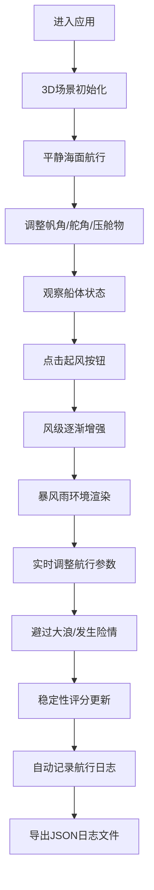

## 1. 产品概述

古代海上丝绸之路帆船避险模拟系统是一款基于WebGL的3D交互航海训练应用，旨在解决传统航海训练中水手难以在岸上安全体验和练习遭遇风暴时应急操船决策的问题。

- 核心目标：通过沉浸式3D模拟，让用户安全体验帆船在暴风雨中的航行状态，学习调整帆角、压舱物分配、舵向修正对船体摇摆、进水速度及航行方向的影响
- 目标用户：航海院校学生、帆船爱好者、历史文化爱好者
- 产品价值：提供安全、低成本、可重复的航海应急决策训练环境，兼具历史文化教育价值

## 2. 核心特性

### 2.1 用户角色
本应用无角色区分，所有用户均可体验完整功能。

### 2.2 功能模块
1. **3D场景模块**：动态海洋、宋代福船、暴风雨效果、物理模拟
2. **操控面板模块**：三个控制滑块（帆角、舵角、压舱物重量）、起风按钮、保存日志按钮
3. **状态指示模块**：风向标指示器、驾驶台仪表盘（横摇指示、进水速率、稳定性评分）
4. **航行日志模块**：自动记录参数、JSON导出功能
5. **响应式适配模块**：移动端垂直布局、3D场景自适应

### 2.3 页面详情

| 页面名称 | 模块名称 | 功能描述 |
|-----------|-------------|---------------------|
| 主页面 | 3D海洋场景 | 动态波浪（顶点着色器生成，波高0.3-1.2单位，周期2-4秒），深蓝#0a2a3a至墨绿#1a4a2a渐变海面 |
| 主页面 | 宋代福船模型 | 船长3单位、宽1单位，船体#5d3a1a木色，桅杆高2单位、帆布#e6dcc3，船尾舵叶宽0.4单位可转动 |
| 主页面 | 控制滑块 | 帆角0-90度、舵角-45度至+45度、压舱物200-800斤，实时影响横摇(-30°~+30°)、纵摇(-20°~+20°)、速度(0.2-2.0单位/秒) |
| 主页面 | 暴风雨系统 | 风级0-4级，海面波浪高度和频率随风级线性增加，雨滴粒子系统（200-800颗粒子） |
| 主页面 | 风向标 | 左侧圆盘直径80px，白底#f0f0f0，红色指针#cc0000，显示当前风向 |
| 主页面 | 驾驶台仪表盘 | 左下角圆形仪表盘，内含横摇指示、进水速率、稳定性评分三个子表盘 |
| 主页面 | 碰撞与避险反馈 | 横摇超过25度时货物箱滑动动画，纵摇超过15度时水花粒子、灯笼晃动效果 |
| 主页面 | 航行日志 | 右上角半透明卷轴，每30秒自动记录参数，支持JSON导出 |
| 主页面 | 危险预警 | 横摇超过28度时红色边框闪烁、屏幕暗角效果 |

## 3. 核心流程

用户进入应用后，首先看到平静海面下的宋代福船，可通过三个滑块调整航行参数。点击"起风"按钮后，暴风雨系统启动，风级逐渐增强，用户需要根据船体状态实时调整帆角、舵角和压舱物重量，保持船体稳定，避免翻船。系统自动记录航行数据，用户可随时导出日志。

## 4. 用户界面设计

### 4.1 设计风格
- **设计基调**：暗色调暴风雨氛围，沉浸式航海体验
- **主色调**：背景#0a1a2a，控件底色#1a2a3a，字体色#e6dcc3
- **强调色**：按钮色#3a5a4a（悬停#4a6b5a），金色#ffd700，红色#cc0000（危险指示）
- **按钮风格**：圆角木质风格，悬停有微妙发光效果
- **字体**：使用航海风格衬线字体，搭配FontAwesome图标
- **布局风格**：全屏3D场景为主体，UI控件半透明浮动于场景之上
- **图标风格**：FontAwesome锚形图标作为滑块手柄，木质纹理滑块轨道

### 4.2 页面设计概述

| 页面名称 | 模块名称 | UI元素 |
|-----------|-------------|-------------|
| 主页面 | 3D场景 | 动态海面（顶点着色器波浪）、宋代福船、雨滴粒子、货物箱、灯笼 |
| 主页面 | 控制滑块 | 木质纹理轨道（#5d3a1a到#8b6f47渐变），金色锚形滑块手柄 |
| 主页面 | 仪表盘 | 圆形白底#f5f0e0，三个指针表盘（平滑过渡动画0.3s ease-in-out） |
| 主页面 | 航行日志 | 半透明卷轴#e6dcc3，麻布纹理CSS渐变，圆角8px |
| 主页面 | 危险预警 | 红色边框box-shadow闪烁，屏幕暗角径向渐变 |
| 主页面 | 风向标 | 左侧圆盘，红色指针随风向旋转 |

### 4.3 响应式设计
- **桌面端优先**：水平布局，滑块与仪表盘分列左右两侧
- **移动端适配**：宽度<768px时，面板改为垂直布局，滑块和仪表盘上下排列，3D场景缩小为窗口高度的60%
- **触摸优化**：滑块增加触摸区域，按钮尺寸适配手指操作

### 4.4 3D场景指导
- **环境氛围**：暴风雨前夕至暴风骤雨的动态天气系统，天空颜色由暗蓝渐变至深灰
- **光照设置**：环境光+方向光模拟阴天光照，风暴时增加闪电频闪效果
- **相机设置**：第三人称跟随视角，距离船体约8单位，高度约4单位，可平滑跟随船体运动
- **构图焦点**：船体位于画面中央偏下，海面占据画面60%以上，突出航行的压迫感
- **交互动画**：船体横摇/纵摇平滑过渡，帆角调整有布料摆动效果，舵叶转动有阻尼感
- **后处理效果**：风暴时添加泛光、色差效果，增强紧张感
- **性能预算**：雨滴粒子不超过800颗，3D渲染帧率不低于30fps

## 5. 性能要求
- **3D渲染帧率**：Chrome 90+浏览器上不低于30fps
- **粒子系统**：每帧粒子不超过800颗，生命周期3-5秒
- **交互响应**：滑块变化响应延迟低于100ms
- **内存优化**：雨滴粒子采用双缓冲防止闪烁，对象池复用粒子
