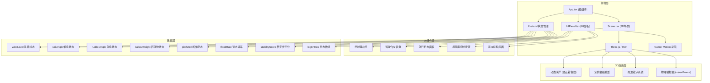

## 1. 架构设计



## 2. 技术描述

- **前端框架**：React@18 + TypeScript@5 + Vite@5
- **3D渲染引擎**：Three.js@0.160 + @react-three/fiber@8.15 + @react-three/drei@9.92
- **状态管理**：Zustand@4.4
- **动画库**：Framer Motion@10.18
- **构建工具**：Vite@5，配置路径别名@指向src目录
- **样式方案**：CSS Modules + CSS Variables
- **图标库**：FontAwesome 6.x (CDN引入)

### 核心技术选型说明
1. **@react-three/fiber**：React声明式Three.js渲染器，支持React Hooks和响应式更新
2. **@react-three/drei**：R3F生态的实用组件库，提供相机、控制、环境等预置组件
3. **Zustand**：轻量级状态管理，避免Redux繁琐的样板代码，支持跨组件状态共享
4. **Framer Motion**：流畅的React动画库，实现UI组件的平滑过渡效果
5. **顶点着色器**：自定义GLSL着色器实现动态海洋波浪，性能远高于JavaScript动画

## 3. 目录结构

```
src/
├── App.tsx              # 根组件，组合3D场景和UI面板
├── store/
│   └── useStore.ts      # Zustand全局状态管理
├── components/
│   ├── Scene.tsx        # Three.js 3D场景组件
│   ├── UIPanel.tsx      # UI面板组件（滑块、仪表盘、日志）
│   ├── Ship.tsx         # 宋代福船组件
│   ├── Ocean.tsx        # 动态海洋组件
│   ├── RainParticles.tsx # 雨滴粒子系统
│   ├── Dashboard.tsx    # 驾驶台仪表盘组件
│   ├── ControlSliders.tsx # 控制滑块组件
│   ├── WeatherVane.tsx  # 风向标组件
│   └── LogPanel.tsx     # 航行日志面板
├── shaders/
│   ├── oceanVertex.glsl # 海洋顶点着色器
│   └── oceanFragment.glsl # 海洋片元着色器
├── types/
│   └── index.ts         # TypeScript类型定义
└── utils/
    └── physics.ts       # 物理计算工具函数
```

## 4. 路由定义

| 路由 | 用途 |
|-------|---------|
| / | 主页面，包含3D场景和所有UI控件 |

本应用为单页面应用，无多路由需求。

## 5. 数据模型

### 5.1 Zustand Store 状态定义

```typescript
interface ShipState {
  windLevel: number;           // 风级 0-4
  windDirection: number;       // 风向角度 0-360度
  sailAngle: number;           // 帆角 0-90度
  rudderAngle: number;         // 舵角 -45到+45度
  ballastWeight: number;       // 压舱物重量 200-800斤
  pitch: number;               // 纵摇角 -20到+20度
  roll: number;                // 横摇角 -30到+30度
  speed: number;               // 前进速度 0.2-2.0单位/秒
  floodRate: number;           // 进水速率 0-100升/秒
  stabilityScore: number;      // 稳定性评分 0-100
  shipPosition: [number, number, number]; // 船体位置
  shipRotation: [number, number, number]; // 船体旋转
  isStormActive: boolean;      // 暴风雨是否激活
  isLanternOn: boolean;        // 灯笼是否点亮
  cargoBoxSliding: boolean;    // 货物箱是否滑动
  waveHeight: number;          // 当前波浪高度
  logEntries: LogEntry[];      // 日志条目数组
  lastLogTime: number;         // 上次记录日志时间
}

interface LogEntry {
  timestamp: string;
  sailAngle: number;
  rudderAngle: number;
  ballastWeight: number;
  rollAngle: number;
  windSpeed: number;
  stabilityScore: number;
}

interface StoreActions {
  setWindLevel: (level: number) => void;
  setSailAngle: (angle: number) => void;
  setRudderAngle: (angle: number) => void;
  setBallastWeight: (weight: number) => void;
  setPitch: (pitch: number) => void;
  setRoll: (roll: number) => void;
  setSpeed: (speed: number) => void;
  setFloodRate: (rate: number) => void;
  addStabilityScore: (delta: number) => void;
  toggleStorm: () => void;
  toggleLantern: () => void;
  setCargoBoxSliding: (sliding: boolean) => void;
  setShipPosition: (pos: [number, number, number]) => void;
  setShipRotation: (rot: [number, number, number]) => void;
  setWaveHeight: (height: number) => void;
  addLogEntry: (entry: LogEntry) => void;
  exportLogs: () => void;
  calculatePhysics: (deltaTime: number) => void;
}
```

### 5.2 物理计算规则

1. **横摇角计算**：`roll = baseRoll + (windForce * sailEfficiency) - (ballastStabilization)`
   - `baseRoll`：波浪引起的基础横摇
   - `windForce`：风力 = windLevel * 2.5
   - `sailEfficiency`：帆效率 = cos(帆角 - 风向角)
   - `ballastStabilization`：压舱稳定力 = (ballastWeight - 500) * 0.01

2. **纵摇角计算**：`pitch = basePitch + (speed * 0.5) - (ballastTrim)`
   - `basePitch`：波浪引起的基础纵摇
   - `ballastTrim`：压舱配平 = (ballastWeight - 500) * 0.005

3. **前进速度**：`speed = baseSpeed * windFactor * sailFactor`
   - `baseSpeed`：基础速度 = 0.2
   - `windFactor`：风系数 = 1 + windLevel * 0.3
   - `sailFactor`：帆系数 = cos(帆角) * 0.8 + 0.2

4. **进水速率**：`floodRate = baseFlood + rollPenalty + pitchPenalty`
   - `baseFlood`：基础进水 = 0
   - `rollPenalty`：横摇惩罚 = max(0, |roll| - 15) * 2
   - `pitchPenalty`：纵摇惩罚 = max(0, |pitch| - 10) * 1.5

## 6. 核心组件职责

### 6.1 Scene.tsx - 3D场景组件
- 管理Three.js场景、相机、渲染器
- 集成动态海洋、船体、雨滴粒子等子组件
- useFrame循环驱动物理计算和动画更新
- 从Zustand store读取状态并应用到3D对象

### 6.2 UIPanel.tsx - UI面板组件
- 整合所有2D UI元素（滑块、仪表盘、日志、按钮）
- 使用Framer Motion实现UI动画效果
- 通过Zustand actions更新全局状态
- 响应式布局适配移动端

### 6.3 Ocean.tsx - 动态海洋组件
- 自定义着色器材质实现动态波浪
- 波高和频率随风级参数动态调整
- 海面颜色从深蓝#0a2a3a到墨绿#1a4a2a渐变

### 6.4 Ship.tsx - 宋代福船组件
- 船体几何模型构建（船体、桅杆、帆布、舵叶、灯笼）
- 根据舵角参数实时旋转舵叶
- 根据帆角参数调整帆布角度
- 根据横摇/纵摇参数应用船体姿态
- 灯笼发光材质控制

### 6.5 Dashboard.tsx - 驾驶台仪表盘
- 三个子表盘：横摇指示、进水速率、稳定性评分
- 指针平滑过渡动画（CSS transition 0.3s）
- 颜色编码安全区域（绿/黄/红）

### 6.6 ControlSliders.tsx - 控制滑块
- 木质纹理渐变轨道（#5d3a1a到#8b6f47）
- 锚形滑块手柄（FontAwesome图标，金色#ffd700）
- 实时状态更新，响应延迟<100ms

## 7. 性能优化策略

1. **粒子系统优化**：
   - 采用双缓冲Canvas防止闪烁
   - 对象池复用雨滴粒子，避免频繁GC
   - 最大粒子数限制800，生命周期3-5秒

2. **3D渲染优化**：
   - 使用BufferGeometry替代Geometry
   - 实例化渲染重复对象（如货物箱）
   - 合理设置相机视锥体剔除距离

3. **动画优化**：
   - useFrame中使用deltaTime进行帧率独立计算
   - 避免在渲染循环中创建新对象
   - CSS transition替代JS动画实现UI过渡

4. **状态更新优化**：
   - Zustand selector避免不必要的重渲染
   - 防抖处理滑块高频更新
   - 日志记录采用时间节流（30秒间隔）

## 8. 构建配置

### vite.config.js
- 路径别名：@ → src
- 开发服务器端口：5173
- 生产构建sourcemap：false
- 依赖预构建：three、@react-three/fiber、@react-three/drei

### tsconfig.json
- 严格模式：strict: true
- JSX编译：react-jsx
- 目标ES版本：ES2020
- 模块解析：bundler
