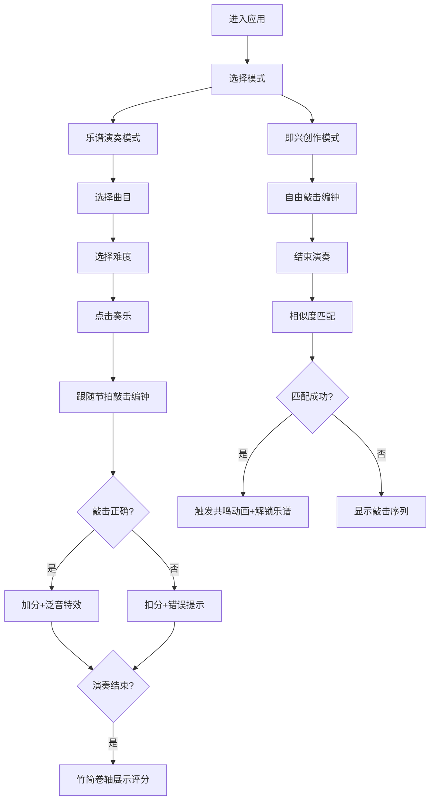

## 1. 产品概述

唐代编钟雅乐交互游戏应用，通过虚拟编钟演奏、乐谱编排与节奏评分系统，让用户体验古代礼乐文化内涵。解决传统雅乐演奏中音高排列复杂、缺乏直观反馈的问题，提供沉浸式的编钟合奏体验。

## 2. 核心功能

### 2.1 功能模块
1. **编钟演奏区**：16个青铜编钟的可视化排列与交互，支持鼠标悬停、点击发声与动画效果
2. **乐谱演奏模式**：预设曲目选择、节拍引导、实时敲击检测与评分
3. **即兴创作模式**：自由演奏记录、曲目相似度匹配与解锁机制
4. **评分展示系统**：准确率与节奏同步率计算、竹简风格结果展示
5. **难度选择系统**：初级/中级/高级三档难度，控制节拍速度与音高范围

### 2.2 页面详情

| 页面名称 | 模块名称 | 功能描述 |
|-----------|-------------|---------------------|
| 主页面 | 编钟展示区 | 16个编钟按大小排列，支持悬停发光、点击摆动与涟漪效果 |
| 主页面 | 右侧操作面板 | 乐谱显示、难度选择、播放/停止控制、得分展示 |
| 主页面 | 装饰铃铛 | 右上角青铜铃铛装饰，悬停发清脆铃声 |
| 主页面 | 结果展示 | 竹简卷轴动画展示演奏评分与评价 |

## 3. 核心流程

用户进入应用后可选择两种模式：
- **演奏模式**：选择曲目→选择难度→点击奏乐→跟随节拍敲击编钟→系统评分→展示结果
- **即兴模式**：自由敲击编钟→系统记录音序→结束演奏→相似度匹配→解锁乐谱（可选）

## 4. 用户界面设计

### 4.1 设计风格
- **主色调**：朱红#b22222、玄黑#1a1a1a、古铜#8b5e3c、牙白#f5f0e1
- **整体风格**：仿唐式工笔重彩，华丽典雅，富有东方古典韵味
- **编钟样式**：合瓦状青铜钟，颜色从深铜色渐变到亮金色，刻有篆书音名
- **木架样式**：朱红色木质支架，承载编钟悬挂
- **背景纹理**：丝绸质感，通过CSS渐变与噪声纹理叠加模拟织物质感

### 4.2 视觉元素
- **按钮样式**：圆形播放/停止按钮，朱红色底色，悬停变为亮红色
- **字体**：小篆用于音名标注，楷体用于乐谱文字
- **动画效果**：编钟摆动、涟漪扩散、粒子光环、竹简卷轴展开
- **装饰元素**：右上角青铜铃铛、木轴纹理卷轴

### 4.3 布局结构
- **桌面端**：左侧编钟区(650px) + 右侧操作面板(280px)，CSS Grid固定布局
- **响应式**：
  - <800px：编钟区450px，编钟缩小50%，面板移至底部
  - 800-1200px：编钟区与面板2:1比例并排

### 4.4 交互反馈
- **悬停反馈**：编钟金色发光、信息浮窗显示音名/频率/工尺谱
- **点击反馈**：编钟摆动动画、涟漪效果、粒子特效
- **乐谱引导**：目标编钟边框闪烁金色
- **成功反馈**：更响亮泛音、金色光环粒子
- **失败反馈**：红色叉号、沉闷"哐"声
