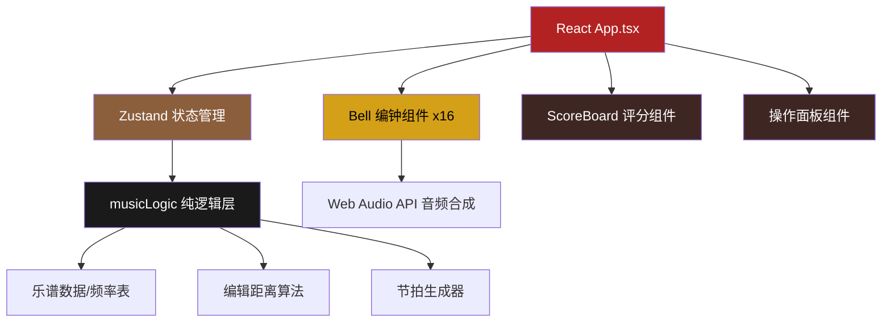

## 1. 架构设计



## 2. 技术描述

- **前端框架**：React 18 + TypeScript
- **构建工具**：Vite 5（端口3000，开启sourcemap）
- **状态管理**：Zustand（管理当前音序、得分、模式、难度等全局状态）
- **动画库**：Framer Motion（编钟摆动、粒子效果、卷轴动画）
- **音频处理**：Web Audio API（正弦波合成、AudioBuffer缓存、低延迟播放）
- **样式方案**：CSS Modules + CSS Grid + CSS Variables

## 3. 目录结构

```
├── src/
│   ├── main.tsx          # React应用入口
│   ├── App.tsx           # 主组件，组合所有模块
│   ├── Bell.tsx          # 单个编钟组件
│   ├── ScoreBoard.tsx    # 得分展示组件
│   ├── musicLogic.ts     # 乐谱数据、频率表、算法
│   ├── store.ts          # Zustand状态管理
│   └── index.css         # 全局样式与CSS变量
├── index.html            # 入口页面
├── vite.config.js        # Vite配置
├── tsconfig.json         # TypeScript配置
└── package.json          # 项目依赖
```

## 4. 核心数据模型

### 4.1 编钟数据结构
```typescript
interface BellData {
  id: number;
  name: string;           // 音名：宫、商、角、徵、羽等
  frequency: number;      // 频率Hz
  size: number;           // 尺寸百分比 0-100
  color: string;          # 渐变色
  gongchi: string;        // 工尺谱记号
}
```

### 4.2 乐谱数据结构
```typescript
interface Score {
  id: string;
  name: string;           // 曲目名称
  notes: ScoreNote[];     // 音符序列
  bpm: Record<Difficulty, number>;  // 不同难度的BPM
}

interface ScoreNote {
  bellId: number;         // 对应编钟ID
  duration: number;       // 节拍数
  isAccent: boolean;      // 是否为重音
}
```

### 4.3 游戏状态
```typescript
interface GameState {
  mode: 'play' | 'improv';
  difficulty: 'easy' | 'medium' | 'hard';
  currentScore: Score | null;
  currentNoteIndex: number;
  isPlaying: boolean;
  score: number;
  accuracy: number;
  rhythmScore: number;
  recordedNotes: number[];
}
```

## 5. 核心技术实现

### 5.1 音频合成与缓存
- 预先生成16个音的AudioBuffer，使用正弦波合成
- 每个编钟独立BufferSource，确保<50ms响应延迟
- 使用线性衰减模拟钟声余韵，持续0.5s，衰减0.2s

### 5.2 动画性能优化
- 使用CSS transform进行编钟摆动，开启硬件加速
- 粒子特效使用CSS动画限制数量≤20个
- 帧率目标：稳定50fps以上，内存占用≤200MB

### 5.3 编辑距离算法
- 实现Levenshtein距离计算用户即兴演奏与预设曲目的相似度
- 阈值=5，小于等于则判定匹配成功

### 5.4 节拍控制系统
- 使用setTimeout/requestAnimationFrame精确控制节拍
- 记录用户点击时间与节拍时间差，计算节奏同步率
- 时间差<0.1s为满分

## 6. 性能指标

| 指标 | 目标值 |
|------|--------|
| 点击响应延迟 | <50ms |
| 动画帧率 | ≥50fps |
| 内存占用（16个编钟） | ≤200MB |
| 音频播放延迟 | <10ms |
| 首屏加载时间 | <2s |
