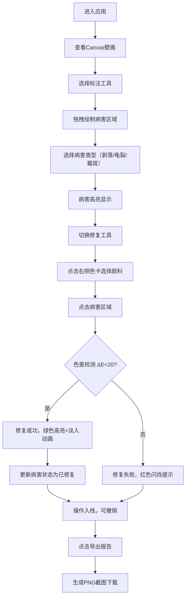

## 1. 产品概述
章怀太子墓壁画修复交互工具，让用户以唐代墓室壁画保护专家的身份，在虚拟壁画前完成病害标注与补色修复作业。
- 主要目的：通过沉浸式交互体验，让用户了解古代壁画保护的专业流程，包括病害识别标注、颜料匹配、修复操作等
- 目标用户：文物爱好者、学生、文化传播受众
- 产品价值：将专业文物修复工作转化为可交互的数字体验，兼具教育性与趣味性

## 2. 核心功能

### 2.1 功能模块
1. **主应用页面**：工具栏、病害面板、壁画Canvas、颜料色卡面板
2. **病害标注系统**：圆形区域绘制、类型选择、高亮显示、右键编辑
3. **颜料匹配修复**：色卡选择、色差检测、填色修复、动画反馈
4. **历史记录管理**：操作撤销/重做、状态快照保存
5. **统计与报告**：病害分类统计、报告导出（PNG截图）
6. **画笔控制**：尺寸调节、自定义光标

### 2.2 页面详情
| 页面名称 | 模块名称 | 功能描述 |
|-----------|-------------|---------------------|
| 主修复页面 | 顶部工具栏 | 工具切换（标注/修复/吸色）、画笔尺寸调节、撤销/重做按钮、导出报告 |
| 主修复页面 | 左侧病害面板 | 病害分类统计列表、病害详情（坐标/半径/类型）、状态筛选 |
| 主修复页面 | 中央壁画区域 | Canvas渲染模拟"客使图"壁画、鼠标交互标注/修复、病害高亮叠加、自定义光标 |
| 主修复页面 | 右侧颜料面板 | 6种矿物色卡展示、点击选中、拖拽吸色、匹配动画反馈 |

## 3. 核心流程

用户进入应用后，首先在Canvas上观察模拟壁画，使用标注工具圈定病害区域，选择病害类型。标注完成后，切换到修复工具，从右侧色卡选择颜料，点击病害区域进行修复。系统自动检测颜料与底色的色差，匹配成功则完成修复并播放动画。所有操作支持撤销/重做，最后可导出包含壁画和统计数据的修复报告。

## 4. 用户界面设计

### 4.1 设计风格
- **主色调**：米黄色仿古宣纸色(#f5eedc)作为背景，深棕木纹色(#5a3d2b)作为工具栏
- **点缀色**：金色(#d4af37)用于按钮边框和高光，病害高亮采用半透明红/黄/绿色
- **按钮风格**：木纹底色+0.5px金色边框，hover时金色发光效果
- **字体**：采用优雅的宋体/衬线字体配合清晰的无衬线字体，体现古典与现代的融合
- **布局风格**：三栏布局（左240px + 中弹性 + 右220px），卡片式病害统计
- **视觉元素**：半透明白色卡片(#ffffffbb)、圆形色卡带内高光、Canvas壁画纹理质感

### 4.2 页面设计概述
| 页面名称 | 模块名称 | UI元素 |
|-----------|-------------|-------------|
| 主修复页面 | 顶部工具栏 | 深棕木纹背景，金色边框按钮，滑动条带数值显示，自定义光标随画笔尺寸变化 |
| 主修复页面 | 左侧病害面板 | 半透明白色卡片，按类型和状态分组，滚动列表，每一项显示坐标、半径、类型标签 |
| 主修复页面 | 中央壁画区域 | Canvas渲染抽象"客使图"（人物轮廓、衣饰色块），病害区域半透明高亮，修复动画 |
| 主修复页面 | 右侧颜料面板 | 6个圆形色卡（直径40px，内圈高光渐变，阴影模糊4px），选中状态金色边框 |

### 4.3 响应式
- **桌面端（≥1024px）**：三栏布局正常显示
- **平板/移动端（<1024px）**：左右面板折叠为顶部Tab栏，点击展开，Canvas区域自适应

### 4.4 动画与交互
- **修复成功动画**：framer-motion，scale从0.9→1.0，opacity从0.5→1.0，时长1.5s
- **修复失败动画**：0.3s红色背景闪烁
- **标注预览**：拖拽时实时显示临时圆圈
- **色卡拖拽**：跟随光标移动的半透明色块
- **按钮hover**：金色边框发光效果（box-shadow）
