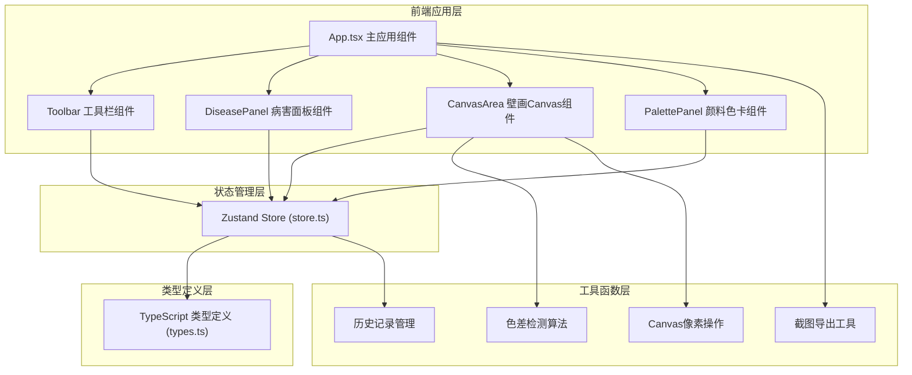
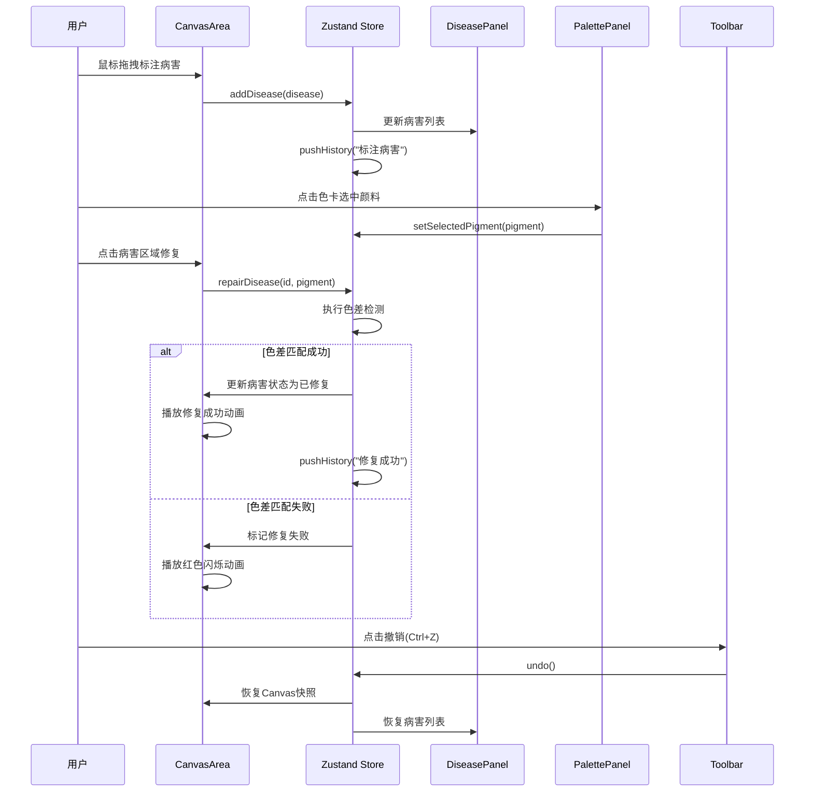

## 1. 架构设计



## 2. 技术描述
- **前端框架**: React@18 + TypeScript@5
- **构建工具**: Vite@5
- **状态管理**: Zustand@4
- **动画库**: framer-motion@11
- **截图工具**: html2canvas@1
- **UI样式**: 原生CSS + CSS变量，无额外UI框架（保持轻量化）

## 3. 文件结构

```
项目根目录/
├── package.json          # 依赖配置与脚本
├── vite.config.js        # Vite配置（端口3000）
├── tsconfig.json         # TypeScript严格模式配置
├── index.html            # 入口HTML
└── src/
    ├── types.ts          # 类型定义（病害、颜料、工具等）
    ├── store.ts          # Zustand全局状态管理
    ├── App.tsx           # 主应用组件
    ├── utils/            # 工具函数目录
    │   ├── colorUtils.ts # 色差检测算法
    │   └── exportUtils.ts # 导出报告工具
    └── components/       # 组件目录
        ├── CanvasArea.tsx    # 核心壁画Canvas组件
        ├── PalettePanel.tsx  # 右侧颜料色卡组件
        ├── DiseasePanel.tsx  # 左侧病害面板组件
        └── Toolbar.tsx       # 顶部工具栏组件
```

## 4. 数据模型

### 4.1 数据类型定义

```mermaid
classDiagram
    class Disease {
        +string id
        +Coordinate center
        +number radius
        +DiseaseType type
        +RepairStatus status
        +string matchedColor?
        +number createdAt
    }
    
    class Coordinate {
        +number x
        +number y
    }
    
    class Pigment {
        +string name
        +string hex
        +string mineral
    }
    
    class HistoryRecord {
        +string action
        +Disease[] previousDiseases
        +string canvasSnapshot?
        +number timestamp
    }
    
    enum DiseaseType {
        <<enumeration>>
        剥落
        龟裂
        霉斑
    }
    
    enum RepairStatus {
        <<enumeration>>
        待修复
        已标注
        已修复
    }
    
    enum ToolType {
        <<enumeration>>
        标注
        修复
        吸色
    }
```

### 4.2 Zustand Store 状态结构

```typescript
interface MuralStore {
  // 状态
  diseases: Disease[]
  currentTool: ToolType
  currentBrushSize: number
  selectedPigment: Pigment | null
  history: HistoryRecord[]
  historyIndex: number
  canvasRef: React.RefObject<HTMLCanvasElement> | null
  
  // 操作方法
  addDisease: (disease: Disease) => void
  updateDisease: (id: string, updates: Partial<Disease>) => void
  deleteDisease: (id: string) => void
  repairDisease: (id: string, pigment: Pigment) => boolean
  setCurrentTool: (tool: ToolType) => void
  setCurrentBrushSize: (size: number) => void
  setSelectedPigment: (pigment: Pigment | null) => void
  undo: () => void
  redo: () => void
  pushHistory: (action: string) => void
}
```

## 5. 核心算法

### 5.1 色差检测算法（简化CIEDE2000）

```typescript
// RGB分量差值之和不超过60作为色差阈值
function colorDifference(rgb1: [number, number, number], rgb2: [number, number, number]): number {
  return Math.abs(rgb1[0] - rgb2[0]) + 
         Math.abs(rgb1[1] - rgb2[1]) + 
         Math.abs(rgb1[2] - rgb2[2]);
}

// 判断是否匹配（ΔE < 20 简化为 RGB差值和 < 60）
function isColorMatch(hex1: string, hex2: string): boolean {
  const rgb1 = hexToRgb(hex1);
  const rgb2 = hexToRgb(hex2);
  return colorDifference(rgb1, rgb2) < 60;
}
```

### 5.2 历史记录管理

- 每次操作前保存当前diseases数组快照和Canvas图像数据（ImageData）
- 使用数组+指针实现撤销/重做，最大记录50步
- 新操作清除当前指针之后的历史

## 6. 性能优化策略

1. **Canvas渲染优化**：
   - 使用requestAnimationFrame控制渲染帧率（目标60FPS）
   - 分层渲染：静态壁画层 + 动态病害高亮层
   - 脏矩形渲染：只重绘变化区域

2. **状态更新优化**：
   - Zustand浅比较避免不必要重渲染
   - 组件粒度拆分，使用React.memo

3. **历史记录优化**：
   - Canvas快照使用ImageData而非base64（减少内存占用）
   - 历史记录限制50条，超出自动移除最早记录

## 7. 事件流


