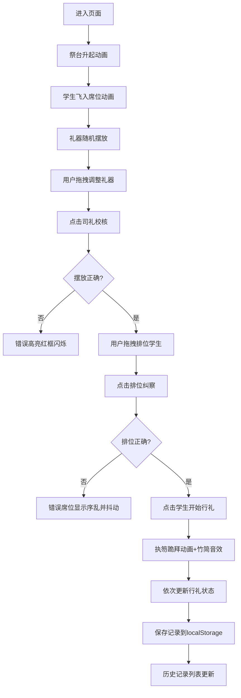

## 1. 产品概述

太学陈设祭祀系统是一款模拟汉代长安太学明堂释菜礼的交互式教育应用，用户扮演司仪引导师生完成祭祀礼仪，通过礼器摆放、学生排位、行礼动画等交互体验古代礼制文化。

- 核心价值：通过沉浸式交互体验传承中华礼乐文化，寓教于乐
- 目标用户：历史文化爱好者、教育工作者、学生群体

## 2. 核心功能

### 2.1 用户角色

| 角色 | 注册方式 | 核心权限 |
|------|----------|----------|
| 司仪（用户） | 无需注册，直接使用 | 摆放礼器、排位学生、主持行礼、校核礼仪 |

### 2.2 功能模块

1. **主界面**：明堂布局展示，包含祭台、东西庑、礼器槽位、学生席位
2. **礼器管理**：礼器拖拽摆放、司礼校核、错误高亮提示
3. **学生排位**：学生信息展示、拖拽排位、排位纠察
4. **行礼交互**：执笏跪拜动画、音效播放、行礼状态更新
5. **礼器统计**：实时统计面板，显示礼器数量与偏差
6. **历史记录**：记录保存、列表展示、状态回放

### 2.3 页面详情

| 页面名称 | 模块名称 | 功能描述 |
|----------|----------|----------|
| 主界面 | 明堂布局 | 渲染祭台（灰砖色高台）、东西庑（浅木色廊柱）、背景（淡米黄色古卷） |
| 主界面 | 礼器摆放区 | 12个槽位，支持拖拽调整6青铜豆、4竹笾、2陶簋位置 |
| 主界面 | 学生排位区 | 东西庑各6席，按年龄长幼、学业高低排位 |
| 主界面 | 交互按钮 | 司礼校核、排位纠察、行礼开始按钮 |
| 主界面 | 统计面板 | 右侧悬浮显示礼器数量统计与偏差 |
| 主界面 | 历史记录 | 左侧边栏显示最近10条记录，支持回放 |

## 3. 核心流程

## 4. 用户界面设计

### 4.1 设计风格

- 主色调：淡米黄色#f8f0e0（背景）、灰砖色#6b7b6b（祭台）、浅木色#d4b88a（庑廊）、朱红色#a02020（廊柱）、黑色#2a2a2a（瓦顶）
- 辅助色：金色#d4a017（青铜豆）、竹色#b5a642（竹笾）、灰陶色#8b7355（陶簋）、浅灰#b0b0b0（深衣）
- 字体：使用书法风格字体，标题用大字，正文用楷书风格
- 按钮：方正规整，汉代印章风格，悬停时有朱红色边框高亮
- 布局：对称式布局，祭台居中，东西庑分列两侧，体现古代建筑礼制
- 图标：写意风格，礼器采用简笔画形式，学生采用半身小人简笔画

### 4.2 页面设计概述

| 页面名称 | 模块名称 | UI元素 |
|----------|----------|--------|
| 主界面 | 明堂布局 | 祭台（方形高台，砖缝纹理）、庑廊（柱廊结构，黑瓦顶）、背景（古卷纸张质感） |
| 主界面 | 礼器区 | 12个60×60px槽位，礼器（青铜豆带云雷纹、竹笾编筐状、陶簋圆腹三足） |
| 主界面 | 学生区 | 60×60px席次网格，学生头像（戴进贤冠、着深衣），显示姓名/年龄/学业 |
| 主界面 | 统计面板 | 圆形图符表示礼器，金色/竹色/灰陶色区分，标注应备数和偏差数 |
| 主界面 | 历史记录 | 左侧边栏，时间戳+摘要，点击加载回放 |

### 4.3 响应式设计

- 桌面端（>800px）：东西庑左右排列，祭台居中，标准尺寸
- 移动端（≤800px）：东西庑上下排列，礼器槽位缩小至80%，学生头像改为小型椭圆，布局纵向排列

### 4.4 动画与交互

- 进入动画：祭台自底向上升起（1秒ease-out），学生依次从左右飞入（延迟0.1秒/人）
- 错误提示：红框闪烁（0.5秒3次）、席位抖动（0.3秒）
- 行礼动画：执笏跪拜（0.4秒CSS transition，笏板从垂直转水平）
- 拖拽交互：30fps以上流畅拖拽
