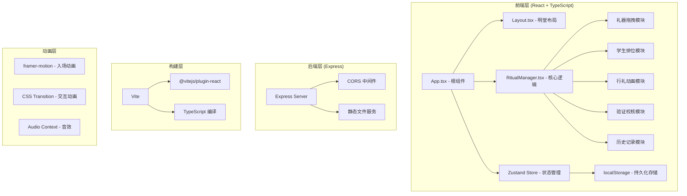
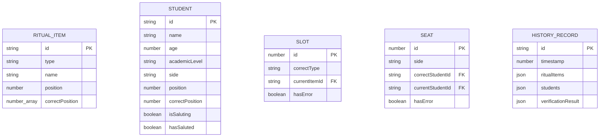

## 1. 架构设计



## 2. 技术描述

- 前端：React@18 + TypeScript@5 + Vite@5
- 后端：Express@4 + CORS@2
- 状态管理：Zustand@4
- 动画库：framer-motion@11
- 构建工具：Vite@5
- 数据库：localStorage（浏览器本地存储）

## 3. 路由定义

| 路由 | 用途 |
|------|------|
| / | 主页面，包含明堂布局与所有交互功能 |
| /api/health | 后端健康检查 |

## 4. API 定义

### TypeScript 类型定义

```typescript
// 礼器类型
type RitualType = 'dou' | 'bian' | 'gui';

interface RitualItem {
  id: string;
  type: RitualType;
  name: string;
  position: number | null;
  correctPosition: number[];
}

// 学生类型
type AcademicLevel = '待诏' | '通一经' | '通五经';

interface Student {
  id: string;
  name: string;
  age: number;
  academicLevel: AcademicLevel;
  side: 'east' | 'west';
  position: number | null;
  correctPosition: number;
  isSaluting: boolean;
  hasSaluted: boolean;
}

// 礼器槽位
interface Slot {
  id: number;
  correctType: RitualType;
  currentItem: RitualItem | null;
  hasError: boolean;
}

// 学生席位
interface Seat {
  id: number;
  side: 'east' | 'west';
  correctStudentId: string;
  currentStudent: Student | null;
  hasError: boolean;
}

// 历史记录
interface HistoryRecord {
  id: string;
  timestamp: number;
  ritualItems: RitualItem[];
  students: Student[];
  verificationResult: {
    ritualCorrect: boolean;
    ritualErrors: number[];
    studentCorrect: boolean;
    studentErrors: number[];
  };
}

// 全局状态
interface AppState {
  ritualItems: RitualItem[];
  slots: Slot[];
  students: Student[];
  eastSeats: Seat[];
  westSeats: Seat[];
  history: HistoryRecord[];
  isAnimating: boolean;
  currentPhase: 'ritual' | 'seating' | 'saluting' | 'complete';
  verificationMode: 'none' | 'ritual' | 'seating';
}
```

## 5. 数据模型

### 5.1 数据模型定义



### 5.2 数据初始化规则

- 礼器：6青铜豆(dou)、4竹笾(bian)、2陶簋(gui)，共12件
- 槽位：12个，正确位置规则为「豆在左、笾在右、簋居中」
  - 位置0-5：青铜豆(dou)
  - 位置6-9：竹笾(bian)  
  - 位置10-11：陶簋(gui)
- 学生：东西庑各6人，共12人
  - 排序规则：先按年龄长幼，再按学业高低（通五经 > 通一经 > 待诏）
  - 东庑：年龄较大、学业较高的6人
  - 西庑：年龄较小、学业较低的6人
- 学生姓名池：董仲舒、公孙弘、司马迁、司马相如、东方朔、班固、张骞、苏武、李陵、卫青、霍去病、霍光

## 6. 核心算法

### 6.1 礼器验证算法
```
输入：当前12个槽位的礼器摆放
输出：错误位置数组
规则：
  - 位置0-5必须是dou（青铜豆）
  - 位置6-9必须是bian（竹笾）
  - 位置10-11必须是gui（陶簋）
  - 统计每种礼器数量是否正确
时间复杂度：O(n), n=12，需在50ms内完成
```

### 6.2 学生排位验证算法
```
输入：东西庑各6个席位的学生排位
输出：错误位置数组
规则：
  - 东庑：按年龄从大到小，同学历按年龄排序
  - 西庑：按年龄从大到小，同学历按年龄排序
  - 学历权重：通五经(3) > 通一经(2) > 待诏(1)
  - 综合排序：先按学历降序，再按年龄降序
时间复杂度：O(n log n), n=12，需在50ms内完成
```

### 6.3 性能要求
- 拖拽动画：≥30fps
- 验证逻辑：≤50ms
- 历史记录读写：≤10ms
- localStorage存储上限：最近10条记录
