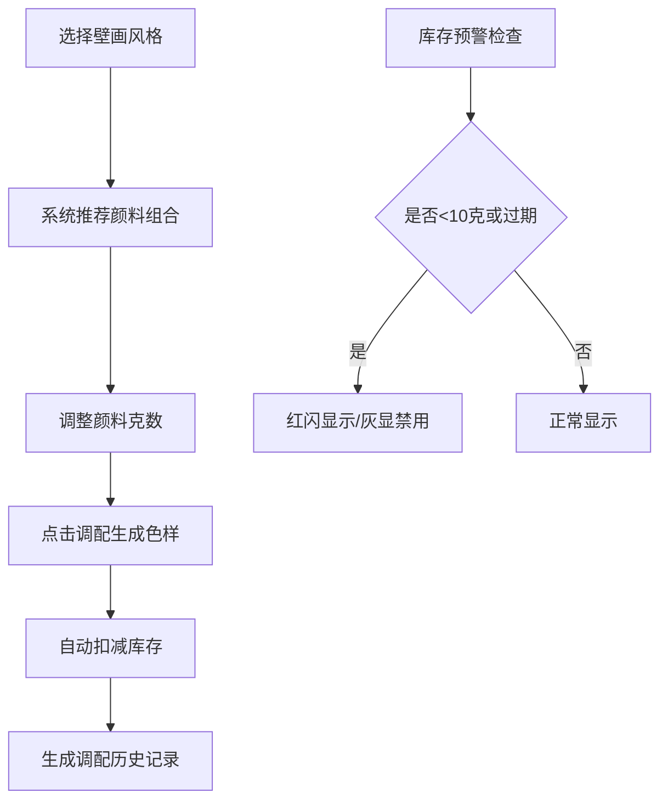

## 1. 产品概述

敦煌壁画颜料库管理系统是一款面向壁画临摹画师的专业工具，解决传统矿物颜料配方传承与库存管理难题。通过数字化记录颜料库存、调配配方与历史追溯，帮助画师精确还原各朝代（北凉、北魏、西魏、隋、唐）壁画的色彩风貌。

- 核心价值：建立颜料配方的数字化传承体系，实现库存智能预警与调配过程可追溯
- 目标用户：敦煌研究院画师、文物修复工作者、传统美术创作者

## 2. 核心功能

### 2.1 用户角色
| 角色 | 注册方式 | 核心权限 |
|------|----------|----------|
| 画师用户 | 无需注册，本地使用 | 颜料库存管理、配方调配、历史记录查看、过期标记 |

### 2.2 功能模块
1. **颜料库存管理**：颜料CRUD、表格展示、库存预警、过期标记
2. **配方调配面板**：壁画风格选择、颜料配比调整、色样生成、库存自动扣减
3. **历史记录追踪**：调配历史查询、风格筛选、配方比例显示、分页加载

### 2.3 页面详情
| 页面名称 | 模块名称 | 功能描述 |
|----------|----------|----------|
| 主页面 | 顶部粒子特效 | 30个半透明圆点随机飘落，营造敦煌壁画颗粒感 |
| 主页面 | 过期预警横幅 | 保质期前30天的颜料黄色横幅提示 |
| 主页面 | 颜料库存表格 | 增删改查、按名称排序、低库存红闪、过期灰显删除线 |
| 主页面 | 配方调配面板 | 风格下拉选择、颜料多选、克数输入、Canvas色样、调配按钮 |
| 主页面 | 历史记录列表 | 风格筛选、色样展示、配方比例、分页加载（每页20条） |

## 3. 核心流程

画师选择壁画风格 → 系统推荐基础颜料组合 → 手动调整各颜料克数 → 点击调配生成色样 → 系统自动扣减库存并记录历史 → 可按风格筛选历史配方 → 库存不足/过期时系统预警

## 4. 用户界面设计

### 4.1 设计风格
- **主色调**：米黄 #f5eedc（敦煌土墙底色）、赭石 #8b5e3c（敦煌泥土色）
- **辅助色**：石青 #2a5db0、石绿 #2d8a5e、朱砂 #c41e3a、赭石 #c46210、钛白 #f8f4e6
- **卡片风格**：纸张做旧效果，box-shadow模拟破损边缘，交替行背景 #faf3e0 / #f5eedc
- **分隔线**：细虚线分隔列表行
- **字体**：标题使用古韵书法风格，正文使用清晰易读的衬线字体
- **按钮动画**：点击时 scale 0.95，持续100ms
- **色样交互**：悬停时放大1.2倍，显示RGB值和HEX色码

### 4.2 页面设计概述
| 页面名称 | 模块名称 | UI元素 |
|----------|----------|---------|
| 主页面 | 顶部区域 | 粒子特效层、标题"敦煌壁画颜料库·莫高窟画师录"、过期预警横幅 |
| 主页面 | 颜料库存表格 | 表头可点击排序、低库存行浅红闪烁动画、过期行灰色删除线、行交替背景 |
| 主页面 | 配方调配面板 | 风格下拉（北凉/北魏/西魏/隋/唐）、颜料多选列表、克数输入（精确0.1克）、Canvas圆形色样（60px直径，渐变效果）、调配按钮 |
| 主页面 | 历史记录列表 | 风格筛选标签、色样圆盘、配方比例字符串、日期用量、分页控件 |

### 4.3 响应式
- **桌面端**：三栏布局，库存表格左侧，调配面板中间，历史记录右侧
- **平板端**：两栏布局，库存与调配上下排列，历史记录单列
- **手机端**：单列堆叠，表格转为可横向滚动的卡片区块，触控区域优化
- **触摸优化**：按钮最小高度44px，色样圆盘点击区域扩大

### 4.4 性能指标
- 颜料列表搜索筛选响应：≤200ms
- 历史记录首屏渲染（20条）：≤300ms
- Canvas色样生成CPU耗时：≤50ms
