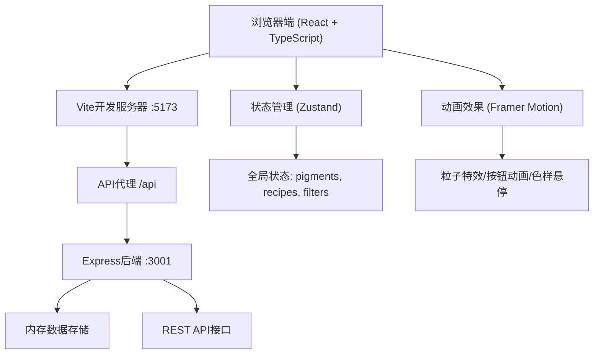
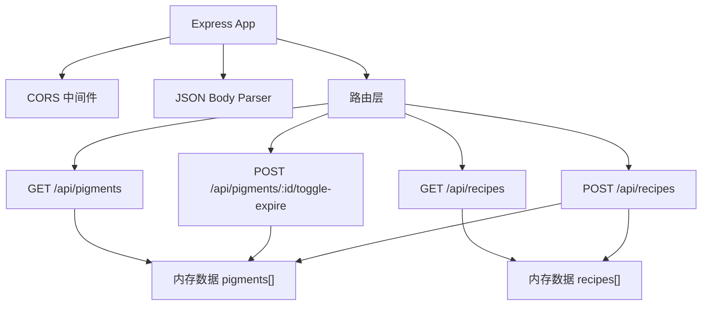
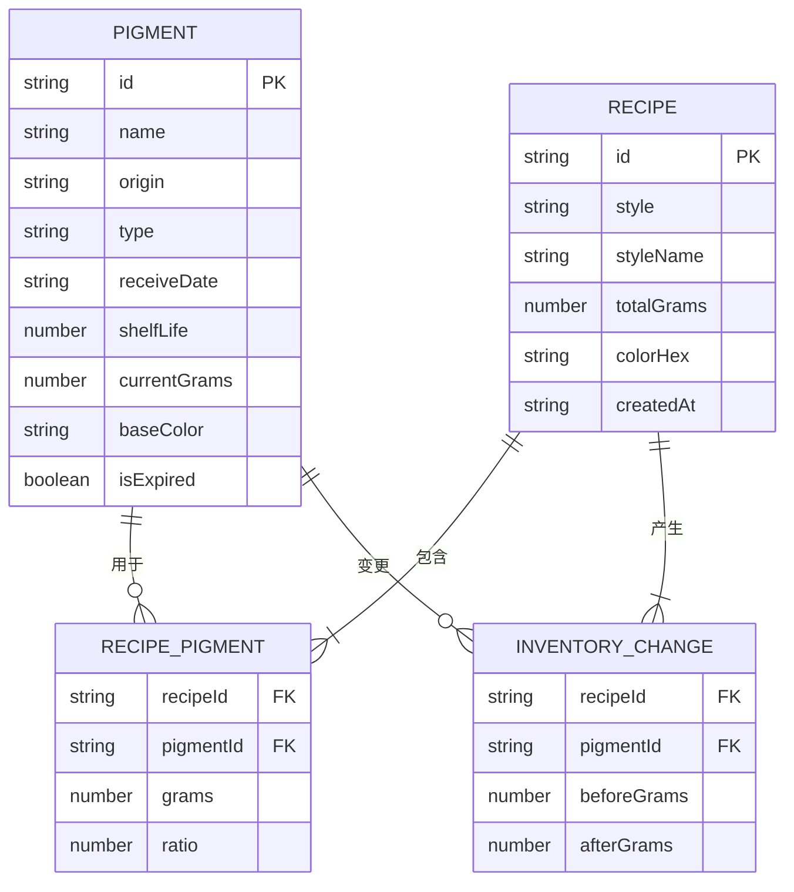

## 1. 架构设计



## 2. 技术描述

- **前端**：React@18 + TypeScript@5 + Vite@5 + Zustand@4 + Framer Motion@11
- **后端**：Express@4 + CORS 中间件
- **状态管理**：Zustand 全局状态管理 pigments、recipes、filterStyle
- **动画库**：Framer Motion 实现粒子特效、按钮按压、色样缩放
- **样式方案**：纯CSS + CSS变量，配合Framer Motion动画
- **数据存储**：后端内存数组存储，包含初始mock数据
- **初始化工具**：Vite + React TypeScript模板

## 3. 路由定义
| 路由 | 用途 |
|------|------|
| / | 主页面，包含所有功能模块 |
| /api/pigments | GET获取颜料列表 |
| /api/pigments/:id/toggle-expire | POST标记颜料过期状态 |
| /api/recipes | POST创建调配记录 |
| /api/recipes?style=xxx | GET按风格筛选历史记录 |

## 4. API 定义

### TypeScript 类型定义
```typescript
// 颜料类型
interface Pigment {
  id: string;
  name: string;           // 石青、石绿等
  origin: string;         // 产地：于阗、龟兹等
  type: 'mineral' | 'plant';  // 矿物/植物
  receiveDate: string;    // 入库日期 YYYY-MM-DD
  shelfLife: number;      // 保质期(年)：矿物5年，植物2年
  currentGrams: number;   // 当前克数
  baseColor: string;      // 基础色HEX
  isExpired: boolean;     // 是否已过期
}

// 配方记录类型
interface Recipe {
  id: string;
  style: string;          // 壁画风格：北凉、北魏等
  styleName: string;      // 风格名称：北凉晕染法等
  pigments: {
    pigmentId: string;
    pigmentName: string;
    grams: number;
    ratio: number;
  }[];
  totalGrams: number;
  colorHex: string;       // 调配后颜色HEX
  colorRgb: { r: number; g: number; b: number };
  createdAt: string;
  inventoryChanges: {
    pigmentId: string;
    before: number;
    after: number;
  }[];
}

// 壁画风格配置
interface MuralStyle {
  id: string;
  name: string;           // 北凉晕染法
  dynasty: string;        // 北凉
  recommendedPigments: string[];  // 推荐颜料ID列表
}
```

### 响应格式
```typescript
// GET /api/pigments
interface PigmentsResponse {
  success: boolean;
  data: Pigment[];
}

// POST /api/recipes 请求
interface CreateRecipeRequest {
  style: string;
  pigments: { pigmentId: string; grams: number }[];
}

// POST /api/recipes 响应
interface RecipeResponse {
  success: boolean;
  data: Recipe;
}

// GET /api/recipes?style=xxx
interface RecipesResponse {
  success: boolean;
  data: Recipe[];
  total: number;
  page: number;
  pageSize: number;
}
```

## 5. 服务端架构



## 6. 数据模型

### 6.1 实体关系图


### 6.2 初始数据 (Mock Data)
```javascript
// 初始颜料数据
const initialPigments = [
  { id: '1', name: '石青', origin: '于阗', type: 'mineral', receiveDate: '2024-01-15', shelfLife: 5, currentGrams: 50, baseColor: '#2a5db0', isExpired: false },
  { id: '2', name: '石绿', origin: '龟兹', type: 'mineral', receiveDate: '2024-02-20', shelfLife: 5, currentGrams: 8, baseColor: '#2d8a5e', isExpired: false },
  { id: '3', name: '朱砂', origin: '凉州', type: 'mineral', receiveDate: '2023-06-10', shelfLife: 5, currentGrams: 30, baseColor: '#c41e3a', isExpired: false },
  { id: '4', name: '赭石', origin: '敦煌', type: 'mineral', receiveDate: '2021-05-01', shelfLife: 5, currentGrams: 25, baseColor: '#c46210', isExpired: true },
  { id: '5', name: '藤黄', origin: '云南', type: 'plant', receiveDate: '2025-03-15', shelfLife: 2, currentGrams: 15, baseColor: '#e6c84c', isExpired: false },
  { id: '6', name: '花青', origin: '四川', type: 'plant', receiveDate: '2024-08-20', shelfLife: 2, currentGrams: 12, baseColor: '#3a5f7a', isExpired: false },
  { id: '7', name: '钛白', origin: '山东', type: 'mineral', receiveDate: '2025-01-10', shelfLife: 5, currentGrams: 100, baseColor: '#f8f4e6', isExpired: false },
  { id: '8', name: '蛤粉', origin: '福建', type: 'mineral', receiveDate: '2024-11-05', shelfLife: 5, currentGrams: 45, baseColor: '#f0ebe0', isExpired: false },
  { id: '9', name: '金箔', origin: '南京', type: 'mineral', receiveDate: '2023-12-25', shelfLife: 5, currentGrams: 5, baseColor: '#ffd700', isExpired: false },
];

// 壁画风格配置
const muralStyles = [
  { id: 'beiliang', name: '北凉晕染法', dynasty: '北凉', recommendedPigments: ['1', '7', '8'] },
  { id: 'beiwei', name: '北魏平涂法', dynasty: '北魏', recommendedPigments: ['2', '3', '4'] },
  { id: 'xiwei', name: '西魏叠色法', dynasty: '西魏', recommendedPigments: ['1', '2', '6'] },
  { id: 'sui', name: '隋代退晕法', dynasty: '隋', recommendedPigments: ['3', '5', '7'] },
  { id: 'tang', name: '唐代金碧法', dynasty: '唐', recommendedPigments: ['1', '3', '9'] },
];
```
