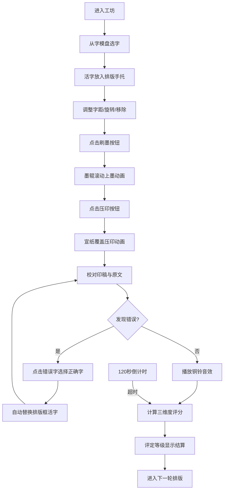

## 1. 产品概述

泥活字排版坊是一款基于浏览器的古代印刷工艺模拟交互游戏，用户在虚拟宋元书坊中扮演活字排印工，体验从拣字、排版到刷墨、压印、校对的完整活字印刷流程。

- 核心目的：通过沉浸式交互体验，让用户了解中国古代活字印刷术的工艺流程，寓教于乐
- 目标用户：对传统文化、历史工艺感兴趣的大众用户，教育场景下的学生群体
- 市场价值：传承中华传统文化，将古老工艺以数字化交互形式呈现，兼具教育意义与娱乐性

## 2. 核心功能

### 2.1 用户角色

| 角色 | 注册方式 | 核心权限 |
|------|----------|----------|
| 排印工 | 无需注册，直接进入 | 完整的排版印刷流程操作、评分结算、多轮次挑战 |

### 2.2 功能模块

1. **字模盘模块**：500个常用汉字展示、部首筛选、拼音首字母搜索、活字选中高亮
2. **排版手托模块**：活字排列、拖拽调整间距、旋转活字、移除活字、网格对齐
3. **刷墨压印模块**：墨辊滚动动画、墨迹粒子效果、宣纸压印动画、墨迹扩散/断续效果
4. **校对纠错模块**：印稿与原文对比、错误字标记、候选字选择、自动替换、铜铃音效
5. **评分结算模块**：三维度评分（排版准确率、上墨均匀度、压印清晰度）、等级评定、得分条形图
6. **计时系统**：虚拟香计时、120秒倒计时、超时强制结算

### 2.3 页面详情

| 页面名称 | 模块名称 | 功能描述 |
|----------|----------|----------|
| 工坊主页 | 字模盘 | 左侧木制字模盘，网格排列活字，支持部首筛选和拼音搜索 |
| 工坊主页 | 排版手托 | 中央区域长条形托板，支持活字排列、拖拽、旋转、移除 |
| 工坊主页 | 印刷台 | 刷墨按钮触发墨辊动画，压印按钮触发宣纸覆盖动画 |
| 工坊主页 | 校对区域 | 右侧显示印刷完成的纸张和原文对比，支持纠错操作 |
| 工坊主页 | 计时香 | 左下角虚拟香柱，粒子烟柱上升效果，120秒倒计时 |
| 工坊主页 | 结算弹窗 | 轮次完成后显示烫金篆体等级、三维度得分条形图 |

## 3. 核心流程

用户进入工坊 → 从字模盘拣字放入排版手托 → 调整字距与角度 → 点击刷墨 → 点击压印 → 校对印稿修正错误（不少于3处随机错误） → 计算评分与等级 → 进入下一轮。

## 4. 用户界面设计

### 4.1 设计风格

- **主色调**：深棕色木质纹理背景(#5c3d2e)、浅橡木色工作台(#c2a878)、暗红色边框(#8b0000)、米白色纸张(#f5ecd6)、深红色按钮(#a52222)
- **按钮风格**：方角木刻风格，悬停时下沉2px阴影，背景变为深褐(#6b2d2d)
- **字体**：主体使用仿宋体，活字为14px仿宋体黑色反白字，等级展示使用烫金篆体
- **布局**：三栏布局（左字模盘、中排版印刷区、右校对区），响应式下小于768px垂直堆叠
- **动画风格**：墨辊ease-in-out滚动2秒、宣纸皱褶波纹0.3Hz、活字闪烁0.5秒、烫金渐变效果

### 4.2 页面设计概述

| 页面名称 | 模块名称 | UI元素 |
|----------|----------|----------|
| 工坊主页 | 字模盘 | 浅棕色(#c8a87c)木盘、暗红色边框、网格布局、部首筛选按钮、拼音搜索框、活字悬停高亮 |
| 工坊主页 | 排版手托 | 深褐色(#6b4c2f)托板320×20px、活字带box-shadow投影、旋转按钮、移除×按钮、拖拽3px网格对齐 |
| 工坊主页 | 印刷台 | 黑色墨辊圆柱体、深棕色(#2b1a0a)半透明墨迹粒子、米白色宣纸、纸张皱褶伪元素、黑色(#1a0a00)字迹 |
| 工坊主页 | 校对区域 | 分隔线、印稿纸张显示、原文灰字(#999)对比、错误字红光闪烁、纠错面板三候选 |
| 工坊主页 | 计时香 | 100px高香柱、半透明灰色烟柱粒子、每秒上升3px |
| 工坊主页 | 结算弹窗 | 居中弹窗、烫金篆体大字、三维度条形图（从#e74c3c渐变到#27ae60） |

### 4.3 响应式设计

- **桌面端**（≥768px）：三栏水平布局，左字模盘25%、中排版区50%、右校对区25%
- **移动端**（<768px）：垂直堆叠排列，字模盘在上、排版区在中、校对区在下
- **触摸优化**：活字点击区域≥44px，拖拽操作支持触摸手势，按钮尺寸适配触摸操作

### 4.4 动画与动效

- **墨辊动画**：从左向右匀速滚动，ease-in-out曲线，持续2秒
- **墨迹粒子**：100个3-5px粒子，随机抖动±2px
- **宣纸压印**：2秒按压，边缘皱褶5种clip-path形状循环切换，波纹0.3Hz
- **活字反馈**：选中高亮、替换时绿色闪烁0.5秒、错误时红光闪烁
- **烟柱动画**：半透明灰色粒子，每秒上升3px
