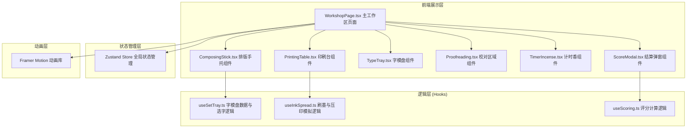

## 1. 架构设计



## 2. 技术描述

- **前端框架**：React 18 + TypeScript
- **构建工具**：Vite 5
- **状态管理**：Zustand 4
- **动画库**：Framer Motion 11
- **样式方案**：CSS Modules + 内联样式（动画相关）
- **字体**：仿宋体 (SimSun, FangSong)
- **后端**：纯前端应用，无后端
- **数据**：内置500常用汉字Mock数据，含拼音、部首分类

## 3. 目录结构

```
auto97/
├── package.json
├── vite.config.js
├── tsconfig.json
├── index.html
├── src/
│   ├── pages/
│   │   └── workshop/
│   │       └── WorkshopPage.tsx       # 主工作区页面
│   ├── components/
│   │   ├── ComposingStick.tsx         # 排版手托组件
│   │   ├── PrintingTable.tsx          # 印刷台组件
│   │   ├── TypeTray.tsx               # 字模盘组件
│   │   ├── Proofreading.tsx           # 校对区域组件
│   │   ├── TimerIncense.tsx           # 计时香组件
│   │   └── ScoreModal.tsx             # 结算弹窗组件
│   ├── composables/
│   │   ├── useSetTray.ts              # 字模盘数据与选字逻辑
│   │   ├── useInkSpread.ts            # 刷墨与压印模拟逻辑
│   │   └── useScoring.ts              # 评分计算逻辑
│   ├── store/
│   │   └── useWorkshopStore.ts        # Zustand全局状态
│   ├── data/
│   │   └── characters.ts              # 500常用汉字数据
│   ├── types/
│   │   └── index.ts                   # TypeScript类型定义
│   ├── utils/
│   │   ├── audio.ts                   # Web Audio API音效工具
│   │   └── pinyin.ts                  # 拼音首字母工具
│   ├── App.tsx
│   ├── main.tsx
│   └── index.css
```

## 4. 核心类型定义

```typescript
// 活字类型
interface Character {
  id: string;
  char: string;
  pinyin: string;
  firstLetter: string;
  radical: string;
  strokeCount: number;
}

// 排版手托中的活字
interface TypesetChar extends Character {
  position: number;
  rotation: number;
  isCorrect?: boolean;
  expectedChar?: string;
}

// 墨迹粒子
interface InkParticle {
  id: string;
  x: number;
  y: number;
  size: number;
  opacity: number;
  jitterX: number;
  jitterY: number;
}

// 评分结果
interface ScoreResult {
  accuracy: number;
  inkUniformity: number;
  impressionClarity: number;
  total: number;
  grade: '雕版工' | '排字匠' | '活字大师';
}

// 游戏状态
type GamePhase = 'selecting' | 'typesetting' | 'inking' | 'pressing' | 'proofreading' | 'scoring';
```

## 5. 状态管理 (Zustand Store)

```typescript
interface WorkshopState {
  phase: GamePhase;
  currentRound: number;
  timeRemaining: number;
  selectedChar: Character | null;
  typesetChars: TypesetChar[];
  targetText: string;
  inkParticles: InkParticle[];
  inkThickness: number;
  pressDuration: number;
  errors: ProofreadError[];
  score: ScoreResult | null;
  
  selectChar: (char: Character | null) => void;
  addToTypeset: (char: Character) => void;
  removeFromTypeset: (id: string) => void;
  rotateChar: (id: string) => void;
  moveChar: (id: string, position: number) => void;
  startInking: () => void;
  startPressing: () => void;
  completePressing: () => void;
  correctError: (errorId: string, correctChar: Character) => void;
  calculateScore: () => void;
  nextRound: () => void;
  resetRound: () => void;
}
```

## 6. 核心算法说明

### 6.1 墨迹均匀度计算
```
1. 将墨迹区域划分为M×N网格
2. 统计每个网格内的墨迹粒子数量与不透明度
3. 计算所有网格墨迹浓度的标准差σ
4. σ < 10 → 40分，10 ≤ σ < 20 → 30分，σ ≥ 20 → 20分
```

### 6.2 压印清晰度计算
```
1. 提取印刷字迹的边缘像素
2. 计算边缘处的灰度梯度变化率
3. 梯度变化率 > 0.8 → 30分，0.5~0.8 → 20分，< 0.5 → 10分
```

### 6.3 排版准确率计算
```
1. 逐字对比排版内容与目标文本
2. 每个正确字符得2分，满分30分
3. 错误字符不倒扣分
```

### 6.4 随机错误注入
```
1. 每轮随机注入不少于3处错误
2. 错误类型：
   - 顺序颠倒：交换相邻两字位置
   - 缺字：随机移除1个字
   - 字模歪斜：将字旋转90度或180度
   - 错字：替换为形近字
```

## 7. 性能优化策略

1. **字模盘渲染优化**：
   - 使用虚拟滚动（Virtual Scrolling）仅渲染可视区域活字
   - 500字分批次加载，首屏渲染延迟<100ms
   - React.memo包裹活字项组件，避免不必要重渲染

2. **动画性能优化**：
   - 墨迹粒子使用CSS transform而非top/left定位
   - 开启GPU加速（will-change: transform）
   - Framer Motion使用layout animations减少重排
   - 粒子动画帧率控制≥50fps

3. **内存优化**：
   - 轮次切换时清理粒子数组与事件监听
   - 使用useMemo/useCallback缓存计算结果与回调
   - 避免闭包导致的内存泄漏

4. **响应式优化**：
   - CSS媒体查询实现<768px垂直堆叠
   - 触摸事件与鼠标事件统一处理
   - 移动端减少粒子数量保证流畅
