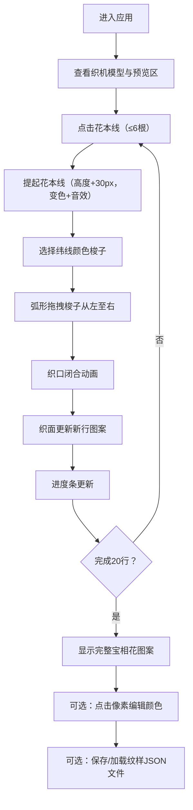

## 1. 产品概述

蜀锦提花织机交互模拟器，解决传统蜀锦织造工艺难以直观理解的问题，通过数字化方式重现"通经断纬、异色共织"的工艺精髓。面向传统文化爱好者、学生和手工艺者，提供沉浸式的蜀锦织造体验。

通过交互式花楼织机模型，让用户亲手操作花本线提拉、纬线穿梭，直观理解经纬交织形成图案的原理，感受蜀锦织造的工匠精神和文化价值。

## 2. 核心功能

### 2.1 用户角色
| 角色 | 注册方式 | 核心权限 |
|------|----------|----------|
| 普通用户 | 无需注册 | 体验完整织造流程、编辑纹样、保存加载纹样 |

### 2.2 功能模块
1. **织机操作区**：花楼织机模型、36根花本线交互、五色纬线梭子、纬线拖拽穿梭
2. **图案预览区**：400x300px织面展示、编织进度条、宝相花图案生成
3. **纹样编辑区**：像素级颜色修改、调色盘选择、纹样保存/加载

### 2.3 页面详情
| 页面名称 | 模块名称 | 功能描述 |
|----------|----------|----------|
| 主页面 | 织机模型 | 展示简化花楼织机（花楼、经轴、综框、筘、卷布轴），36根朱红色花本线可点击提起（最多6根） |
| 主页面 | 纬线交互 | 五色梭子（青、粉、金、蓝、绿），从左至右弧形拖拽（跨度200px）完成穿纬 |
| 主页面 | 织面展示 | 米白色背景织面，实时显示经纬交织图案，累计20行显示完整宝相花 |
| 主页面 | 纹样编辑 | 点击8x8px像素点，弹出五色调色盘修改颜色，自动更新后续图案行 |
| 主页面 | 文件操作 | 保存纹样为JSON文件（花本线状态+每行颜色数组），加载已有纹样继续编织 |

## 3. 核心流程

用户打开应用后，首先看到左侧的花楼织机模型和右侧的图案预览区。用户点击花楼上的花本线将其提起（最多6根），提起的花本线高度上升30px并变为亮红色，伴随木质咔嗒音效。然后从左侧选择一个纬线颜色的梭子，按住鼠标水平拖拽至右侧（路径为弧形弧线），拖拽过程中显示丝线光泽的渐变拖尾。拖拽完成后，织口闭合动画触发，织面上新增一行图案，进度条实时更新。重复此过程累计20行后，织面显示完整的宝相花图案。用户可随时点击织面上的像素点修改颜色，或通过保存/加载功能管理纹样文件。

## 4. 用户界面设计

### 4.1 设计风格
- **主色调**：墨黑#1a1a2e、檀木#8b5e3c、宣纸白#f5f0e8
- **点缀色**：朱红#c04040（花本线）、亮红#ff4444（提起状态）、五色纬线（青#00aaff、粉#ff88cc、金#eebb00、蓝#4466aa、绿#44bb44）
- **字体**：宋体（SimSun, serif），体现宋代美学风格
- **背景**：淡木纹纹理（CSS渐变模拟）
- **按钮风格**：檀木色圆角按钮，悬停时有木纹高光效果

### 4.2 页面设计概述
| 页面名称 | 模块名称 | UI元素 |
|----------|----------|--------|
| 主页面 | 织机操作区 | 花楼顶部36根花本线（悬停抖动rotate(2deg) 0.3s）、经轴、综框、筘、卷布轴、左侧五色梭子 |
| 主页面 | 图案预览区 | 400x300px米白色织面、下方进度条（百分比显示）、宝相花图案（菱形+曲线，五色混合） |
| 主页面 | 控制区 | 保存按钮、加载按钮、重置按钮 |
| 主页面 | 交互反馈 | 花本线提起动画、木质咔嗒音效（440Hz，0.1s）、纬线拖尾动画（box-shadow渐变）、织面渐显动画（opacity 0→1，0.5s） |

### 4.3 响应式
- **桌面端（>1024px）**：左右二分式布局，左侧织机操作区，右侧图案预览区
- **平板端（768px-1024px）**：保持左右布局，适当缩小元素尺寸
- **移动端（<768px）**：上下布局，织机操作区在上，图案预览区在下，优化触摸交互区域

### 4.4 动效设计
- **花本线悬停**：transform: rotate(2deg)，持续0.3s，轻微抖动效果
- **花本线点击**：y轴上移30px，颜色从#c04040变为#ff4444，播放440Hz音频0.1s
- **纬线拖拽**：box-shadow从当前纬线色渐变为透明，跟随鼠标位置
- **织面更新**：新行opacity从0到1，持续0.5s，纸张铺展效果
- **织口闭合**：综框上下快速移动动画，模拟织机打纬动作

### 4.5 性能要求
- 织面刷新频率 ≥ 30FPS
- 花本线点击响应时间 < 100ms
- 纬线拖拽每帧更新拖尾位置，无明显卡顿
