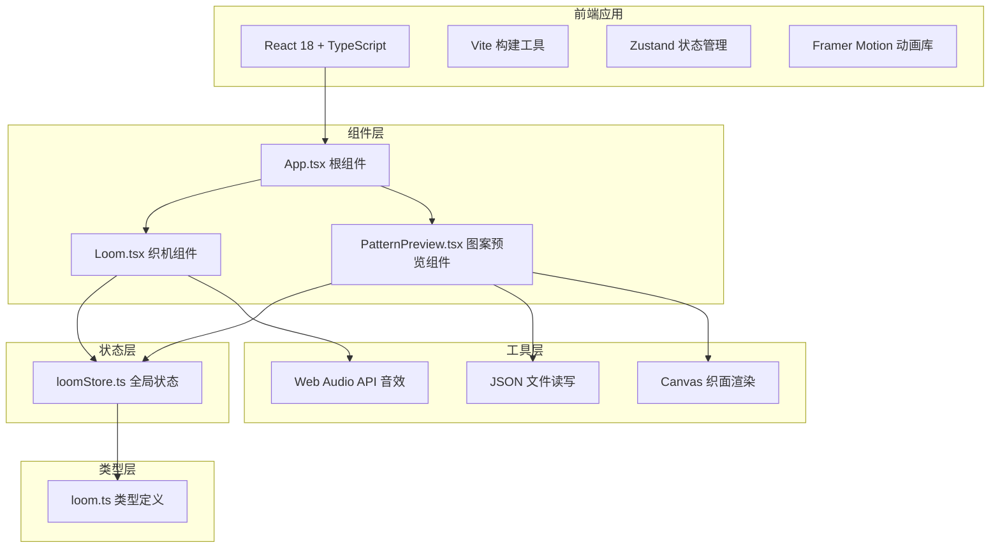
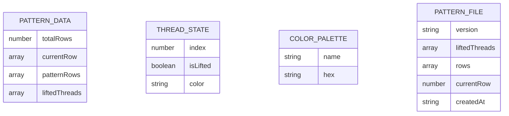

## 1. 架构设计



## 2. 技术描述

- **前端框架**：React@18 + TypeScript@5
- **构建工具**：Vite@5（端口3000）
- **状态管理**：Zustand@4
- **动画库**：Framer Motion@11
- **无后端**，数据存储于本地JSON文件
- **织面渲染**：HTML5 Canvas API
- **音效合成**：Web Audio API

## 3. 路由定义

| 路由 | 用途 |
|------|------|
| / | 主页面，包含织机操作区和图案预览区 |

## 4. 数据模型

### 4.1 数据模型定义



### 4.2 类型定义

```typescript
// src/types/loom.ts
export interface ThreadState {
  index: number;
  isLifted: boolean;
}

export interface PatternRow {
  colors: string[]; // 36个像素的颜色数组
}

export interface PatternData {
  liftedThreads: boolean[]; // 36根花本线状态
  rows: PatternRow[]; // 20行图案数据
  currentRow: number; // 当前编织行索引
  totalRows: number; // 总行数
}

export interface PatternFile {
  version: string;
  liftedThreads: boolean[];
  rows: string[][];
  currentRow: number;
  createdAt: string;
}

export const WEFT_COLORS = [
  { name: '青色', hex: '#00aaff' },
  { name: '粉色', hex: '#ff88cc' },
  { name: '金色', hex: '#eebb00' },
  { name: '蓝色', hex: '#4466aa' },
  { name: '绿色', hex: '#44bb44' },
];

export const COLORS = {
  inkBlack: '#1a1a2e',
  sandalwood: '#8b5e3c',
  ricePaper: '#f5f0e8',
  cinnabar: '#c04040',
  brightRed: '#ff4444',
  warpWhite: '#e8e0d0',
} as const;
```

## 5. 文件结构

```
auto98/
├── package.json
├── vite.config.js
├── tsconfig.json
├── index.html
├── src/
│   ├── App.tsx
│   ├── main.tsx
│   ├── index.css
│   ├── components/
│   │   ├── Loom.tsx
│   │   └── PatternPreview.tsx
│   ├── store/
│   │   └── loomStore.ts
│   └── types/
│       └── loom.ts
└── .trae/
    └── documents/
        ├── PRD_蜀锦提花织机.md
        └── TECH_蜀锦提花织机.md
```

## 6. 核心模块说明

### 6.1 Zustand 状态管理（loomStore.ts）

```typescript
// 状态结构
{
  // 花本线状态：36根，每根isLifted
  liftedThreads: boolean[];
  
  // 当前行颜色数组：36个像素颜色
  currentRowColors: string[];
  
  // 已编织的行：每行36个颜色
  patternRows: string[][];
  
  // 当前行索引（0-19）
  currentRowIndex: number;
  
  // 宝相花基础图案（用于生成20行预设图案）
  basePattern: string[][];
  
  // 动作方法：
  - toggleThread(index: number)
  - setCurrentColor(index: number, color: string)
  - completeRow()
  - updatePixel(row: number, col: number, color: string)
  - savePattern()
  - loadPattern(data: PatternFile)
  - resetLoom()
}
```

### 6.2 织机组件（Loom.tsx）

核心功能：
- 渲染织机结构（花楼、经轴、综框、筘、卷布轴）
- 36根花本线的点击交互（最多提起6根）
- 花本线悬停抖动动画
- 点击音效合成（Web Audio API）
- 五色纬线梭子渲染
- 纬线拖拽交互（弧形路径，跨度200px）
- 拖拽拖尾动画（box-shadow渐变）
- 织口闭合动画（framer-motion）
- 完成一行后触发状态更新

### 6.3 图案预览组件（PatternPreview.tsx）

核心功能：
- Canvas渲染400x300px织面
- 8x8px像素网格（36列 x 20行 = 288px x 160px，居中显示）
- 逐行渐显动画（opacity 0→1，0.5s）
- 点击像素点弹出调色盘
- 调色盘颜色修改
- 编织进度条（百分比）
- 宝相花完整图案显示（20行完成后）
- 保存纹样为JSON文件
- 加载JSON纹样文件
- 文件输入处理

### 6.4 性能优化

1. **Canvas渲染优化**：
   - 使用requestAnimationFrame确保≥30FPS
   - 仅在图案变化时重绘，避免不必要的渲染
   - 离屏Canvas预渲染图案行

2. **状态更新优化**：
   - Zustand选择器优化，避免不必要的重渲染
   - 花本线状态使用浅比较
   - 拖拽状态使用useRef避免重渲染

3. **动画优化**：
   - Framer Motion使用will-change优化
   - 拖拽拖尾使用CSS transform而非top/left
   - 花本线动画使用GPU加速属性（transform、opacity）
