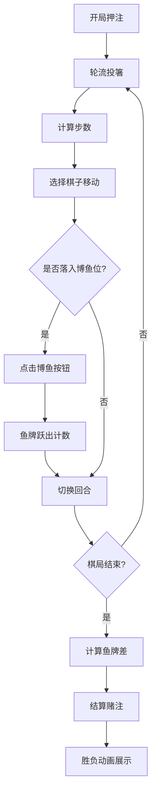

## 1. 产品概述
六博棋戏是一款基于战国时期博戏文化的多人对战Web游戏，玩家在虚拟楚墓墓室中通过投箸行棋、博鱼夺筹、赌注结算体验古代博弈乐趣。

## 2. 核心功能

### 2.1 用户角色
| 角色 | 进入方式 | 核心权限 |
|------|----------|----------|
| 玩家（朱红虎方） | 单人模式/双人对战 | 控制六枚虎形棋子，投箸行棋，博鱼夺筹 |
| 玩家（玄青豹方） | 双人对战/AI控制 | 控制六枚豹形棋子，投箸行棋，博鱼夺筹 |
| AI对手 | 单人模式自动启用 | 采用贪心策略控制豹方棋子 |

### 2.2 功能模块
1. **棋盘模块**：8x8青石网格棋盘，中央水银池，棋子渲染与移动
2. **投箸模块**：六根箸投掷动画与步数计算
3. **博鱼模块**：水银池鱼牌抓取与粒子特效
4. **结算模块**：赌注结算动画与筹码流转
5. **AI模块**：单人模式AI对手决策逻辑
6. **状态面板**：实时棋局信息展示

### 2.3 页面详情
| 页面名称 | 模块名称 | 功能描述 |
|----------|----------|----------|
| 游戏主界面 | 棋盘组件 | 8x8网格渲染，水银池效果，3D棋子，路径高亮 |
| 游戏主界面 | 投箸组件 | 点击投掷，箸散落动画，步数计算 |
| 游戏主界面 | 博鱼组件 | 弹出博鱼按钮，鱼牌跃出动画，水花粒子特效 |
| 游戏主界面 | 结算组件 | 金色光柱升起，筹码飘落，胜负展示 |
| 游戏主界面 | 状态面板 | 轮次、步数、鱼牌数、筹码实时显示 |
| 游戏主界面 | AI模块 | 贪心策略决策，思考动画 |

## 3. 核心流程

## 4. 用户界面设计

### 4.1 设计风格
- **主色调**：暗金#b8860b、墨黑#1a1a1a、青石#5a5a5a
- **点缀色**：朱红#d4322f（虎方）、玄青#3c3b6e（豹方）、铜锈绿#4a7c59（按钮）、铜黄#cda434（悬停）
- **水银池**：银灰渐变#c0c0c0到#808080
- **按钮风格**：仿铜锈绿，悬停变铜黄，矩形带竹简边框
- **字体**：中文书法风格标题 + 宋体正文
- **布局**：棋盘居中，左侧状态面板，右侧投箸区，顶部筹码显示
- **边框**：仿竹简纹理重复平铺

### 4.2 页面设计概述
| 页面名称 | 模块名称 | UI元素 |
|----------|----------|--------|
| 游戏主界面 | 棋盘 | 8x8青石网格，中央4x4水银池，12条金色鱼牌，粒子波纹 |
| 游戏主界面 | 棋子 | 虎形3D（2格）、豹形3D（1格），CSS 3D变换，选中高亮 |
| 游戏主界面 | 投箸区 | 6根竖立青竹签，点击散落动画，朱色刻字面 |
| 游戏主界面 | 状态面板 | 暗金文字，墨黑背景，竹简边框 |
| 游戏主界面 | 结算动画 | 金色光柱，筹码飘落，赢家头像 |
| 游戏主界面 | 粒子特效 | 投箸散落、水花溅起、光柱光晕 |

### 4.3 响应式设计
- 桌面端：棋盘480x480px，三栏布局（状态面板+棋盘+投箸区）
- 平板端：棋盘400x400px，两栏布局（上状态面板+中棋盘+下投箸区）
- 手机端：棋盘320x320px，单栏垂直布局，触控优化
- 触控目标最小44x44px，棋子点击区域扩大

### 4.4 性能要求
- 棋盘渲染FPS ≥ 50
- 投箸动画FPS ≥ 30
- 博鱼粒子特效FPS ≥ 30
- 使用CSS transform和opacity实现硬件加速动画
