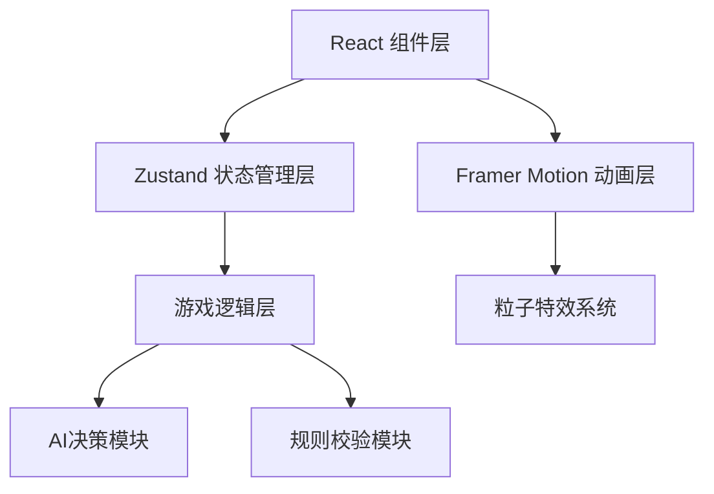

## 1. 架构设计


## 2. 技术描述
- **前端框架**：React 18 + TypeScript 5
- **构建工具**：Vite 5
- **状态管理**：Zustand 4
- **动画库**：Framer Motion 11
- **开发语言**：TypeScript（严格模式）
- **样式方案**：CSS Modules + CSS Variables
- **无后端**：纯前端游戏，状态全部本地管理

## 3. 目录结构
```
src/
├── store/
│   └── gameStore.ts          # Zustand全局状态管理
├── components/
│   ├── GameBoard.tsx         # 棋盘组件（8x8网格、水银池、棋子）
│   ├── DiceCast.tsx          # 六箸投掷组件
│   ├── FishBoi.tsx           # 博鱼组件
│   ├── Settlement.tsx        # 结算动画组件
│   ├── StatusPanel.tsx       # 状态面板组件
│   └── Piece.tsx             # 棋子组件（虎/豹3D效果）
├── hooks/
│   ├── useAI.ts              # AI决策Hook
│   └── useGameLogic.ts       # 游戏逻辑Hook
├── types/
│   └── game.ts               # TypeScript类型定义
├── utils/
│   ├── constants.ts          # 游戏常量
│   └── helpers.ts            # 工具函数
├── App.tsx                   # 主应用组件
└── main.tsx                  # 入口文件
```

## 4. 数据模型

### 4.1 核心类型定义
```typescript
// 玩家类型
type Player = 'tiger' | 'leopard';

// 棋子类型
interface Piece {
  id: string;
  type: 'tiger' | 'leopard';
  player: Player;
  position: { x: number; y: number };
  size: 1 | 2; // 1格或2格
  isSelected: boolean;
}

// 鱼牌类型
interface FishCard {
  id: string;
  isCaught: boolean;
  caughtBy: Player | null;
}

// 箸类型
interface Zhu {
  id: number;
  isUp: boolean; // 正面朝上（朱色）
}

// 游戏状态
interface GameState {
  phase: 'betting' | 'playing' | 'settling' | 'ended';
  currentPlayer: Player;
  turn: number;
  pieces: Piece[];
  fishCards: FishCard[];
  zhus: Zhu[];
  lastSteps: number;
  bets: { tiger: number; leopard: number };
  fishCount: { tiger: number; leopard: number };
  isAITurn: boolean;
  showFishBoi: boolean;
  boiPosition: { x: number; y: number } | null;
  selectedPiece: string | null;
  validMoves: { x: number; y: number }[];
  winner: Player | null;
}
```

### 4.2 常量定义
```typescript
const BOARD_SIZE = 8;
const MERCURY_POOL = { x: 2, y: 2, width: 4, height: 4 };
const BOI_POSITIONS = [
  { x: 2, y: 2 }, { x: 5, y: 2 },
  { x: 2, y: 5 }, { x: 5, y: 5 }
];
const FISH_COUNT = 12;
const ZHU_COUNT = 6;
const PIECE_COUNT_PER_PLAYER = 6;
```

## 5. 核心模块说明

### 5.1 游戏状态管理 (gameStore.ts)
- 使用Zustand create创建store
- 包含所有游戏状态和action方法
- 方法：selectPiece, movePiece, castZhus, catchFish, settleBets, resetGame

### 5.2 棋盘组件 (GameBoard.tsx)
- 8x8网格使用CSS Grid渲染
- 水银池使用绝对定位+渐变背景+粒子波纹动画
- 棋子使用CSS 3D变换（transform-style: preserve-3d）
- 移动路径使用半透明箭头SVG，framer-motion动画
- 棋子移动动画：0.3秒ease-out缓出

### 5.3 投箸组件 (DiceCast.tsx)
- 6根箸竖立排列，点击触发投掷
- 每根箸50%概率正面朝上
- 投掷动画：framer-motion实现箸沿随机方向飞出，最后落定
- 步数计算：正面朝上数量（0-6）

### 5.4 博鱼组件 (FishBoi.tsx)
- 棋子落入博鱼位时弹出博鱼按钮
- 点击后鱼牌从池中跃出，旋转180度
- 水花粒子特效：20个银色半透明粒子，0.5秒消散
- 鱼牌计数+1

### 5.5 结算组件 (Settlement.tsx)
- 终局时棋盘中央升起金色光柱（CSS动画0.8秒）
- 光柱顶部显示赢家头像和赢取筹码数
- 败方筹码向下飘落消失动画
- 根据鱼牌差计算赌注倍数

### 5.6 AI模块 (useAI.ts)
- 贪心策略：优先尝试走入可博鱼的4个格位
- 次优策略：逼近对方虎形大棋
- 思考动画：头像素描快速描边0.3秒
- 延迟500ms执行移动，模拟思考过程

## 6. 性能优化
- 使用CSS transform和opacity动画，开启GPU加速
- 粒子特效使用requestAnimationFrame，限制最大粒子数
- 状态更新使用Zustand选择性订阅，避免不必要重渲染
- 棋盘格子使用memo缓存，仅在状态变化时重绘
- 动画使用framer-motion的layout动画优化
