## 1. 产品概述

符文合成与战斗验证系统，玩家通过拖拽基础符文合成高阶符文，组成技能组合在自动战斗中对抗怪物，实时观察伤害数值、元素克制效果和战斗节奏。

- 核心玩法：符文拖拽合成 + 自动战斗演武
- 目标用户：游戏爱好者、策略类玩家
- 产品价值：提供直观的元素克制和战斗系统验证体验

## 2. 核心功能

### 2.1 功能模块

1. **符文管理模块**：基础符文池展示、符文拖拽交互、合成槽、配方匹配、符文背包
2. **战斗演武模块**：怪物生成与AI、自动攻击系统、伤害计算、元素克制、战斗特效
3. **实时统计面板**：波次、击杀数、最高连击统计

### 2.2 页面详情

| 页面名称 | 模块名称 | 功能描述 |
|----------|----------|----------|
| 主界面 | 符文池区域 | 左下角扇形排列4种基础符文卡片，支持拖拽 |
| 主界面 | 合成槽区域 | 三个合成槽，接受拖拽符文，匹配配方合成高阶符文 |
| 主界面 | 背包区域 | 展示已合成的高阶符文，可装备到技能栏 |
| 主界面 | 战斗场景 | Canvas渲染的战斗区域，怪物从右侧出现，自动战斗 |
| 主界面 | 统计面板 | 右上角实时显示波次、击杀数、最高连击 |

## 3. 核心流程

```mermaid
flowchart LR
    A["选择基础符文"] --> B["拖拽到合成槽"]
    B --> C["三个符文填满"]
    C --> D["匹配合成配方"]
    D --> E["合成成功/失败"]
    E --> F["高阶符文存入背包"]
    F --> G["装备符文到技能栏"]
    G --> H["开始自动战斗"]
    H --> I["怪物分批出现"]
    I --> J["自动攻击最近怪物"]
    J --> K["伤害计算&元素克制"]
    K --> L["显示飘字伤害"]
    L --> M["怪物死亡/继续战斗"]
    M --> N["统计数据更新"]
```

## 4. 用户界面设计

### 4.1 设计风格

- **主色调**：#00E5FF（赛博朋克青）
- **辅助色**：#FF00EA（赛博朋克粉）
- **背景色**：#121212（深色背景）
- **符文主题色**：
  - 火焰：#FF6B35 → #FF4B1F
  - 寒冰：#4FC3F7 → #0288D1
  - 雷电：#FFF176 → #FDD835
  - 暗影：#7E57C2 → #5E35B1
- **按钮风格**：圆角8px，悬停发光效果，点击涟漪动画
- **字体**：Orbitron（赛博朋克风格标题）+ Roboto（正文）
- **卡片风格**：毛玻璃半透明背景，霓虹边框，微光脉冲动画
- **图标风格**：线性霓虹风格图标

### 4.2 页面设计概述

| 页面名称 | 模块名称 | UI Elements |
|----------|----------|-------------|
| 主界面 | 符文池 | 扇形布局，60x60px卡片，渐变背景，脉冲动画，拖拽半透明 |
| 主界面 | 合成槽 | 虚线边框高亮，拖入时金色边框 #FFD700，粒子爆炸特效 |
| 主界面 | 战斗场景 | 深色星空渐变背景 #0A0E27→#1A1A3A，Pixi.js Canvas渲染 |
| 主界面 | 怪物 | 头顶血条，左右摇摆动画，死亡碎片消散效果 |
| 主界面 | 伤害飘字 | 向上移动淡出，1.2s持续时间 |
| 主界面 | 统计面板 | 毛玻璃背景，右上角固定，实时数据更新 |

### 4.3 交互效果

- **拖拽**：卡片跟随鼠标，透明度0.7
- **悬停**：卡片放大1.05倍，边框发光
- **合成成功**：粒子爆炸从中心扩散，0.6s
- **按钮点击**：环形涟漪扩散，0.4s
- **卡片过渡**：0.3s ease-in-out 平滑动画
- **怪物行走**：左右摇摆5px，频率0.3s
- **怪物死亡**：缩小并旋转360度，0.5s

### 4.4 性能要求

- 50个实体同时存在时保持至少30fps
- Pixi.js批量精灵渲染优化
- 动画使用CSS和Pixi.js原生动画系统

### 4.5 元素克制系统

- 克制链：火→冰→雷→暗影→火
- 同元素伤害：降低50%
- 相克元素伤害：提高100%
