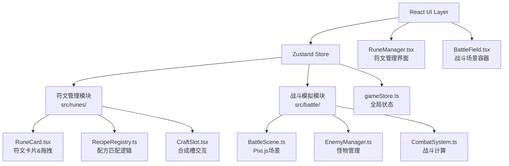

## 1. 架构设计



## 2. 技术描述

- **前端框架**：React@18 + TypeScript@5
- **构建工具**：Vite@5
- **状态管理**：Zustand@4
- **渲染引擎**：Pixi.js@7
- **样式方案**：CSS Modules + CSS Variables
- **路径别名**：@/ 指向 src/ 目录

## 3. 目录结构

```
src/
├── main.tsx                    # 应用入口
├── App.tsx                     # 根组件
├── store/
│   └── gameStore.ts           # Zustand 状态管理
├── runes/                      # 符文管理模块
│   ├── RuneManager.tsx        # 符文管理主组件
│   ├── RuneCard.tsx           # 符文卡片组件
│   ├── CraftSlot.tsx          # 合成槽组件
│   ├── RecipeRegistry.ts      # 合成配方案例
│   └── types.ts               # 符文类型定义
├── battle/                     # 战斗模拟模块
│   ├── BattleField.tsx        # 战斗场景容器
│   ├── BattleScene.ts         # Pixi.js 场景
│   ├── EnemyManager.ts        # 怪物管理器
│   ├── CombatSystem.ts        # 战斗系统
│   └── types.ts               # 战斗类型定义
├── components/                 # 通用组件
│   └── StatsPanel.tsx         # 统计面板
├── styles/
│   ├── globals.css            # 全局样式
│   └── variables.css          # CSS 变量
└── utils/
    └── animation.ts           # 动画工具函数
```

## 4. 数据模型

### 4.1 符文类型定义

```typescript
type ElementType = 'fire' | 'ice' | 'thunder' | 'shadow';

interface Rune {
  id: string;
  name: string;
  element: ElementType;
  tier: 'basic' | 'advanced';
  damage: number;
  description: string;
  color: { from: string; to: string };
}

interface Recipe {
  id: string;
  ingredients: ElementType[];
  result: string; // 结果符文ID
  name: string;
}

interface CraftSlot {
  index: number;
  rune: Rune | null;
}
```

### 4.2 战斗类型定义

```typescript
interface Enemy {
  id: string;
  name: string;
  element: ElementType;
  maxHp: number;
  currentHp: number;
  attack: number;
  x: number;
  y: number;
  speed: number;
  sprite: any; // Pixi.js Sprite
}

interface DamageNumber {
  id: string;
  value: number;
  x: number;
  y: number;
  isCritical: boolean;
  element: ElementType;
}

interface BattleState {
  wave: number;
  kills: number;
  maxCombo: number;
  currentCombo: number;
  enemies: Enemy[];
  isRunning: boolean;
}
```

### 4.3 Store 状态定义

```typescript
interface GameState {
  // 符文相关
  basicRunes: Rune[];
  advancedRunes: Rune[];
  inventory: Rune[];
  equippedSkills: Rune[];
  craftSlots: CraftSlot[];
  
  // 战斗相关
  battleState: BattleState;
  
  // Actions
  addToCraftSlot: (rune: Rune, slotIndex: number) => void;
  removeFromCraftSlot: (slotIndex: number) => void;
  craftRunes: () => void;
  equipRune: (rune: Rune, skillIndex: number) => void;
  startBattle: () => void;
  pauseBattle: () => void;
  resetBattle: () => void;
}
```

## 5. 核心算法

### 5.1 配方匹配算法

```typescript
function matchRecipe(slots: CraftSlot[], recipes: Recipe[]): Recipe | null {
  const elements = slots
    .filter(s => s.rune)
    .map(s => s.rune!.element)
    .sort();
  
  for (const recipe of recipes) {
    const sortedIngredients = [...recipe.ingredients].sort();
    if (arraysEqual(elements, sortedIngredients)) {
      return recipe;
    }
  }
  return null;
}
```

### 5.2 元素克制伤害计算

```typescript
const elementAdvantage: Record<ElementType, ElementType> = {
  fire: 'ice',
  ice: 'thunder',
  thunder: 'shadow',
  shadow: 'fire',
};

function calculateDamage(
  skillElement: ElementType,
  enemyElement: ElementType,
  baseDamage: number
): number {
  if (skillElement === enemyElement) {
    return baseDamage * 0.5; // 同元素减伤50%
  }
  if (elementAdvantage[skillElement] === enemyElement) {
    return baseDamage * 2; // 克制增伤100%
  }
  return baseDamage;
}
```

### 5.3 最近怪物查找

```typescript
function findNearestEnemy(
  enemies: Enemy[],
  fromX: number,
  fromY: number
): Enemy | null {
  if (enemies.length === 0) return null;
  
  let nearest = enemies[0];
  let minDist = Infinity;
  
  for (const enemy of enemies) {
    const dist = Math.hypot(enemy.x - fromX, enemy.y - fromY);
    if (dist < minDist) {
      minDist = dist;
      nearest = enemy;
    }
  }
  
  return nearest;
}
```

## 6. 性能优化策略

1. **Pixi.js 批量渲染**：使用 `PIXI.ParticleContainer` 管理大量精灵
2. **对象池模式**：怪物和伤害数字复用对象，避免频繁GC
3. **节流更新**：统计面板数据每100ms更新一次
4. **CSS 硬件加速**：动画使用 `transform` 和 `opacity`
5. **事件委托**：拖拽事件使用事件委托减少监听器
