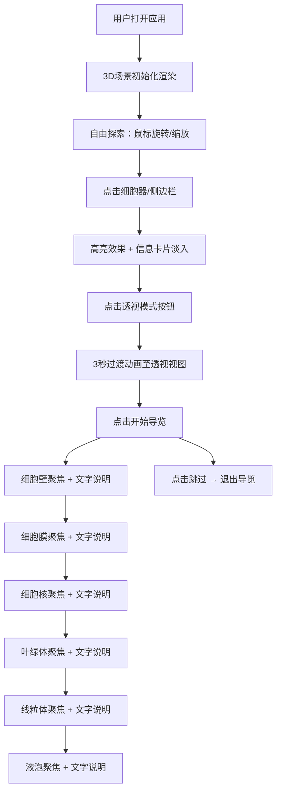

## 1. 产品概述

植物细胞3D可视化教学平台，面向生物学教师与学生，提供可交互的植物细胞内部结构沉浸式探索体验。通过逼真的3D模型与动态导览，解决传统教学中抽象、平面化的细胞结构难以直观理解的痛点，显著提升生物课堂的教学效率与学习兴趣。

## 2. 核心功能

### 2.1 功能模块
1. **主视口页面**：3D细胞模型渲染、视角交互、高亮显示、信息面板
2. **侧边导航模块**：细胞器列表、颜色标识、快速聚焦跳转
3. **底部工具栏**：透视模式切换、结构解析导览启动
4. **信息弹窗模块**：细胞器详情卡片、可拖拽、淡入淡出动画

### 2.2 页面详情

| 页面名称 | 模块名称 | 功能描述 |
|----------|----------|----------|
| 主视口 | 3D细胞场景 | 直径50单位球形植物细胞，细胞壁半透明浅绿带网格，内部含叶绿体（深绿椭圆）、线粒体（红色短棒）、细胞核（紫色球体带核仁）、液泡（半透明淡蓝中心大球） |
| 主视口 | 视角交互 | 鼠标拖拽旋转、滚轮缩放、相机平滑阻尼动画（0.3s过渡） |
| 主视口 | 点击拾取 | Raycaster检测点击细胞器，触发高亮（边缘发光+1.1倍放大）+信息弹窗 |
| 主视口 | 透视模式 | 细胞壁透明度降至0.1，细胞器半透明并显示内部结构（叶绿体基粒小点、细胞核染色质细丝），相机自动旋转至45度俯视，3秒过渡动画 |
| 主视口 | 结构导览 | 按预设路径（细胞壁→细胞膜→细胞核→叶绿体→线粒体→液泡）依次聚焦，每站停留4秒，中央打字机效果3行文字说明，可跳过 |
| 侧边栏 | 细胞器列表 | 240px固定宽度，半透明深蓝毛玻璃背景，底部微光渐变，每项带颜色圆点，点击触发相机平滑聚焦动画 |
| 信息卡片 | 详情展示 | 白色背景2px浅灰边框12px圆角，标题18px加粗，内容14px常规，支持拖拽，淡入淡出切换动画 |
| 底部工具栏 | 操作按钮 | 毛玻璃风格图标按钮，悬停上浮3px，点击凹陷，0.3s CSS过渡 |

## 3. 核心流程

用户打开应用 → 进入主视口看到3D细胞模型 → 通过鼠标旋转/缩放探索结构 → 点击任意细胞器或侧边栏列表项 → 细胞器高亮 + 右上角信息卡片渐入 → 点击底部透视模式按钮 → 3秒动画过渡至半透明内观视角 → 点击开始导览按钮 → 按路径依次自动聚焦每个细胞器并播放文字说明 → 可随时点击跳过导览。

## 4. 用户界面设计

### 4.1 设计风格
- **主色调**：深邃藏青背景 `#0B1D3A`（模拟显微镜暗视野），搭配浅色文字
- **辅助色**：细胞壁浅绿、叶绿体深绿、线粒体红、细胞核紫、液泡淡蓝
- **按钮风格**：毛玻璃（backdrop-filter: blur）、圆角、微光渐变描边
- **字体**：无衬线现代字体，标题18px加粗，正文14px常规
- **布局**：左侧240px固定侧边栏 + 中央70%宽度3D视口 + 底部固定工具栏
- **视觉特效**：毛玻璃、圆角卡片、微光渐变、柔和阴影

### 4.2 页面设计概览

| 区域 | 模块 | UI元素 |
|------|------|--------|
| 左侧 | 侧边栏 | 240px宽、半透明深蓝（rgba(10,30,70,0.75)）、毛玻璃、底部微光渐变、细胞器列表带彩色圆点、hover高亮 |
| 中央 | 3D视口 | WebGL渲染画布、深色背景#0B1D3A、鼠标交互光标变化（悬停可点击目标时指针） |
| 右上角 | 信息卡片 | 白色背景、2px浅灰border、12px圆角、18px加粗标题、14px正文、示意图标、可拖拽手柄 |
| 底部 | 工具栏 | 毛玻璃按钮容器、透视切换图标按钮、导览启动图标按钮、悬停上浮3px动画、点击凹陷效果 |

### 4.3 响应式设计
- 桌面端优先（≥1280px）：完整三栏布局
- 平板（768-1279px）：侧边栏可折叠为图标模式
- 移动端（<768px）：单列布局，侧边栏改为底部抽屉，工具栏适配触控

### 4.4 3D场景指导
- **环境与氛围**：暗视野（#0B1D3A）模拟显微镜观察，添加环境光+点光源组合营造体积感
- **灯光设置**：AmbientLight(0xffffff, 0.4) + DirectionalLight(0xffffff, 0.8) 位置(50,80,50) + 辅助PointLight增强局部
- **相机设置**：PerspectiveCamera(fov=60, near=0.1, far=1000)，初始位置(0, 30, 80) 看向原点
- **交互与动画**：OrbitControls带enableDamping阻尼系数0.08，TWEEN.js处理所有过渡（0.3-3秒）
- **后处理**：轻微Bloom发光效果增强生物质感，可选FXAA抗锯齿
- **性能预算**：单帧draw call < 50，60fps流畅，点击响应 ≤ 200ms
