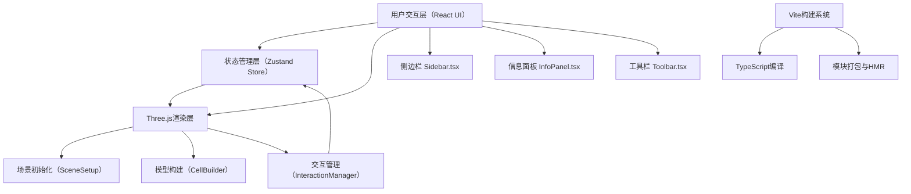

## 1. 架构设计



## 2. 技术描述

| 层次 | 技术选型 | 版本/说明 |
|------|----------|-----------|
| 前端框架 | React | 18.x，函数组件 + Hooks |
| 构建工具 | Vite | 5.x，配置alias路径别名 |
| 语言 | TypeScript | strict严格模式，dom+esnext |
| 3D引擎 | Three.js | 0.160.x，原生WebGL渲染 |
| 3D类型 | @types/three | 0.160.x |
| 动画库 | @tweenjs/tween.js | 处理相机动画、高亮过渡、UI过渡 |
| 状态管理 | Zustand | 轻量级store，管理选中状态、透视模式、导览状态 |
| 工具库 | uuid | 唯一标识细胞器实例 |
| 样式方案 | 原生CSS + CSS变量 | 无需额外CSS框架 |

初始化方式：手动搭建Vite + React + TS项目骨架，不使用脚手架默认模板以精确控制依赖版本。

## 3. 目录结构与文件职责

```
src/
├── main.ts                  # 入口：挂载React根，初始化Three循环
├── store/
│   └── store.ts             # Zustand全局状态
├── scene/
│   ├── SceneSetup.ts        # Three.js场景/相机/渲染器/灯光初始化
│   ├── CellBuilder.ts       # 细胞模型几何体与材质构建
│   └── InteractionManager.ts # 射线拾取/高亮/相机动画/导览/透视切换
└── ui/
    ├── Sidebar.tsx          # 左侧细胞器列表
    ├── InfoPanel.tsx        # 右上角可拖拽信息卡片
    └── Toolbar.tsx          # 底部操作工具栏
```

## 4. 状态模型（Zustand Store）

```typescript
interface CellStore {
  selectedOrganelle: string | null;       // 当前选中细胞器ID
  isSliceView: boolean;                   // 透视模式开关
  isTourActive: boolean;                  // 导览是否进行中
  tourStep: number;                       // 导览当前步骤索引
  infoPanelPosition: { x: number; y: number }; // 信息面板位置
  setSelected: (id: string | null) => void;
  toggleSliceView: () => void;
  startTour: () => void;
  stopTour: () => void;
  setTourStep: (n: number) => void;
  setInfoPanelPosition: (pos: {x:number;y:number}) => void;
}
```

## 5. 细胞器数据模型

```typescript
interface Organelle {
  id: string;
  name: string;               // 中文名
  nameEn: string;             // 英文名
  color: number;              // 十六进制颜色
  mesh: THREE.Object3D;       // Three.js对象引用
  info: {
    title: string;
    description: string;      // 功能简介（支持3行分段）
    icon: string;             // 示意图标（emoji或SVG路径）
  };
}
```

预设导览顺序：细胞壁 → 细胞膜 → 细胞核 → 叶绿体 → 线粒体 → 液泡

## 6. 关键实现要点

| 功能模块 | 实现方案 |
|----------|----------|
| 细胞壁网格纹理 | SphereGeometry + 多层透明材质叠加，外层使用EdgesGeometry生成wireframe |
| 半透明材质顺序渲染 | 手动设置renderOrder，液泡→细胞器→细胞膜→细胞壁由内到外 |
| 高亮发光效果 | OutlineEffect后处理或自定义ShaderMaterial实现bloom边缘发光 |
| 相机聚焦动画 | TWEEN将camera.position插值至目标位置+lookAt目标中心，duration=1000ms，easing=Quadratic.InOut |
| 透视模式切换 | TWEEN材质opacity过渡（0.9→0.1细胞壁），同步相机动画至(60,60,60)俯视45度 |
| 打字机效果 | useRef+setInterval逐字追加，每站4秒内完成3行文字输出 |
| Raycaster拾取 | 窗口mousedown事件归一化坐标，递归检测细胞场景下所有Mesh，优先命中最近对象 |
| 信息面板拖拽 | mousedown记录偏移→mousemove更新position→mouseup解绑，使用transform:translate定位 |
| 60fps性能 | 几何体共享BufferGeometry，材质尽量复用，避免每帧创建新对象，动画基于requestAnimationFrame |
