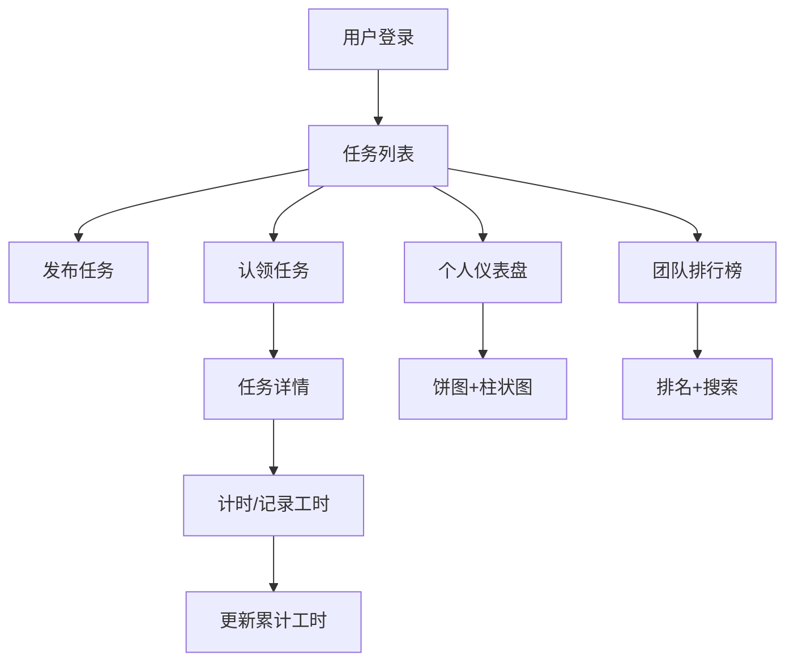

## 1. 产品概述

TeamTally 是一个面向社区团队的线上任务与工时协作平台，帮助团队成员发布任务、认领任务、记录工时，并查看个人和团队的贡献排行榜。

- 目标用户：社区团队、志愿组织、小型项目团队
- 核心价值：轻量化的任务协作和工时追踪，提升团队透明度和协作效率
- 无后端依赖，纯前端实现，数据本地持久化

## 2. 核心功能

### 2.1 用户角色

| 角色 | 登录方式 | 核心权限 |
|------|----------|----------|
| 普通用户 | 用户名登录（无密码） | 发布任务、认领任务、记录工时、查看统计和排行榜 |

### 2.2 功能模块

1. **任务列表页**：任务发布、任务认领、任务卡片网格展示、虚拟列表滚动
2. **任务详情页**：完整任务信息展示、工时记录列表、任务编辑
3. **个人仪表盘**：任务状态饼图、近7天工时柱状图
4. **团队排行榜**：总工时排名、搜索过滤、前三名高亮
5. **计时器模块**：开始/暂停计时、手动输入工时、累计工时更新
6. **设置页**：用户名设置

### 2.3 页面详情

| 页面名称 | 模块名称 | 功能描述 |
|----------|----------|----------|
| 任务列表页 | 任务发布表单 | 弹出表单，输入标题、描述、预计工时、截止日期 |
| 任务列表页 | 任务卡片列表 | 卡片网格布局，虚拟列表，悬浮动画，状态标签 |
| 任务详情页 | 任务信息展示 | 标题、描述、预计工时、截止日期、认领人、状态 |
| 任务详情页 | 工时记录列表 | 每条记录显示时间、时长、提交人 |
| 任务详情页 | 计时器模块 | 开始/暂停按钮，HH:MM:SS显示，手动输入工时 |
| 任务详情页 | 任务编辑 | 创建者和认领者可编辑描述和截止日期 |
| 个人仪表盘 | 饼图统计 | 本人任务状态分布（待认领/进行中/已完成） |
| 个人仪表盘 | 柱状图统计 | 最近7天每天工时总和，Canvas绘制，悬停提示 |
| 团队排行榜 | 排名列表 | 排名、用户名、总工时、完成任务数，前三名金银铜高亮 |
| 团队排行榜 | 搜索过滤 | 输入用户名过滤列表 |
| 设置页 | 用户设置 | 用户名输入，简单登录机制 |

## 3. 核心流程

### 3.1 任务发布流程
用户进入任务列表页 → 点击"发布任务"按钮 → 弹出表单 → 填写任务信息 → 提交 → 任务出现在列表中

### 3.2 任务认领流程
用户浏览任务列表 → 找到待认领任务 → 点击"认领"按钮 → 任务状态变为"进行中" → 记录认领人

### 3.3 工时记录流程
用户进入已认领任务的详情页 → 启动计时器 → 工作 → 暂停/提交工时 → 工时累加到任务 → 显示"已记录X小时"提示

### 3.4 查看统计流程
用户进入仪表盘 → 查看任务状态分布饼图 → 查看近7天工时柱状图 → 鼠标悬停查看具体数值

## 4. 用户界面设计

### 4.1 设计风格

- 配色方案：清爽蓝白主题
  - 主背景：#F0F5FF
  - 侧边栏：深蓝色渐变（#1A237E → #283593），白色文字
  - 任务卡片：纯白背景，2px 浅蓝边框，12px 圆角
  - 激活状态：4px 宽亮蓝色竖条
  - 排行榜：交替背景色（白 / #F8F8F8），前三名发光效果
- 按钮风格：圆角设计，蓝色主色调，悬停有微动效
- 字体：系统无衬线字体，时间数字使用等宽字体
- 布局风格：侧边栏 + 内容区的经典布局，卡片式设计
- 动效：页面淡入过渡（0.3s），卡片悬浮上浮（6px + 阴影扩散）

### 4.2 页面设计概述

| 页面名称 | 模块名称 | UI元素 |
|----------|----------|--------|
| 任务列表页 | 侧边栏导航 | 深蓝渐变，四个导航标签，激活态亮蓝竖条 |
| 任务列表页 | 顶部操作区 | "发布任务"按钮，搜索/筛选（可选） |
| 任务列表页 | 任务卡片网格 | 320px宽卡片，网格布局，虚拟滚动，悬浮上浮 |
| 任务详情页 | 任务信息区 | 标题、描述、元信息（状态/预计工时/截止日期） |
| 任务详情页 | 计时器卡片 | 毛玻璃效果，圆角8px，等宽字体时间显示 |
| 任务详情页 | 工时记录列表 | 时间线样式，交替背景 |
| 个人仪表盘 | 饼图区域 | Canvas绘制，数据点圆点标记，浅灰背景 |
| 个人仪表盘 | 柱状图区域 | Canvas绘制，悬停显示数值，数据点圆点 |
| 团队排行榜 | 排名列表 | 交替行背景，前三名金银铜色发光，奖杯图标 |
| 团队排行榜 | 搜索框 | 顶部输入框，实时过滤 |

### 4.3 响应式设计

- 桌面端（≥768px）：侧边栏 + 内容区布局，卡片网格多列
- 移动端（<768px）：侧边栏折叠为顶部状态栏 + 底部标签栏，卡片单列流式布局
- 触摸优化：按钮和可点击区域增大，适应手指操作

### 4.4 性能优化

- 虚拟列表：任务列表使用虚拟滚动，仅渲染可见区域卡片
- 首屏渲染：≤500ms
- 滚动性能：100+任务时保持60FPS
- 数据持久化：IndexedDB 异步读写，不阻塞主线程
