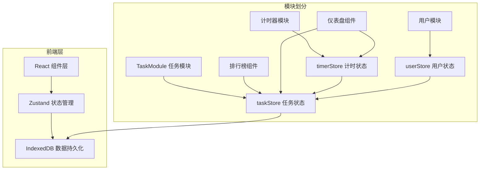
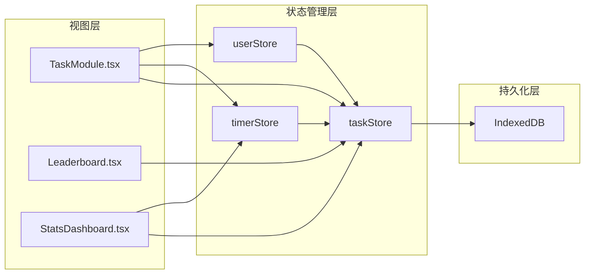

## 1. 架构设计



## 2. 技术选型

- 前端框架：React@18 + TypeScript
- 构建工具：Vite
- 状态管理：Zustand
- 路由：react-router-dom@6
- 数据持久化：IndexedDB（idb-keyval 库）
- 工具库：uuid
- 图表：原生 Canvas 自绘（饼图、柱状图）
- 样式：原生 CSS + CSS Modules（或内联样式，按需求实现）

### 技术决策说明

1. **无后端架构**：纯前端实现，所有数据存储在浏览器 IndexedDB 中
2. **Zustand 状态管理**：轻量级，支持跨组件状态共享，与 IndexedDB 同步
3. **虚拟列表**：任务列表使用虚拟滚动技术，确保大数据量下的性能
4. **Canvas 图表**：自绘图表，避免引入额外图表库，减小包体积

## 3. 路由定义

| 路由 | 页面 | 说明 |
|------|------|------|
| `/` | 任务列表页 | 首页，展示所有任务卡片 |
| `/task/:id` | 任务详情页 | 展示单个任务详情和计时器 |
| `/dashboard` | 个人仪表盘 | 个人统计数据可视化 |
| `/leaderboard` | 团队排行榜 | 团队成员工时排名 |
| `/settings` | 设置页 | 用户名设置等 |

## 4. 数据模型

### 4.1 数据结构定义

```typescript
// 任务状态
type TaskStatus = 'pending' | 'in_progress' | 'completed';

// 工时记录
interface TimeEntry {
  id: string;
  taskId: string;
  userId: string;
  userName: string;
  duration: number; // 小时数
  timestamp: number; // 提交时间戳
  date: string; // YYYY-MM-DD 格式，用于统计
}

// 任务
interface Task {
  id: string;
  title: string;
  description: string;
  estimatedHours: number;
  deadline: string; // YYYY-MM-DD
  status: TaskStatus;
  creatorId: string;
  creatorName: string;
  assigneeId?: string;
  assigneeName?: string;
  totalHours: number; // 累计工时
  createdAt: number;
  updatedAt: number;
}

// 用户
interface User {
  id: string;
  name: string;
  createdAt: number;
}

// 排行榜项
interface LeaderboardEntry {
  userId: string;
  userName: string;
  totalHours: number;
  completedTasks: number;
}
```

### 4.2 数据流向图



## 5. 文件结构

```
src/
├── main.tsx                      # 应用入口，初始化 IndexedDB
├── App.tsx                       # 根组件，路由配置
├── styles/
│   └── globals.css               # 全局样式
├── modules/
│   ├── task/
│   │   ├── TaskModule.tsx        # 任务模块入口（列表+详情）
│   │   ├── taskStore.ts          # 任务状态管理（CRUD + IndexedDB同步）
│   │   ├── TaskCard.tsx          # 任务卡片组件
│   │   ├── TaskList.tsx          # 任务列表（虚拟列表）
│   │   ├── TaskDetail.tsx        # 任务详情页
│   │   ├── TaskForm.tsx          # 任务发布/编辑表单
│   │   └── TimeEntryList.tsx     # 工时记录列表
│   ├── timer/
│   │   ├── timerStore.ts         # 计时器状态管理
│   │   └── Timer.tsx             # 计时器组件
│   └── user/
│       ├── userStore.ts          # 用户状态管理
│       └── LoginForm.tsx         # 登录表单
├── components/
│   ├── Leaderboard.tsx           # 排行榜组件
│   ├── StatsDashboard.tsx        # 个人统计仪表盘
│   ├── Sidebar.tsx               # 侧边栏导航
│   ├── MobileNav.tsx             # 移动端底部导航
│   ├── PieChart.tsx              # 饼图组件（Canvas）
│   └── BarChart.tsx              # 柱状图组件（Canvas）
├── hooks/
│   ├── useVirtualList.ts         # 虚拟列表 Hook
│   └── useIndexedDB.ts           # IndexedDB Hook
└── utils/
    ├── db.ts                     # IndexedDB 封装
    ├── time.ts                   # 时间格式化工具
    └── constants.ts              # 常量定义
```

## 6. 模块调用关系

### 6.1 任务模块
- **TaskModule.tsx** → 调用 **taskStore**（获取任务列表、创建任务）
- **TaskModule.tsx** → 调用 **userStore**（获取当前用户、认领任务）
- **TaskModule.tsx** → 调用 **timerStore**（管理当前任务计时）

### 6.2 计时器模块
- **timerStore** → 调用 **taskStore**（提交工时后更新任务累计工时）
- **Timer.tsx** → 调用 **timerStore**（开始/暂停/重置计时）

### 6.3 用户模块
- **userStore** → 调用 **taskStore**（认领任务时更新任务状态）
- **userStore** → 与 **IndexedDB** 同步用户数据

### 6.4 排行榜
- **Leaderboard.tsx** → 调用 **taskStore**（获取所有任务，计算排名）

### 6.5 仪表盘
- **StatsDashboard.tsx** → 调用 **taskStore**（获取用户任务数据）
- **StatsDashboard.tsx** → 调用 **timerStore**（获取计时数据，可选）

## 7. 性能优化方案

1. **虚拟列表**：任务列表使用 `useVirtualList` Hook，仅渲染视口内的卡片
2. **按需加载**：任务详情数据按需获取，避免一次性加载所有数据
3. **IndexedDB 异步**：所有数据库操作使用异步 API，不阻塞主线程
4. **React.memo**：列表项组件使用 memo 优化，避免不必要的重渲染
5. **requestAnimationFrame**：计时器使用 rAF 确保平滑更新
6. **CSS 硬件加速**：动画使用 transform 和 opacity，触发 GPU 加速
