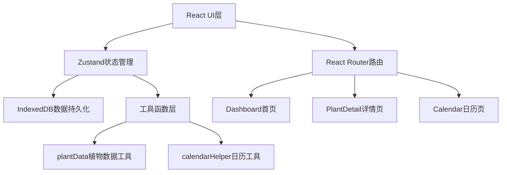
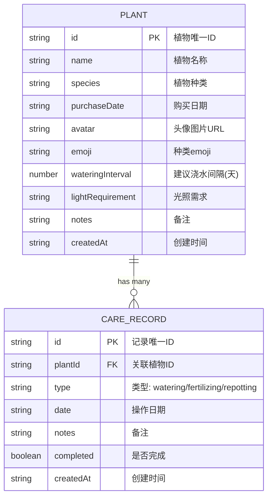

## 1. 架构设计



## 2. 技术描述
- 前端：React@18 + TypeScript + Vite
- 状态管理：zustand
- 数据存储：IndexedDB (idb-keyval)
- 路由：react-router-dom@6
- 工具库：uuid（生成唯一ID）、date-fns（日期处理）
- 构建工具：Vite

## 3. 路由定义
| Route | Purpose |
|-------|---------|
| / | 首页Dashboard，展示所有植物卡片 |
| /plant/:id | 植物详情页，展示时间轴和档案 |
| /calendar | 养护日历页，月视图展示 |

## 4. 数据模型

### 4.1 数据模型定义



### 4.2 TypeScript 类型定义

```typescript
interface Plant {
  id: string;
  name: string;
  species: string;
  purchaseDate: string;
  avatar: string | null;
  emoji: string;
  wateringInterval: number;
  lightRequirement: string;
  notes?: string;
  createdAt: string;
}

interface CareRecord {
  id: string;
  plantId: string;
  type: 'watering' | 'fertilizing' | 'repotting';
  date: string;
  notes: string;
  completed: boolean;
  createdAt: string;
}

type CareType = 'watering' | 'fertilizing' | 'repotting';
```

## 5. 项目结构

```
src/
├── components/
│   ├── Dashboard.tsx      # 首页瀑布流卡片
│   ├── PlantDetail.tsx    # 植物详情页
│   └── Calendar.tsx       # 养护日历
├── store/
│   └── plantStore.ts      # Zustand状态管理
├── utils/
│   ├── plantData.ts       # 植物默认数据与养护计算
│   └── calendarHelper.ts  # 日历数据整理
├── App.tsx                # 路由主组件
└── main.tsx               # 应用入口
```

## 6. 核心模块说明

### 6.1 Zustand Store (plantStore.ts)
- 管理植物列表和养护记录的CRUD操作
- 与IndexedDB同步数据
- 提供查询方法：getPlantById、getRecordsByPlantId、getRecordsByDate

### 6.2 Dashboard组件
- 瀑布流布局展示植物卡片
- 计算距上次浇水天数并显示颜色状态
- 添加植物浮窗表单

### 6.3 PlantDetail组件
- 左右分栏布局（移动端上下布局）
- 三个独立时间轴：浇水、施肥、换盆
- 添加新记录功能，自动更新首页状态

### 6.4 Calendar组件
- 月视图展示，彩色圆点标记事件
- 点击日期弹出待办列表
- 勾选完成自动同步到时间轴

### 6.5 工具函数
- plantData.ts：内置植物种类默认数据，根据种类计算浇水间隔和光照需求
- calendarHelper.ts：将养护记录按月份归并，生成日历数据结构
