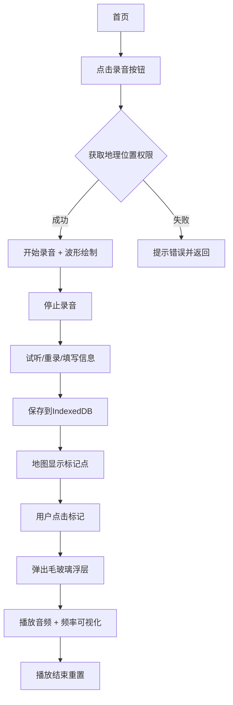

# SoundScape 产品需求文档

## 1. 产品概述

SoundScape 是一款基于地理位置的声音故事记录与回放应用，让用户可以在不同地点录制语音并附上文字和标签，形成可交互的声音地图，其他用户能在地图上点击标记收听。

- 核心目的：通过地理位置 + 音频的方式，让用户记录和分享生活中的声音故事，创造沉浸式的地理音频记忆体验
- 目标用户：旅行者、城市探索者、故事讲述者、日常生活记录者
- 产品价值：将抽象的地理位置与具体的声音记忆绑定，为用户提供独特的情感记录和分享方式

## 2. 核心功能

### 2.1 用户角色
| 角色 | 注册方式 | 核心权限 |
|------|----------|----------|
| 普通用户 | 本地存储，无需注册 | 录制音频、管理片段、查看地图、筛选搜索 |

### 2.2 功能模块
1. **录音模块**：地理位置获取、实时音频录制、波形可视化、文字描述、标签管理
2. **声音地图模块**：20x20网格地图、标记点展示、标记颜色编码、悬停提示、详情浮层
3. **音频回放模块**：音频播放、频率条可视化、进度条、自动重置
4. **片段管理模块**：侧边栏列表、详情编辑、删除确认、分享复制
5. **搜索筛选模块**：关键词搜索、标签筛选、预设标签按钮、空状态展示

### 2.3 页面详情
| 页面名称 | 模块名称 | 功能描述 |
|----------|----------|----------|
| 主界面 | 录音界面 | 录音按钮、实时波形绘制、保存表单（标题/描述/标签）、试听/重录功能 |
| 主界面 | 地图视图 | 20x20网格地图、彩色标记点、悬停标题、毛玻璃浮层卡片、播放按钮 |
| 侧边栏 | 我的片段 | 片段列表展示、时间与预览文字、点击进入详情 |
| 详情页 | 片段详情 | 编辑描述、删除片段（确认弹窗）、分享链接（toast提示） |
| 顶部栏 | 搜索筛选 | 半透明搜索框、预设标签按钮、高亮动画、空状态提示 |

## 3. 核心流程

### 录音与保存流程
用户点击录音按钮 → 请求地理位置权限 → 获取成功后开始录音 → 实时显示波形 → 录音结束/停止 → 试听/重录 → 填写标题、描述、标签 → 保存到IndexedDB → 地图上显示标记点

### 播放流程
用户点击地图标记 → 弹出浮层卡片 → 显示位置/时间/描述 → 点击播放 → 音频播放 + 频率条可视化 → 进度条动画 → 播放结束自动重置

### 管理流程
用户打开侧边栏 → 查看片段列表 → 点击进入详情 → 编辑描述/删除/分享 → 操作反馈（toast/确认弹窗）

## 4. 用户界面设计

### 4.1 设计风格
- **主色调**：暗色主题，背景#1A1A2E，卡片#16213E，边框#E94560（橙色）
- **辅助色**：录音波形#4A90D9→#50E3C2渐变，频率条#F39C12→#E74C3C渐变
- **标签颜色**：故事#FF6B6B、自然#4ECDC4、趣事#FFE66D、默认#95A5A6
- **侧边栏**：深蓝底色#2C3E50配白色文字，固定左侧240px
- **按钮风格**：圆角设计，悬停缩放1.05 + 阴影扩散，过渡0.3s
- **字体**：系统字体（-apple-system, BlinkMacSystemFont, "Segoe UI", Roboto, sans-serif）
- **段落间距**：1.6倍行高
- **特殊效果**：毛玻璃（backdrop-filter: blur）、页面切换左右滑动0.3s、Toast顶部滑入滑出

### 4.2 页面设计概述
| 页面名称 | 模块名称 | UI元素 |
|----------|----------|----------|
| 主界面 | 录音界面 | 大圆形录音按钮（#E94560渐变）、Canvas波形画布、输入框组、标签胶囊、操作按钮组 |
| 主界面 | 地图视图 | 20x20浅灰网格（每格100px）、彩色圆点标记、浮动毛玻璃卡片、全屏频率条Canvas |
| 侧边栏 | 我的片段 | 用户头像占位圆、"我的片段"标题、片段列表卡片、滚动区域 |
| 详情页 | 片段详情 | 大标题卡片、描述编辑区、标签展示、删除/分享按钮组、确认弹窗（淡入淡出） |
| 顶部栏 | 搜索筛选 | 半透明搜索框（backdrop-filter: blur(4px)，圆角20px）、标签按钮行、底部高亮动画 |

### 4.3 响应式设计
- **桌面端**：左侧固定240px侧边栏，主内容区自适应
- **移动端**：侧边栏折叠为底部Tab栏（地图/录音/我的）
- **地图视图**：全屏支持左右拖拽平移
- **触控优化**：按钮最小尺寸44px，手势滑动支持

### 4.4 性能要求
- 录音启动延迟：≤ 500ms
- 音频播放延迟：≤ 100ms
- 标记悬停响应：50个标记点时 ≤ 100ms
- 页面切换动画：0.3s ease-in-out 流畅无卡顿
