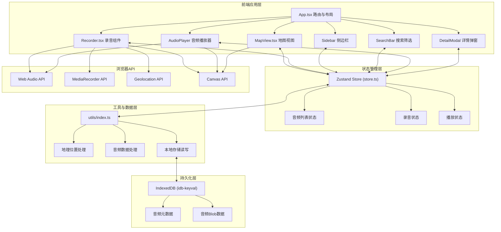
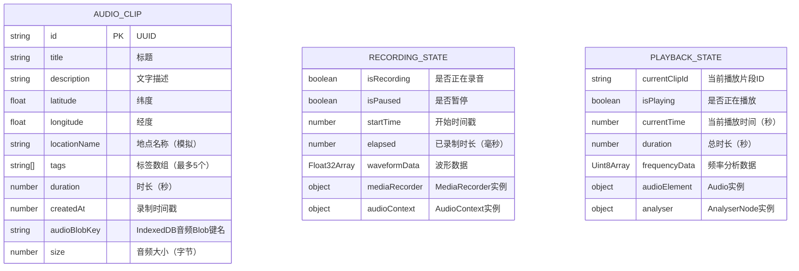

# SoundScape 技术架构文档

## 1. 架构设计



## 2. 技术说明

- **前端框架**：React@18 + TypeScript，基于Vite构建
- **路由管理**：react-router-dom@6
- **状态管理**：Zustand（轻量级状态管理，支持TypeScript）
- **数据持久化**：IndexedDB（通过idb-keyval库封装，存储音频Blob和元数据）
- **音频处理**：Web Audio API（分析节点、音频播放）、MediaRecorder API（录制）
- **可视化**：Canvas API（波形绘制、频率条）
- **地理位置**：Geolocation API获取经纬度，模拟反向地理编码
- **唯一ID**：uuid库生成

## 3. 路由定义

| 路由 | 用途 |
|------|------|
| / | 首页，包含录音入口和地图视图切换 |
| /map | 声音地图主视图 |
| /record | 录音界面 |
| /clip/:id | 片段详情页 |
| /my | 我的片段列表 |

## 4. 数据模型

### 4.1 数据模型定义



### 4.2 TypeScript 类型定义

```typescript
// src/types.ts
export interface Coordinates {
  latitude: number;
  longitude: number;
}

export interface Tag {
  name: string;
  color: string;
}

export interface AudioClip {
  id: string;
  title: string;
  description: string;
  coordinates: Coordinates;
  locationName: string;
  tags: string[];
  duration: number;
  createdAt: number;
  audioBlobKey: string;
  size: number;
}

export interface RecordingState {
  isRecording: boolean;
  isPaused: boolean;
  startTime: number;
  elapsed: number;
  waveformData: number[];
}

export interface PlaybackState {
  currentClipId: string | null;
  isPlaying: boolean;
  currentTime: number;
  duration: number;
}

export type PresetTag = '故事' | '自然' | '趣事' | '生活' | '旅行';

export const TAG_COLORS: Record<string, string> = {
  '故事': '#FF6B6B',
  '自然': '#4ECDC4',
  '趣事': '#FFE66D',
  '生活': '#A78BFA',
  '旅行': '#60A5FA',
  '默认': '#95A5A6',
};
```

## 5. 核心文件结构

```
auto133/
├── package.json              # 项目配置与依赖
├── index.html                # Vite入口HTML
├── vite.config.js            # Vite配置（React插件）
├── tsconfig.json             # TypeScript严格模式配置
└── src/
    ├── main.tsx              # React入口挂载
    ├── types.ts              # 类型定义
    ├── store.ts              # Zustand全局状态
    ├── utils/
    │   └── index.ts          # 工具函数集合
    ├── styles/
    │   └── index.css         # 全局样式与主题
    ├── components/
    │   ├── App.tsx           # 主应用（路由+布局）
    │   ├── MapView.tsx       # 地图视图
    │   ├── Recorder.tsx      # 录音组件
    │   ├── Sidebar.tsx       # 侧边栏
    │   ├── SearchBar.tsx     # 搜索筛选栏
    │   ├── AudioPlayer.tsx   # 音频播放+可视化
    │   ├── ClipDetail.tsx    # 片段详情页
    │   ├── ClipCard.tsx      # 地图标记浮层卡片
    │   ├── TagButton.tsx     # 标签按钮组件
    │   ├── Toast.tsx         # Toast提示组件
    │   └── ConfirmDialog.tsx # 确认对话框
    └── hooks/
        ├── useAudioRecorder.ts # 录音Hook封装
        ├── useAudioPlayer.ts   # 播放Hook封装
        └── useGeolocation.ts   # 地理位置Hook
```

## 6. 关键技术实现说明

### 6.1 音频录制
- 使用 `useAudioRecorder` Hook 封装 MediaRecorder + AudioContext
- AnalyserNode 获取时域数据绘制实时波形
- 录音数据存储为 Blob，通过 idb-keyval 写入 IndexedDB

### 6.2 地图渲染
- CSS Grid 绘制 20x20 网格背景（每格100px = 2000px总宽高）
- 经纬度映射到网格坐标：`x = (longitude + 180) / 360 * 2000`，`y = (90 - latitude) / 180 * 2000`
- 移动端支持 transform 平移 + 拖拽手势

### 6.3 音频播放可视化
- AnalyserNode.getByteFrequencyData() 获取频率数据
- 30条竖直条 = 将频率数组均分30段取均值
- requestAnimationFrame 驱动 Canvas 重绘，暖色渐变填充

### 6.4 状态管理
- Zustand store 切片管理：clips / recording / playback / ui
- 持久化中间件自动同步 clips 到 IndexedDB

### 6.5 动画实现
- 页面切换：React Router + CSS transform translateX + transition 0.3s
- Toast：@keyframes slideDown → 停留2s → slideUp
- 确认弹窗：opacity 0→1 缩放 0.9→1 过渡 0.25s

## 7. 性能优化策略

1. **音频处理**：使用 AudioContext 单例模式复用，避免重复创建
2. **Canvas渲染**：使用 requestAnimationFrame 合理调度，离屏Canvas缓存静态元素
3. **地图标记**：50+标记点时使用 CSS transform 替代 top/left，启用 GPU 加速
4. **搜索筛选**：useMemo 缓存筛选结果，防抖搜索输入（200ms）
5. **懒加载**：详情弹窗按需渲染，非激活状态不挂载DOM
6. **IndexedDB**：音频Blob与元数据分表存储，读取时按需加载音频数据
