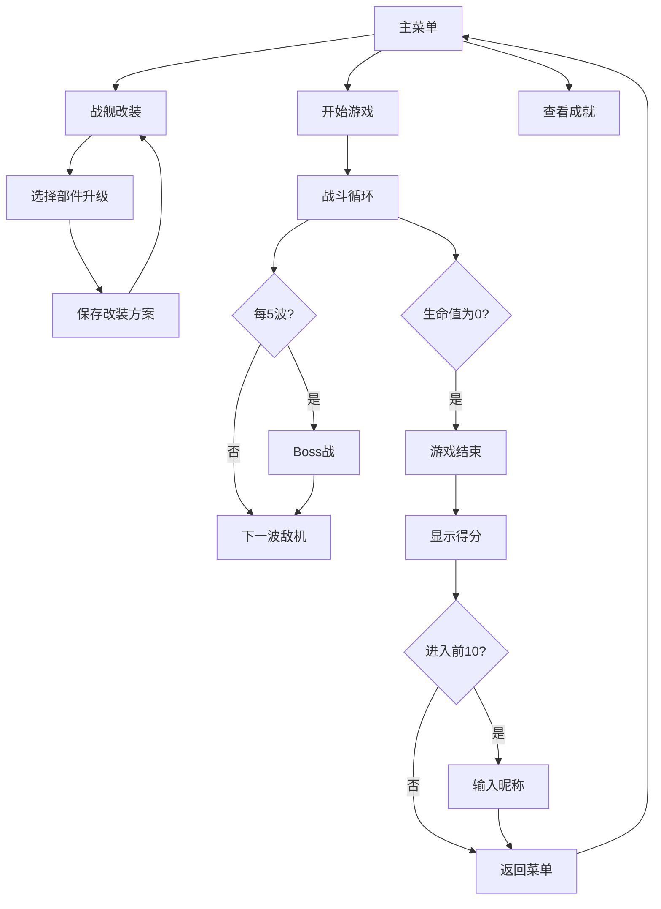

## 1. 产品概述

AstroForge 是一款基于浏览器的经典太空射击游戏，融合了战舰自定义改装、动态弹幕系统和排行榜功能，让玩家在深空中体验紧张刺激的对战与个性化飞船搭配的乐趣。

- 核心目标：提供流畅的60FPS太空射击体验，结合深度改装系统和Boss战，打造高可玩性的纯前端游戏
- 目标用户：喜欢街机射击游戏、享受飞船个性化定制的休闲与核心玩家
- 市场价值：无需下载安装，随时随地在浏览器中体验高质量射击游戏

## 2. 核心功能

### 2.1 用户角色
| 角色 | 注册方式 | 核心权限 |
|------|----------|----------|
| 玩家 | 本地昵称输入 | 游戏体验、改装飞船、查看排行榜、解锁成就 |

### 2.2 功能模块
1. **主菜单界面**：游戏标题、开始按钮、改装入口、排行榜展示、成就入口
2. **战斗系统**：玩家飞船控制、敌机编队生成、子弹系统、碰撞检测、粒子特效、Boss战
3. **战舰改装系统**：主武器/护盾/引擎三大部件升级、多套方案保存、外观实时预览
4. **排行榜系统**：本地得分排行、昵称输入、按总分/波数排序
5. **成就系统**：5个成就徽章、解锁条件检测、弹窗提示

### 2.3 页面详情
| 页面名称 | 模块名称 | 功能描述 |
|----------|----------|----------|
| 主菜单 | 标题区域 | 像素风格"AstroForge"标题，发光动画与火焰尾迹特效 |
| 主菜单 | 功能按钮区 | 开始游戏、战舰改装、查看成就三个主要按钮 |
| 主菜单 | 排行榜展示 | 主页下方展示前5名排行榜 |
| 战斗界面 | 游戏画布 | Canvas渲染游戏内容，60FPS游戏循环 |
| 战斗界面 | 底部控制栏 | 生命值图标、积分显示、当前波数 |
| 战斗界面 | 移动端触控 | 左右虚拟摇杆、射击按钮 |
| 改装界面 | 部件卡片网格 | 三列卡片，武器红、护盾蓝、引擎绿边框 |
| 改装界面 | 飞船预览区 | 右侧3/4侧视图，实时反映改装外观变化 |
| 改装界面 | 升级详情 | 点击卡片展开进度条和购买按钮 |
| 结束界面 | 得分展示 | 本局得分、最高记录、达到波数 |
| 结束界面 | 昵称输入 | 进入前10名时弹出输入框 |
| 成就页面 | 成就徽章 | 5个成就徽章及解锁状态 |

## 3. 核心流程

玩家从主菜单开始，可选择直接开始游戏或先进行战舰改装。游戏中控制飞船躲避敌机和子弹，击毁敌机获得积分。每5波敌机后遭遇Boss战。游戏结束后查看得分，若进入前10名可输入昵称保存成绩。击落敌机获得的积分可用于改装升级飞船部件。

## 4. 用户界面设计

### 4.1 设计风格
- **主色调**：深空蓝黑渐变（#0B0C10 到 #1A1A2E）
- **强调色**：武器红（#FF4757）、护盾蓝（#3742FA）、引擎绿（#2ED573）、金色（#FFD700）
- **按钮样式**：圆角按钮，悬停放大1.05倍+阴影加深，点击按下效果
- **字体**：像素风格标题字体 + 现代无衬线正文字体
- **布局风格**：卡片式布局、深空背景星点粒子动画
- **视觉特效**：粒子爆炸、屏幕震动、发光效果、护盾半透明球

### 4.2 页面设计概览
| 页面名称 | 模块名称 | UI元素 |
|----------|----------|--------|
| 主菜单 | 标题区 | 像素字体"AstroForge"、发光动画、火焰尾迹、居中布局 |
| 主菜单 | 按钮区 | 三个垂直排列按钮、悬停动画、深空背景星点 |
| 主菜单 | 排行榜 | 列表形式、排名/昵称/得分/波数 |
| 战斗界面 | 画布 | 全屏Canvas、底部60px控制栏 |
| 战斗界面 | 控制栏 | 心形生命图标、积分数字、波数标识 |
| 改装界面 | 左侧网格 | 三列卡片网格、12px圆角、2px彩色边框 |
| 改装界面 | 右侧预览 | 飞船3/4侧视图、CSS绘制、实时更新 |
| 结束界面 | 得分面板 | 居中卡片、得分数字、重玩/返回按钮 |

### 4.3 响应式设计
- 桌面端：宽屏布局，改装界面左右分栏
- 移动端：竖屏适配，触控虚拟摇杆+射击按钮，改装界面上下布局
- 触摸优化：按钮最小48px触控区域，滑动手感优化

### 4.4 动效与粒子
- 星点背景：约200颗闪烁小白点缓慢浮动
- 爆炸粒子：敌机击毁时0.3秒消散的碎屑粒子
- 引擎尾焰：飞船尾部粒子拖尾，升级后更亮更长
- Boss爆炸：全屏大范围粒子爆炸
- 屏幕震动：击中敌机时的震动反馈
- 无敌闪烁：被击中后1秒无敌状态闪烁效果
