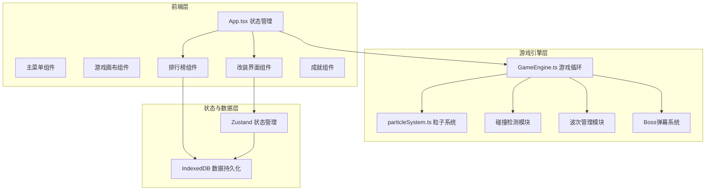

## 1. 架构设计



## 2. 技术描述

- **前端框架**：React@18 + TypeScript
- **构建工具**：Vite
- **状态管理**：Zustand
- **数据持久化**：IndexedDB (idb-keyval)
- **游戏渲染**：Canvas 2D API
- **唯一标识**：uuid
- **样式方案**：原生CSS + CSS变量
- **后端依赖**：无（纯前端应用）

## 3. 文件结构

```
src/
├── main.tsx              # React入口
├── App.tsx               # 主组件，游戏状态切换
├── engine/
│   ├── GameEngine.ts     # 游戏循环核心类
│   └── particleSystem.ts # 粒子特效模块
├── modules/
│   └── ShipCustomizer.tsx # 战舰改装组件
├── components/
│   ├── Leaderboard.tsx   # 排行榜组件
│   ├── MainMenu.tsx      # 主菜单组件
│   ├── GameOver.tsx      # 游戏结束组件
│   └── Achievements.tsx  # 成就组件
├── store/
│   └── useGameStore.ts   # Zustand状态管理
├── utils/
│   ├── storage.ts        # IndexedDB封装
│   └── constants.ts      # 游戏常量配置
├── types/
│   └── index.ts          # TypeScript类型定义
└── styles/
    └── global.css        # 全局样式
```

## 4. 核心模块说明

### 4.1 GameEngine 游戏引擎
- 基于 requestAnimationFrame 的60FPS游戏循环
- AABB碰撞检测系统
- 敌机波次生成管理
- Boss战与三种弹幕模式
- 粒子系统调度
- 分数与生命值管理
- 屏幕震动效果

### 4.2 ParticleSystem 粒子系统
- 爆炸粒子生成（敌机击毁）
- 引擎尾焰粒子
- Boss全屏爆炸粒子
- 粒子生命周期管理（上限500个）
- Canvas 2D渲染优化

### 4.3 ShipCustomizer 改装系统
- 三大部件：主武器、护盾、引擎
- 每部件3个等级，升级外观变化
- 多套改装方案保存/切换
- 实时飞船预览（CSS绘制）
- IndexedDB数据持久化

### 4.4 Leaderboard 排行榜
- 本地Top 10排行
- 昵称输入（最多8字符）
- 按总分/波数排序
- IndexedDB存储

### 4.5 成就系统
- 5个成就徽章
- 条件实时检测
- 解锁弹窗提示
- IndexedDB记录

## 5. 数据模型

### 5.1 游戏状态
```typescript
interface GameState {
  scene: 'menu' | 'customize' | 'playing' | 'gameover' | 'achievements';
  score: number;
  highScore: number;
  wave: number;
  lives: number;
  isInvincible: boolean;
}
```

### 5.2 飞船改装
```typescript
interface ShipBuild {
  id: string;
  name: string;
  weapon: { type: 'laser' | 'scatter' | 'rapid'; level: 1 | 2 | 3 };
  shield: { type: 'damage' | 'reflect' | 'armor'; level: 1 | 2 | 3 };
  engine: { type: 'speed' | 'dodge' | 'boost'; level: 1 | 2 | 3 };
}
```

### 5.3 排行榜
```typescript
interface LeaderboardEntry {
  id: string;
  name: string;
  score: number;
  wave: number;
  date: number;
}
```

### 5.4 成就
```typescript
interface Achievement {
  id: string;
  name: string;
  description: string;
  unlocked: boolean;
  unlockedAt?: number;
}
```

## 6. 性能指标

- 游戏循环：稳定60FPS
- 粒子数量：≤500时无卡顿
- 动画帧率：≥50FPS
- 响应延迟：触控/键盘输入≤100ms响应
- 内存占用：单页应用≤200MB
