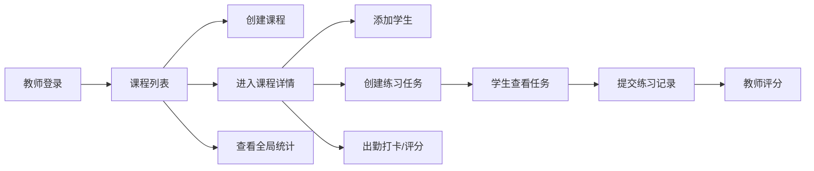

## 1. 产品概述

音乐教学管理应用，帮助音乐机构高效管理课程、学生出勤、练习任务和教学数据，解决传统手动记录效率低下的问题。

- 目标用户：音乐教师和教学机构管理者
- 核心价值：数字化管理学生出勤、作业布置和练习跟踪，提升教学管理效率
- 市场价值：为音乐教育行业提供轻量化、直观易用的教学管理工具

## 2. 核心功能

### 2.1 用户角色

| 角色 | 注册方式 | 核心权限 |
|------|----------|----------|
| 教师 | 内置默认账号 | 创建课程、管理学生、布置任务、记录出勤、评分、查看统计 |
| 学生 | 教师添加 | 查看任务、提交练习、查看个人日历和进度 |

### 2.2 功能模块

1. **课程管理页**：课程卡片网格展示、创建/编辑/删除课程
2. **课程详情页**：学生列表、出勤打卡、评分、练习任务管理
3. **学生详情页**：个人信息、出勤日历、练习记录
4. **任务管理**：任务卡片、进度环、提交与评分
5. **练习日历**：周视图日历、练习时长色块、翻页动画
6. **统计面板**：出勤率、完成率、平均评分可视化

### 2.3 页面详情

| 页面名称 | 模块名称 | 功能描述 |
|----------|----------|----------|
| 课程列表页 | 课程卡片网格 | 渐变色卡片、悬停浮起动画、点击右滑进入详情 |
| 课程详情页 | 学生管理侧边栏 | 学生列表、出勤按钮、星级评分、堆叠条形图 |
| 课程详情页 | 任务列表 | 任务卡片、圆形进度环、点击展开详情、提交练习 |
| 学生详情页 | 练习日历 | 周视图、时长色块、左右滑动翻页、点击查看详情 |
| 全局统计页 | 统计面板 | 响应式卡片、出勤率、完成率、平均评分柱状图 |

## 3. 核心流程

## 4. 用户界面设计

### 4.1 设计风格

- **主背景色**：极浅暖灰 #F9F5F0
- **卡片背景**：白色 #FFFFFF，2px 浅棕边框 #E4D9C8，16px 圆角
- **主色调**：深蓝色渐变（侧边栏），渐变色课程卡片（按封面颜色）
- **按钮样式**：圆角按钮，hover 时 0.2s 放大 + 颜色加深
- **字体**：显示字体使用 Playfair Display，正文字体使用 Lato
- **布局**：左侧固定侧边栏 + 右侧主内容区，卡片网格布局
- **图标**：使用 lucide-react 音乐相关图标

### 4.2 页面设计概述

| 页面名称 | 模块名称 | UI 元素 |
|----------|----------|----------|
| 课程列表 | 卡片网格 | 渐变背景、悬停浮起 10px、阴影扩散、右滑转场 |
| 课程详情 | 出勤按钮 | 圆形按钮（绿/红/灰）、点击切换状态 |
| 课程详情 | 星级评分 | 1-5 星、点击弹性动画、从小到大填充 |
| 课程详情 | 堆叠条形图 | 横向展示出勤率 |
| 任务卡片 | 进度环 | 圆形动画进度环 0-100%、点击手势展开 |
| 练习日历 | 周视图 | 色块深浅表示时长、左右滑翻页动画 |
| 统计面板 | 响应式卡片 | 3/2/1 列自适应、柱状图可视化 |

### 4.3 响应式设计

- **桌面端**（≥1024px）：侧边栏固定显示，卡片 3 列布局
- **平板端**（768px-1023px）：侧边栏固定显示，卡片 2 列布局
- **移动端**（<768px）：侧边栏隐藏为汉堡菜单，卡片 1 列布局
- **触摸优化**：增大点击区域，支持手势滑动翻页

### 4.4 动画与交互

- 页面切换：右滑/左滑过渡（<100ms）
- 卡片悬停：上浮 10px + 阴影扩散（0.2s ease）
- 星星评分：弹性缩放动画
- 日历翻页：左右滑动过渡（≥50fps）
- 列表项 hover：浅色背景 + 左边界竖线滑入
- 顶部导航：毛玻璃效果（backdrop-filter: blur(10px)）
