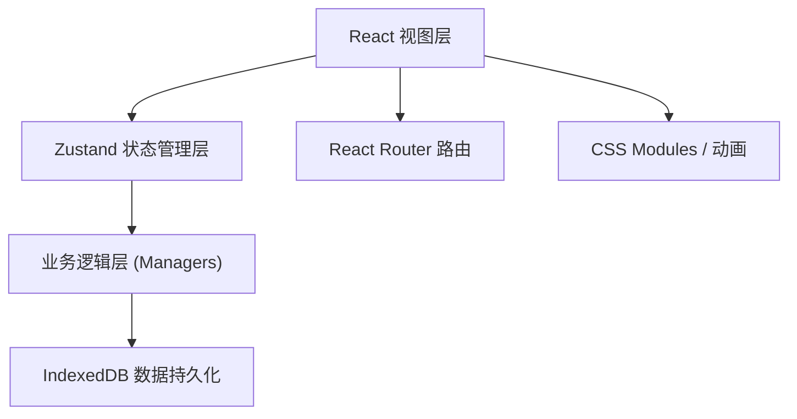
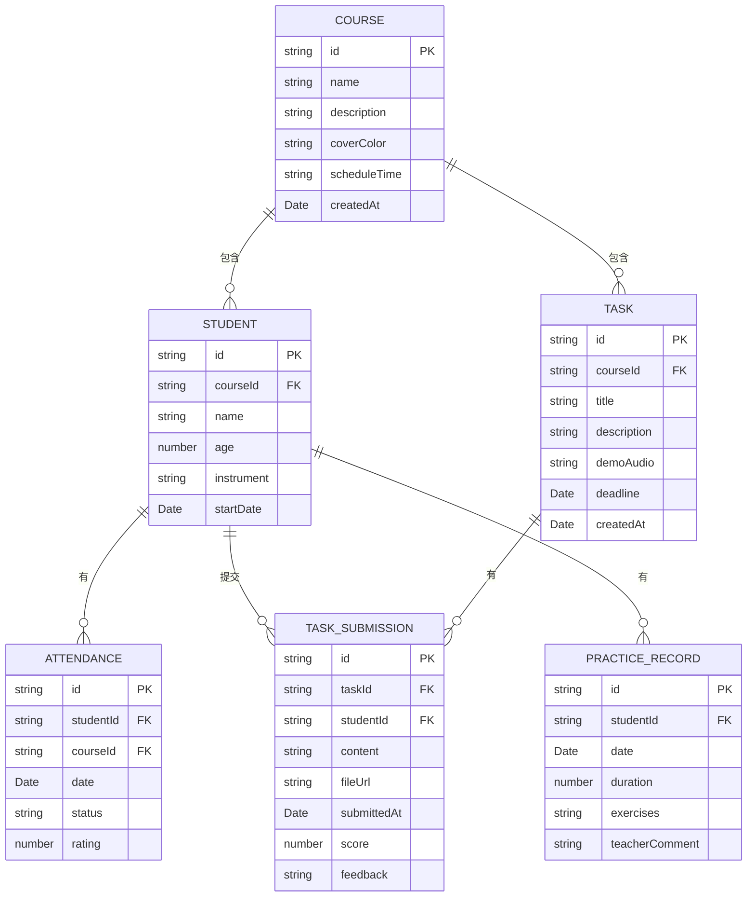

## 1. 架构设计



## 2. 技术描述

- **前端框架**：React 18 + TypeScript
- **构建工具**：Vite 5
- **路由**：react-router-dom 6
- **状态管理**：Zustand
- **数据持久化**：IndexedDB (idb-keyval)
- **拖拽排序**：@dnd-kit/sortable
- **唯一标识**：uuid
- **图标库**：lucide-react
- **样式方案**：Tailwind CSS 3 + CSS 自定义动画

## 3. 路由定义

| 路由 | 页面 | 用途 |
|------|------|------|
| `/` | CourseList | 课程列表首页 |
| `/course/:id` | CourseDetail | 课程详情页（学生、出勤、任务） |
| `/student/:id` | StudentDetail | 学生详情页（日历、练习记录） |
| `/stats` | StatsPanel | 全局统计面板 |

## 4. 数据模型



## 5. 模块结构

```
src/
├── modules/
│   ├── course/
│   │   ├── CourseManager.ts      # 课程CRUD逻辑
│   │   └── CourseView.tsx        # 课程列表卡片组件
│   ├── student/
│   │   ├── StudentManager.ts     # 学生、出勤、评分逻辑
│   │   └── StudentDetail.tsx     # 学生详情页
│   ├── task/
│   │   ├── TaskManager.ts        # 任务创建、提交、评分逻辑
│   │   └── TaskCard.tsx          # 任务卡片组件
│   └── stats/
│       └── StatsPanel.tsx        # 统计面板组件
├── store/
│   └── useStore.ts               # Zustand 全局状态
├── utils/
│   ├── db.ts                     # IndexedDB 封装
│   └── animations.css            # 全局动画样式
├── App.tsx
├── main.tsx
└── index.css
```

## 6. 性能优化

- 页面切换响应时间 < 100ms：使用 CSS transform 硬件加速
- 日历翻页帧率 ≥ 50fps：使用 will-change + GPU 加速
- 列表虚拟化：长列表使用 Intersection Observer
- 状态更新：Zustand 选择器避免不必要重渲染
- 数据持久化：IndexedDB 异步操作不阻塞 UI
