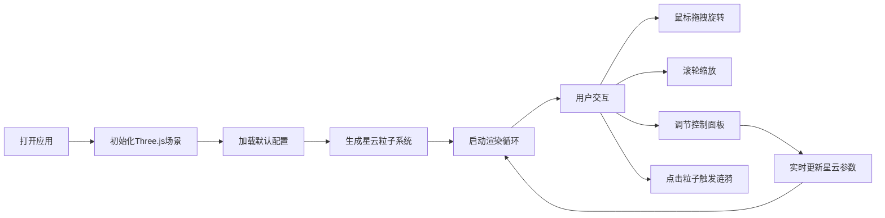

## 1. 产品概述

AureliaNebula 是一个沉浸式3D交互式星云粒子系统应用，用户可以实时生成、旋转和缩放绚丽的动态星云，并通过调节粒子密度、颜色和速度参数来改变视觉效果。

- 面向对视觉艺术、天文爱好者和创意工作者的沉浸式体验工具
- 提供高度可定制的星云视觉效果，支持实时参数调整和交互反馈

## 2. 核心功能

### 2.1 功能模块

1. **3D星云粒子系统**：数千粒子组成的动态星云，球形分布、螺旋运动、随机漂移
2. **实时参数控制面板**：粒子数量、颜色变化速度、粒子大小滑块，6种预设颜色主题
3. **交互与动画系统**：鼠标拖拽旋转、滚轮缩放、点击粒子涟漪效果、自动旋转、亮度脉动
4. **视觉增强效果**：粒子光晕、粒子连线、星空背景、毛玻璃控制面板

### 2.2 页面详情

| 页面名称 | 模块名称 | 功能描述 |
|---------|---------|----------|
| 主页面 | 3D星云场景 | 全屏渲染动态星云，支持鼠标交互 |
| 主页面 | 控制面板 | 右侧悬浮面板，包含参数调节控件 |
| 主页面 | 星空背景 | 深邃星空渐变背景，点缀静态星星 |

## 3. 核心流程

用户打开应用 → 自动加载默认配置并渲染星云 → 用户通过鼠标拖拽/缩放与星云交互 → 用户调节控制面板参数 → 星云实时响应参数变化 → 用户点击粒子触发涟漪效果

## 4. 用户界面设计

### 4.1 设计风格

- **设计方向**：科技感、沉浸式、深邃宇宙主题
- **主色调**：深蓝黑渐变背景 (#0B0B1A → #1A1A2E)
- **强调色**：蓝紫渐变、粉紫渐变、金青渐变等6种主题
- **字体**：科技感无衬线字体，白色文字
- **控件风格**：毛玻璃效果 (backdrop-filter: blur(12px))，半透明深色底
- **滑块样式**：深灰轨道，圆形蓝紫渐变滑块

### 4.2 页面设计概述

| 页面名称 | 模块名称 | UI元素 |
|---------|---------|--------|
| 主页面 | 星云粒子系统 | 3D粒子、光晕效果、粒子连线、螺旋运动 |
| 主页面 | 控制面板 | 标题、滑块控件、颜色主题选择器、重置按钮 |
| 主页面 | 背景 | 深空渐变、静态小星星 |

### 4.3 响应式

- 全屏自适应，画布随窗口大小变化
- 控制面板固定在右侧，宽度280px
- 页面整体禁止滚动

### 4.4 3D场景指导

- **环境**：深邃星空背景，营造宇宙沉浸感
- **光照**：粒子自发光，无需外部光源
- **相机设置**：透视相机，初始看向星云中心，支持轨道控制
- **构图**：星云居中，控制面板右侧悬浮
- **交互与动画**：鼠标拖拽旋转（带阻尼）、滚轮缩放、自动旋转、亮度脉动、点击涟漪
- **后处理效果**：点击时画面四周短暂泛光
- **性能**：5000粒子时FPS不低于25
