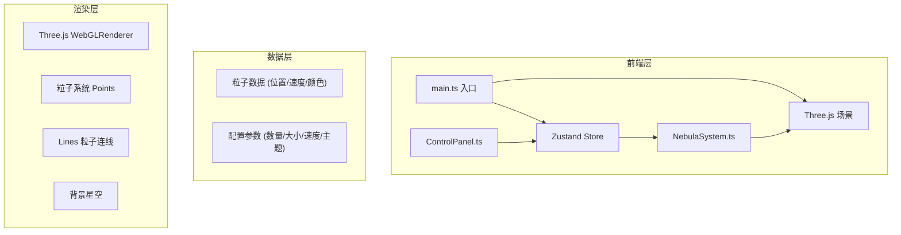

## 1. 架构设计



## 2. 技术描述

- **前端框架**：原生 TypeScript + Three.js (无React/Vue框架)
- **构建工具**：Vite
- **3D渲染**：three@0.160.0
- **状态管理**：zustand
- **工具库**：uuid
- **后端**：无（纯前端应用）

## 3. 文件结构

| 文件路径 | 用途 |
|---------|------|
| `package.json` | 项目依赖与脚本配置 |
| `index.html` | 入口HTML页面 |
| `vite.config.js` | Vite构建配置 |
| `tsconfig.json` | TypeScript配置 |
| `src/main.ts` | 应用入口，初始化场景、相机、渲染器 |
| `src/NebulaSystem.ts` | 星云粒子系统核心类 |
| `src/ControlPanel.ts` | UI控制面板 |
| `src/store.ts` | Zustand状态管理 |
| `src/style.css` | 全局样式 |

## 4. 核心模块设计

### 4.1 NebulaSystem 类

```typescript
class NebulaSystem {
  // 属性
  particleCount: number
  particleSize: number
  colorTheme: ColorTheme
  rotationSpeed: number
  
  // 方法
  constructor(scene: THREE.Scene)
  updateParams(params: NebulaParams)
  update(deltaTime: number)
  createParticles()
  dispose()
}
```

### 4.2 Zustand Store

```typescript
interface NebulaState {
  particleCount: number
  colorSpeed: number
  particleSize: number
  colorTheme: string
  setParticleCount: (n: number) => void
  setColorSpeed: (s: number) => void
  setParticleSize: (s: number) => void
  setColorTheme: (t: string) => void
  reset: () => void
}
```

### 4.3 ControlPanel 类

负责DOM控制面板的创建与事件绑定，通过Zustand store分发参数变更。

## 5. 数据流

1. 应用启动 → 加载默认配置 → 初始化Zustand store
2. Store状态变更 → NebulaSystem响应更新 → 重新生成/调整粒子
3. 用户交互(鼠标/触摸) → Three.js OrbitControls → 相机变换
4. 渲染循环 → NebulaSystem.update → 粒子位置/颜色更新 → 渲染

## 6. 性能优化策略

- 使用 BufferGeometry 替代 Geometry，提升性能
- 粒子精灵纹理复用，减少Draw Call
- 粒子连线使用距离阈值，限制连线数量
- 参数变化时批量更新，避免逐帧重建
- 使用 requestAnimationFrame 同步刷新
