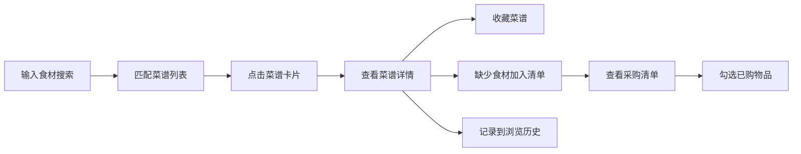

## 1. 产品概述
RecipeRadar 是一款智能菜谱匹配与采购管理应用，帮助用户根据冰箱剩余食材快速发现可烹饪的菜谱，并自动生成食材采购清单。
- 核心价值：减少食材浪费、简化做饭决策、一站式购物规划
- 目标用户：家庭主妇、租房青年、厨艺爱好者

## 2. 核心功能

### 2.1 用户角色
| 角色 | 注册方式 | 核心权限 |
|------|----------|----------|
| 普通用户 | 无需注册（本地存储） | 浏览菜谱、搜索匹配、管理采购清单、收藏菜谱、查看历史记录 |

### 2.2 功能模块
1. **菜谱核心模块**：食材搜索、智能匹配、菜谱详情展示
2. **清单与收藏模块**：采购清单管理、菜谱收藏、浏览历史记录

### 2.3 页面详情
| 页面名称 | 模块名称 | 功能描述 |
|----------|----------|----------|
| 首页 | 侧边栏导航 | 固定左侧渐变深蓝绿侧边栏，包含导航菜单、收藏列表、移动端汉堡菜单 |
| 首页 | 搜索栏 | 毛玻璃效果搜索栏，支持食材输入、emoji下拉建议、实时搜索 |
| 首页 | 菜谱卡片网格 | 三列卡片展示，包含菜名、烹饪时间、难度星级、渐变emoji主图、悬停浮起动画 |
| 菜谱详情页 | 详情头部 | 菜名、渐变emoji主图、收藏心形按钮（带放大回弹动画） |
| 菜谱详情页 | 食材清单 | 已拥有食材绿色高亮、缺少食材红色标出、一键加入采购清单 |
| 菜谱详情页 | 烹饪步骤 | 分步说明、步骤编号、点击打勾动画 |
| 菜谱详情页 | 评论区域 | 星级评分、评论输入框、评论列表 |
| 采购清单页 | 总价估算 | 实时计算总花费、数字跳动动画 |
| 采购清单页 | 清单列表 | 食材行、复选框勾选、浅绿色背景、扫光动画、手动添加食材 |
| 采购清单页 | 清空已购 | 移除已勾选项目、缩小消失动画、更新总价 |
| 历史记录页 | 时间线 | 最近10条浏览记录、圆形缩略图、时间倒序排列 |

## 3. 核心流程

用户在首页搜索栏输入冰箱剩余食材 → 系统实时匹配可做菜谱 → 用户浏览卡片网格 → 点击卡片进入详情页（从右向左滑入）→ 查看食材清单（区分已有/缺少）→ 一键将缺少食材加入采购清单 → 收藏喜欢的菜谱 → 进入采购清单页勾选已购物品 → 查看历史浏览记录

## 4. 用户界面设计

### 4.1 设计风格
- **主色调**：清爽蓝绿配色，主背景 #F0FAF8，卡片 #FFFFFF，海蓝色边框 #2E86AB
- **侧边栏**：渐变深蓝绿背景 #0B525B 到 #1B7A7A，白色文字，宽度 240px
- **卡片样式**：2px 海蓝色边框，16px 圆角，悬停上浮 8px 带阴影扩散
- **搜索栏**：毛玻璃效果，背景模糊 10px
- **按钮效果**：hover 时缩放 1.05 并改变背景亮度
- **页面切换**：0.3 秒淡入淡出过渡动画
- **食材图标**：使用 emoji 图标（🥦🍗🥚等）
- **字体**：现代无衬线字体，标题稍大粗体，正文清晰易读

### 4.2 页面设计概述
| 页面名称 | 模块名称 | UI 元素 |
|----------|----------|---------|
| 首页 | 侧边栏 | 渐变背景、白色文字、logo、导航项、收藏列表、汉堡菜单图标 |
| 首页 | 搜索栏 | 毛玻璃背景、圆角、搜索图标、输入框、emoji下拉建议 |
| 首页 | 卡片网格 | 三列布局、淡入动画、悬停浮起、菜名/时间/星级/emoji拼图 |
| 菜谱详情页 | 头部区域 | 大标题、渐变emoji拼图、心形收藏按钮（回弹动画） |
| 菜谱详情页 | 食材清单 | 表格布局、绿色已拥有/红色缺少标签、加入清单按钮 |
| 菜谱详情页 | 烹饪步骤 | 左侧编号圆形、文字说明、点击打勾动画 |
| 菜谱详情页 | 评论区 | 星级评分组件、textarea输入、评论列表展示 |
| 采购清单页 | 总价区 | 大号数字、跳动动画、货币符号 |
| 采购清单页 | 清单行 | 复选框、食材名/数量/单价、扫光动画、删除按钮 |
| 历史记录页 | 时间线 | 垂直线条、圆形缩略图、菜谱名称、浏览时间 |

### 4.3 响应式设计
- **桌面端（>1024px）**：侧边栏固定展开240px，三列卡片网格
- **平板端（768-1024px）**：侧边栏折叠为汉堡菜单，两列卡片网格
- **移动端（<768px）**：汉堡菜单悬浮左侧，单列卡片布局，触摸优化
- 所有动画保持 60fps，搜索响应时间 ≤200ms
