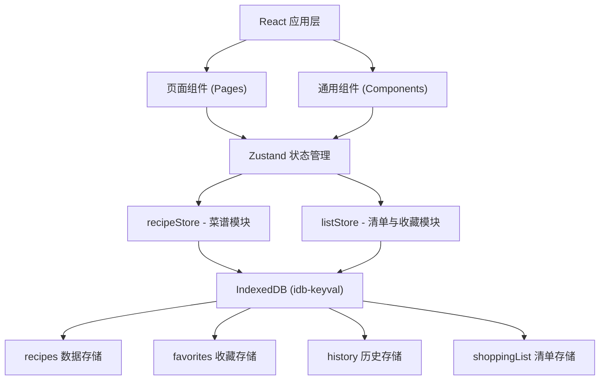
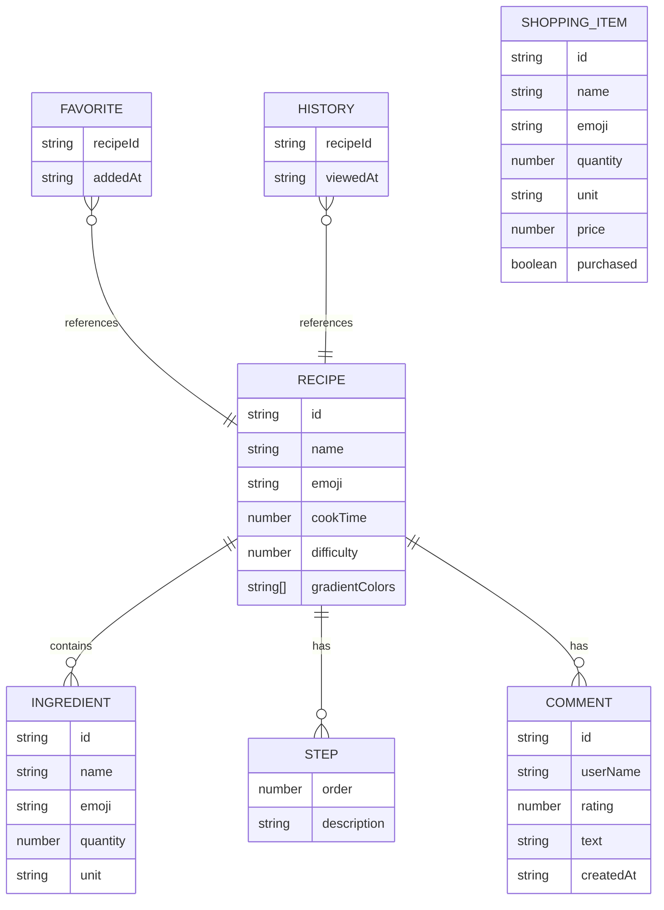

## 1. 架构设计



## 2. 技术说明
- **前端框架**：React@18 + TypeScript
- **构建工具**：Vite
- **路由**：react-router-dom@6
- **状态管理**：Zustand
- **数据持久化**：IndexedDB (idb-keyval)
- **唯一ID**：uuid
- **CSS方案**：原生 CSS + CSS 变量（不使用 Tailwind，保持独立样式文件）

## 3. 路由定义
| 路由 | 用途 |
|------|------|
| / | 首页（菜谱搜索与列表展示） |
| /recipe/:id | 菜谱详情页 |
| /list | 采购清单页 |
| /history | 浏览历史记录页 |

## 4. 数据模型

### 4.1 数据模型定义



### 4.2 类型定义（TypeScript）

```typescript
interface Ingredient {
  id: string;
  name: string;
  emoji: string;
  quantity: number;
  unit: string;
}

interface Step {
  order: number;
  description: string;
}

interface Comment {
  id: string;
  userName: string;
  rating: number;
  text: string;
  createdAt: string;
}

interface Recipe {
  id: string;
  name: string;
  emoji: string;
  cookTime: number;
  difficulty: number;
  gradientColors: string[];
  ingredients: Ingredient[];
  steps: Step[];
  comments: Comment[];
}

interface ShoppingItem {
  id: string;
  name: string;
  emoji: string;
  quantity: number;
  unit: string;
  price: number;
  purchased: boolean;
}

interface Favorite {
  recipeId: string;
  addedAt: string;
}

interface HistoryItem {
  recipeId: string;
  viewedAt: string;
}
```

## 5. 模块拆分

### 5.1 菜谱核心模块
- `src/pages/HomePage.tsx` - 首页（侧边栏、搜索、卡片网格）
- `src/pages/RecipeDetailPage.tsx` - 菜谱详情页
- `src/store/recipeStore.ts` - 菜谱状态管理（搜索、匹配、收藏、历史）

### 5.2 清单与收藏模块
- `src/pages/ListPage.tsx` - 采购清单页
- `src/pages/HistoryPage.tsx` - 历史记录页
- `src/store/listStore.ts` - 清单状态管理（增删改查、总价计算）

### 5.3 共享模块
- `src/types/index.ts` - 共享类型定义
- `src/data/mockRecipes.ts` - Mock 菜谱数据
- `src/App.tsx` - 应用入口与路由配置
- `src/main.tsx` - React 入口
- `src/index.css` - 全局样式与动画
