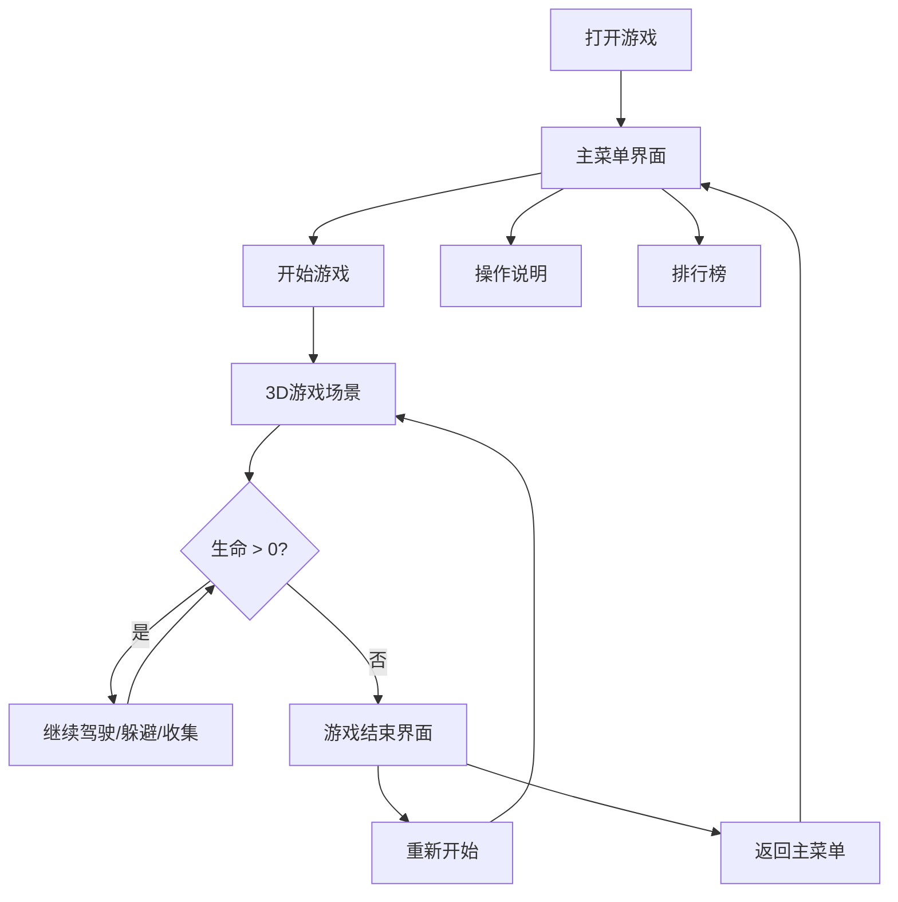

## 1. 产品概述

危险品运输3D俯视竞速游戏，玩家驾驶卡车在无限延伸的3D道路上行驶，躲避随机障碍物并收集能量道具，在浏览器中体验紧张刺激的驾驶与规避乐趣。

- 核心玩法：俯视视角驾驶卡车，躲避障碍物（水泥墩、破损车辆、动态卡车），收集能量光球（加速/护盾/双倍得分）
- 目标用户：休闲游戏玩家，喜欢竞速和躲避类游戏的用户
- 产品价值：提供无需下载、即开即玩的3D竞速游戏体验，支持PC和移动端

## 2. 核心功能

### 2.1 功能模块

1. **主菜单系统**：开始游戏、操作说明、排行榜
2. **驾驶与控制系统**：WASD/方向键控制车辆，加速/刹车/转弯侧倾
3. **道路生成系统**：无限生成直线、弯道、坡道
4. **碰撞系统**：AABB碰撞检测，障碍物碰撞减速、减血、粒子特效、屏幕抖动
5. **道具系统**：能量光球收集、道具持有（最多3个）、空格使用道具
6. **粒子特效系统**：碰撞碎片、道具光晕、速度线
7. **分数与难度系统**：距离累积分数、动态难度递增、本地最高分记录
8. **HUD界面**：得分、生命值、道具图标实时显示
9. **游戏结束界面**：最终得分、最高分、重新开始

### 2.2 页面详情

| 页面名称 | 模块名称 | 功能描述 |
|-----------|-------------|---------------------|
| 主菜单 | 标题动画 | 白色粗体48px标题，微光动画，深蓝星空粒子背景 |
| 主菜单 | 开始游戏按钮 | 点击进入游戏场景 |
| 主菜单 | 操作说明面板 | 半透明毛玻璃面板，键盘图示说明 |
| 主菜单 | 排行榜面板 | 显示本地存储的前10名分数 |
| 游戏场景 | 3D道路 | 深灰色带黄色中心线和白色边缘线，两侧绿色草地 |
| 游戏场景 | 玩家卡车 | 蓝色车身带警示条纹，转弯侧倾动画 |
| 游戏场景 | 障碍物 | 静态水泥墩/破损车辆（暗灰色带红色高亮）、动态红色卡车（带预警线） |
| 游戏场景 | 能量光球 | 浮空旋转，蓝/绿/金三色对应不同道具类型 |
| HUD | 得分显示 | 屏幕上端中央，白色粗体32px |
| HUD | 生命值 | 左下角3个红色心形图标 |
| HUD | 道具栏 | 右上角圆形带颜色边框的道具图标 |
| 游戏结束 | 得分面板 | 淡入动画，半透明黑色遮罩，显示最终得分、最高分、重新开始按钮 |

## 3. 核心流程

玩家打开游戏 → 主菜单（星空背景粒子飘动） → 点击"开始游戏" → 进入3D俯视场景 → 驾驶卡车躲避障碍物、收集道具 → 生命值归零或主动退出 → 游戏结束界面显示得分 → 返回主菜单或重新开始

## 4. 用户界面设计

### 4.1 设计风格
- 主色调：深蓝 #0A0E27（背景）、深灰 #2A2A35（道路）、绿色 #3E6B3E（草地）、白色 #FFFFFF（UI文字）
- 能量球颜色：蓝色 #00BFFF（加速）、绿色 #00FF7F（护盾）、金色 #FFD700（双倍得分）
- 护盾光罩：半透明蓝 #3A86FF40
- 按钮风格：圆角矩形，悬停有微发光效果
- 字体：系统无衬线字体，标题粗体
- 布局：全屏Canvas渲染，HTML叠加层实现UI

### 4.2 动画效果
- 标题微光动画（持续循环）
- 星空粒子缓慢飘动
- 车辆转弯侧倾 0.3秒
- 碰撞屏幕抖动 0.1秒
- 碰撞碎片粒子 0.3秒
- 道具使用光晕扩散 0.5秒
- 游戏结束界面淡入动画
- 能量光球浮空旋转

### 4.3 响应式设计
- 宽屏（>1200px）：道路宽度为屏幕的60%
- 平板（768-1200px）：道路宽度为屏幕的80%
- 手机（<768px）：道路宽度为100%，UI元素尺寸增大

### 4.4 3D场景指导
- 环境：深蓝星空背景（主菜单）、白天户外场景（游戏中）
- 光照：方向光模拟太阳光，环境光保证场景可见度
- 相机：俯视正交/透视相机，跟随车辆
- 粒子预算：道具光晕粒子≤150个，碰撞粒子≤100个
- 性能目标：60FPS稳定帧率
