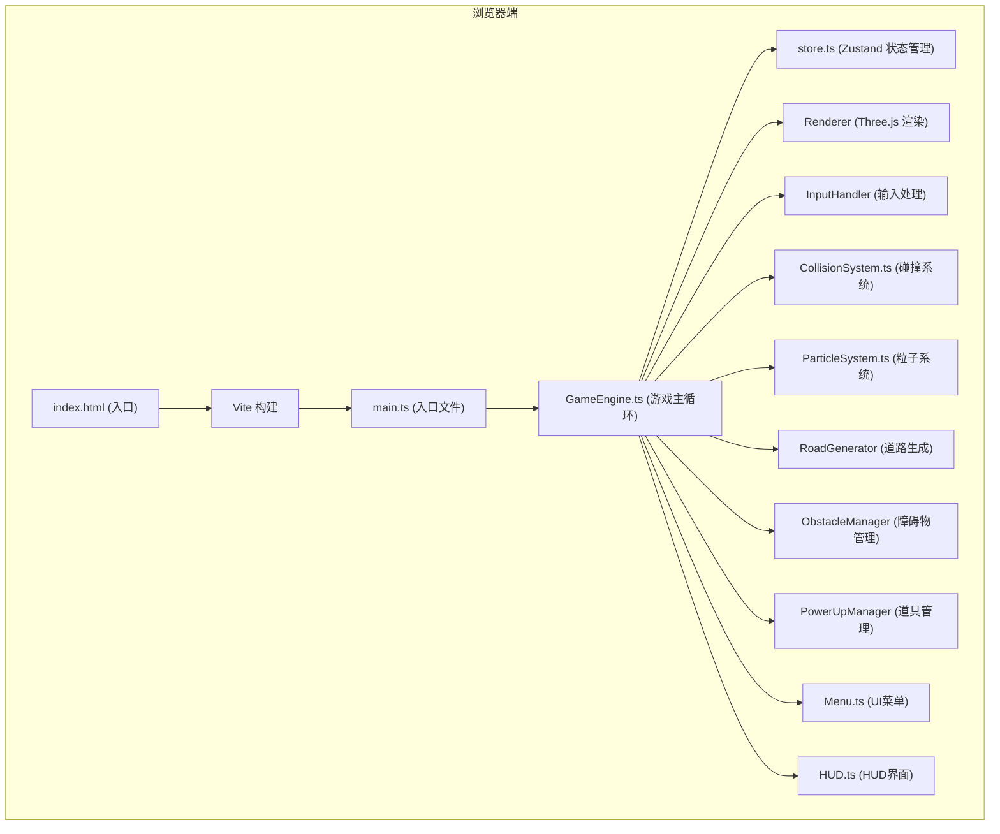

## 1. 架构设计



## 2. 技术描述

- **前端框架**：纯 TypeScript + Three.js（无React/Vue框架，直接操作DOM和Three.js）
- **构建工具**：Vite 5.x
- **状态管理**：Zustand 4.x
- **3D渲染**：Three.js 0.160.0
- **UI渲染**：Three.js CSS2DRenderer + 原生HTML/CSS
- **数据存储**：localStorage（排行榜、最高分）
- **后端依赖**：无，纯前端应用

## 3. 项目文件结构

```
.
├── package.json              # 依赖配置 (three@0.160, zustand, uuid)
├── index.html                # 入口页面
├── vite.config.js            # Vite 构建配置
├── tsconfig.json             # TypeScript 严格模式配置
└── src/
    ├── main.ts               # 应用入口
    ├── store.ts              # Zustand 全局状态
    ├── types.ts              # 全局类型定义
    ├── game/
    │   ├── GameEngine.ts     # 游戏主循环引擎
    │   ├── CollisionSystem.ts # AABB碰撞检测系统
    │   ├── ParticleSystem.ts  # 粒子特效系统
    │   ├── RoadGenerator.ts   # 无限道路生成器
    │   ├── ObstacleManager.ts # 障碍物管理器
    │   ├── PowerUpManager.ts  # 能量道具管理器
    │   ├── InputHandler.ts    # 键盘输入处理
    │   └── Vehicle.ts         # 玩家车辆逻辑
    ├── ui/
    │   ├── Menu.ts            # 主菜单、操作说明、排行榜、游戏结束UI
    │   ├── HUD.ts             # 游戏内HUD (得分、生命、道具)
    │   └── styles.css         # UI样式
    └── utils/
        └── helpers.ts         # 工具函数
```

## 4. 数据模型（Store状态）

### 4.1 Zustand Store 定义

```typescript
type GameState = 'menu' | 'playing' | 'gameover';
type PowerUpType = 'speed' | 'shield' | 'double';

interface GameStore {
  // 游戏状态
  gameState: GameState;
  score: number;
  highScore: number;
  lives: number;
  distance: number;
  speed: number;
  baseSpeed: number;
  
  // 道具
  activePowerUps: PowerUpType[];  // 最多3个，FIFO
  speedBoostActive: boolean;
  shieldActive: boolean;
  doubleScoreActive: boolean;
  speedBoostTimer: number;
  shieldTimer: number;
  doubleScoreTimer: number;
  
  // 排行榜
  leaderboard: number[];
  
  // Actions
  startGame: () => void;
  endGame: () => void;
  resetGame: () => void;
  goToMenu: () => void;
  addScore: (points: number) => void;
  decrementLife: () => void;
  collectPowerUp: (type: PowerUpType) => void;
  usePowerUp: () => void;
  updateActivePowerUps: (delta: number) => void;
  updateDistance: (delta: number) => void;
  updateHighScore: () => void;
}
```

## 5. 核心模块说明

### 5.1 GameEngine.ts
- 初始化 Three.js 场景、相机、渲染器、灯光
- 管理游戏主循环（requestAnimationFrame）
- 调度各子系统更新
- 数据流向：InputHandler → Store → 更新逻辑 → Renderer → CollisionSystem → ParticleSystem

### 5.2 CollisionSystem.ts
- 基于 AABB（轴对齐包围盒）算法
- 检测玩家车辆与障碍物的碰撞
- 检测玩家车辆与能量光球的碰撞
- 触发碰撞回调（减血、减速、粒子、屏幕抖动、道具收集）

### 5.3 ParticleSystem.ts
- 管理三种粒子：碰撞碎片、道具光晕、速度线
- 每个粒子包含：位置、速度、颜色、生命周期
- 粒子上限：道具光晕≤150，碰撞碎片≤100

### 5.4 Menu.ts & HUD.ts
- 使用 Three.js CSS2DRenderer 实现HTML叠加层
- Menu 负责主菜单、操作说明、排行榜、游戏结束界面
- HUD 负责得分、生命值、道具图标实时显示

## 6. 性能优化策略

- 对象池模式复用障碍物和道具3D对象
- 视椎剔除（Frustum Culling）
- 粒子数量硬限制
- 道路分段加载，回收远离玩家的路段
- 使用 requestAnimationFrame 配合 deltaTime 平滑动画
- 简化3D模型面数
