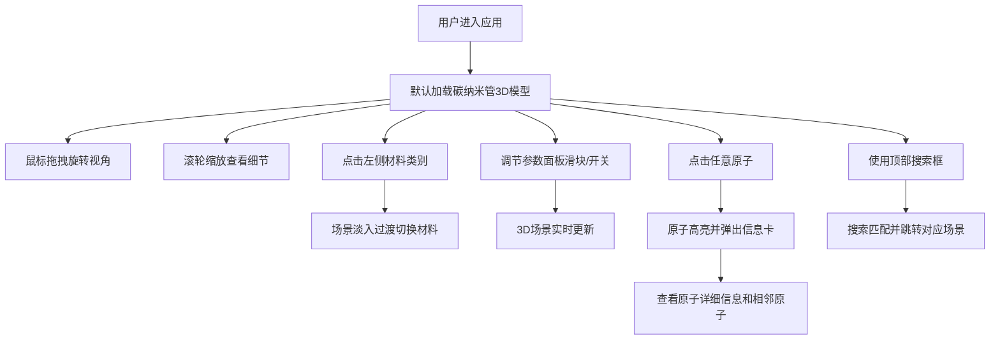

## 1. 产品概述

NanoLens 是一款面向材料科学专业学生和研究人员的3D纳米材料微观结构可视化工具。通过交互式3D渲染技术，直观展示碳纳米管、石墨烯、量子点等纳米材料的原子排列、缺陷位点和表面形貌，支持实时视角调节与参数控制。

- 核心价值：将抽象的纳米级材料结构转化为可交互、可探索的3D可视化体验
- 目标用户：材料科学、化学、物理专业的学生及研究人员

## 2. 核心特性

### 2.1 功能模块

1. **3D主场景**：晶体结构渲染、原子球体、化学键圆柱、深空渐变背景、鼠标交互（旋转/缩放）
2. **侧边栏控制面板**：材料类别层级菜单、参数调节面板（原子大小、键显示开关、缺陷生成、密度调节）
3. **原子信息卡**：点击原子弹出浮动信息卡，显示元素、坐标、配位数、相邻原子列表
4. **顶部导航栏**：当前材料名称、搜索框、放大/缩小控制按钮

### 2.2 页面详情

| 页面名称 | 模块名称 | 功能描述 |
|---------|---------|---------|
| 主页面 | 3D场景渲染 | 原子彩色球体（碳深灰、氧红、氢白）、化学键半透明圆柱、深空渐变背景(#0D1117到#161B22)、鼠标拖拽旋转（平滑惯性阻尼）、滚轮缩放（镜头光晕变化） |
| 主页面 | 左侧侧边栏 | 毛玻璃半透明效果(背景模糊16px, rgba(22,27,34,0.85), 宽度260px)、材料类别层级菜单（一维纳米管/二维石墨烯/零维量子点）、参数调节面板（原子大小滑块、键显示开关、缺陷随机生成开关、密度调节滑动条） |
| 主页面 | 原子信息卡 | 点击原子高亮并弹出毛玻璃浮动信息卡、显示元素/坐标/配位数、1纳米范围内相邻原子列表（可滚动）、淡入动画、微弱边缘发光 |
| 主页面 | 顶部导航栏 | 高度60px、深色半透明、白色文字、当前材料名称、搜索框（支持原子符号或材料名称搜索跳转）、放大/缩小按钮 |

## 3. 核心流程

## 4. 用户界面设计

### 4.1 设计风格

- 主色调：深空渐变背景 #0D1117 → #161B22
- 强调色：碳(#4A4A4A深灰)、氧(#E53935红)、氢(#FAFAFA白)
- UI风格：毛玻璃半透明、深色系科技感、微弱发光边缘
- 字体：现代无衬线字体，白色文字配深色半透明背景
- 交互：平滑过渡动画、惯性阻尼、淡入淡出

### 4.2 页面设计概览

| 页面名称 | 模块名称 | UI元素 |
|---------|---------|-------|
| 主页面 | 3D场景 | 全屏Canvas、深空渐变背景、彩色原子球体、半透明化学键、动态镜头光晕 |
| 主页面 | 侧边栏 | 固定左侧260px、毛玻璃效果backdrop-blur(16px)、层级折叠菜单、滑块控件、开关按钮 |
| 主页面 | 信息卡 | 毛玻璃浮层、白色文字、边缘box-shadow发光、淡入fadeIn动画、滚动列表 |
| 主页面 | 导航栏 | 固定顶部60px、深色半透明背景、搜索输入框、缩放按钮组 |

### 4.3 响应式设计

- 桌面端优先设计，全屏Canvas渲染
- 侧边栏固定宽度，主场景自适应剩余空间
- 触控设备支持双指缩放和单指拖拽

### 4.4 3D场景指导

- 环境：深空渐变背景，营造微观粒子悬浮感
- 灯光：多点环境光 + 方向光，突出原子球体立体感
- 相机：PerspectiveCamera，支持轨道控制(OrbitControls)带惯性阻尼
- 交互：Raycaster实现原子拾取点击
- 后处理：根据缩放距离动态调整镜头光晕强度
- 性能：InstancedMesh批量渲染原子，保证数百原子流畅60fps
