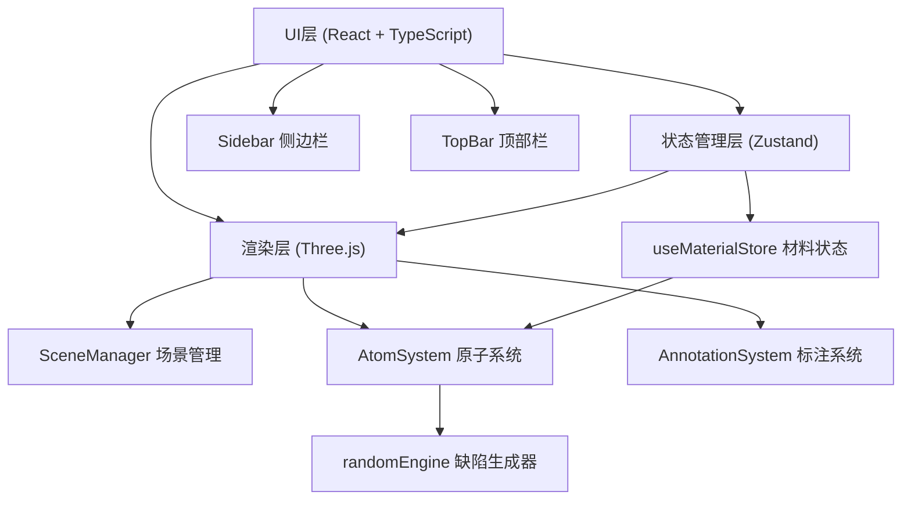

## 1. 架构设计



## 2. 技术说明

- 前端框架：Vanilla TypeScript (无React/Vue，直接DOM操作+Three.js)
- 构建工具：Vite 5.x
- 3D渲染：Three.js 0.160.0
- 状态管理：Zustand 4.x
- UI控件：Tweakpane (参数面板)
- 工具库：uuid (唯一ID生成)
- 样式：原生CSS + CSS变量

## 3. 文件结构

```
d:\P\tasks\auto142/
├── package.json
├── index.html
├── vite.config.js
├── tsconfig.json
└── src/
    ├── main.ts                    # 入口文件，场景初始化和渲染循环
    ├── types.ts                   # 共享类型定义
    ├── stores/
    │   └── useMaterialStore.ts    # Zustand状态管理
    ├── scene/
    │   ├── SceneManager.ts        # Three.js场景/相机/灯光/渲染器管理
    │   ├── AtomSystem.ts          # 原子和化学键生成与交互
    │   └── AnnotationSystem.ts    # 浮动信息卡管理
    ├── ui/
    │   ├── Sidebar.ts             # 侧边栏UI组件
    │   └── TopBar.ts              # 顶部导航栏UI组件
    └── utils/
        └── randomEngine.ts        # 缺陷随机生成器
```

## 4. 数据模型

### 4.1 核心类型定义

```typescript
// 元素类型
type ElementType = 'C' | 'O' | 'H' | 'N' | 'Si';

// 原子信息接口
interface Atom {
  id: string;
  element: ElementType;
  position: { x: number; y: number; z: number };
  coordinationNumber: number;
  neighbors: string[];
  isDefect?: boolean;
}

// 化学键接口
interface Bond {
  id: string;
  atomAId: string;
  atomBId: string;
  length: number;
}

// 材料类型
type MaterialCategory = 'nanotube' | 'graphene' | 'quantumdot';

// 材料数据接口
interface MaterialData {
  id: MaterialCategory;
  name: string;
  displayName: string;
  category: string;
  atoms: Atom[];
  bonds: Bond[];
  latticeParams: { a?: number; b?: number; c?: number };
}

// 可视化参数
interface VisualParams {
  atomScale: number;
  showBonds: boolean;
  generateDefects: boolean;
  defectDensity: number;
}

// UI状态
interface MaterialStoreState {
  currentMaterial: MaterialCategory;
  materials: Record<MaterialCategory, MaterialData>;
  selectedAtom: Atom | null;
  visualParams: VisualParams;
  cameraDistance: number;
  setCurrentMaterial: (id: MaterialCategory) => void;
  selectAtom: (atom: Atom | null) => void;
  setVisualParams: (params: Partial<VisualParams>) => void;
  setCameraDistance: (distance: number) => void;
  searchAndNavigate: (query: string) => void;
}
```

### 4.2 元素颜色映射

| 元素符号 | 颜色HEX | 说明 |
|---------|---------|------|
| C | #4A4A4A | 深灰色碳原子 |
| O | #E53935 | 红色氧原子 |
| H | #FAFAFA | 白色氢原子 |
| N | #3D5AFE | 蓝色氮原子 |
| Si | #FFB300 | 金色硅原子 |

## 5. 核心模块职责

### 5.1 SceneManager
- 初始化Three.js Scene、PerspectiveCamera、WebGLRenderer
- 配置OrbitControls（惯性阻尼、缩放范围）
- 设置灯光（AmbientLight + DirectionalLight × 2）
- 管理渲染循环和镜头光晕效果
- 处理窗口resize事件

### 5.2 AtomSystem
- 根据材料数据生成原子SphereGeometry网格
- 根据化学键数据生成CylinderGeometry连接圆柱
- 支持原子大小缩放、化学键显示/隐藏
- 使用Raycaster处理原子点击拾取
- 调用randomEngine生成缺陷结构
- 原子选中高亮效果

### 5.3 AnnotationSystem
- 创建毛玻璃效果浮动信息卡DOM元素
- 根据3D坐标计算屏幕位置投影
- 实现淡入动画和边缘发光效果
- 管理相邻原子列表滚动显示
- 点击外部自动关闭

### 5.4 Sidebar
- 层级菜单：一维纳米管/二维石墨烯/零维量子点
- 参数调节：原子大小滑块(0.5-2.0)、键显示开关、缺陷开关、密度滑块(0-0.3)
- 材料切换触发场景淡入过渡动画
- 通过Zustand store与3D场景通信

### 5.5 TopBar
- 显示当前材料名称
- 搜索框：支持元素符号(C/O/H)和材料名称搜索
- 放大/缩小按钮：控制相机距离
