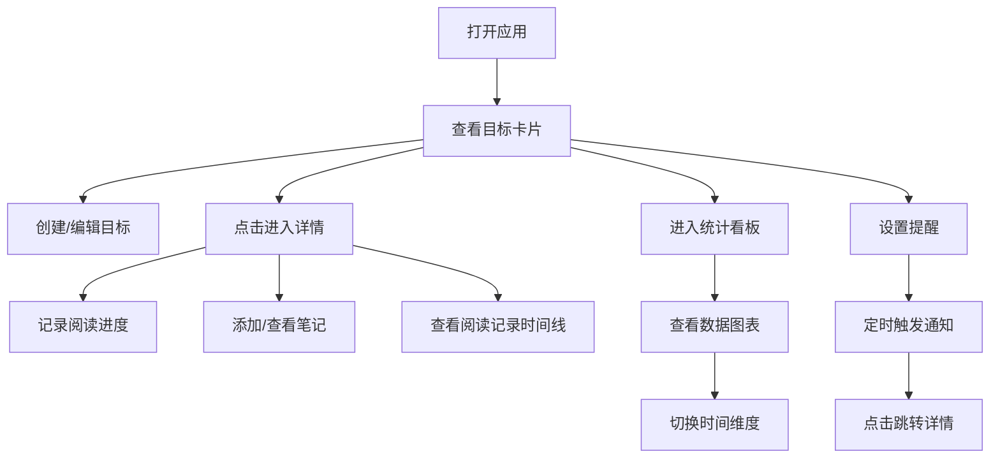

## 1. 产品概述

个人阅读目标跟踪工具，帮助用户规划和跟踪阅读进度，解决读书计划容易中断、忘记阅读进度以及缺乏阅读数据统计的问题。

- 主要面向热爱阅读、有阅读规划需求的用户，提供目标管理、阅读记录、数据分析、笔记管理和阅读提醒功能
- 产品价值：通过可视化进度追踪和数据统计，提升用户阅读动力，培养良好阅读习惯

## 2. 核心功能

### 2.1 用户角色

| 角色 | 注册方式 | 核心权限 |
|------|---------|---------|
| 普通用户 | 本地使用，无需注册 | 创建阅读目标、记录阅读、查看统计、管理笔记、设置提醒 |

### 2.2 功能模块

1. **主页**：阅读目标卡片网格展示，快速查看所有阅读目标进度
2. **目标详情页**：目标详情、阅读记录时间线、笔记模块
3. **统计看板页**：阅读数据可视化统计分析
4. **设置/提醒页**：提醒配置和应用设置

### 2.3 页面详情

| 页面名称 | 模块名称 | 功能描述 |
|---------|---------|---------|
| 主页 | 目标卡片网格 | 展示所有阅读目标卡片，每张卡片包含书籍信息、渐变背景、环形进度条，点击进入详情 |
| 主页 | 顶部导航栏 | 固定毛玻璃效果，应用logo、名称、用户头像、设置按钮 |
| 目标详情页 | 目标信息模态框 | 半透明遮罩毛玻璃效果，展示书籍详情和操作按钮 |
| 目标详情页 | 阅读记录时间线 | 时间线形式展示阅读记录，支持滚动加载更多 |
| 目标详情页 | 笔记模块 | 浮动标签列表，点击弹出笔记预览，支持排序 |
| 统计看板页 | 柱状图 | 展示每周/月阅读页数趋势，支持时间范围切换 |
| 统计看板页 | 环形图 | 展示不同心情标签占比 |
| 统计看板页 | 折线图 | 展示连续阅读天数趋势 |
| 提醒模块 | 系统通知 | 浏览器Notification API推送阅读提醒 |
| 提醒模块 | 页面提示框 | 右下角半透明毛玻璃提示框，5秒自动消失 |

## 3. 核心流程

用户打开应用 → 查看主页目标卡片网格 → 点击目标卡片查看详情 → 记录阅读进度 → 添加笔记 → 查看统计分析 → 设置阅读提醒

## 4. 用户界面设计

### 4.1 设计风格

- **主背景**：#F5F0EB（米白色），温暖书卷气息
- **卡片背景**：#FFFFFF，带1px浅灰边框#DCD6D0，12px圆角
- **笔记页面**：淡黄#FFF8E7背景，暗红色#8B4513文字，2px深棕#A0522D边框
- **导航栏**：固定毛玻璃效果（背景模糊12px）
- **按钮与交互**：所有卡片和按钮的点击和悬停都有平滑过渡（transition: all 0.25s ease）
- **渐变配色**：按书籍类别自动生成渐变色（科幻类紫蓝渐变、文学类暖黄渐变等）
- **字体**：采用思源宋体和思源黑体搭配，体现书卷气息

### 4.2 页面设计概述

| 页面名称 | 模块名称 | UI元素 |
|---------|---------|--------|
| 主页 | 目标卡片 | 渐变背景、书籍封面、环形进度条、悬停旋转动画、3列网格布局 |
| 主页 | 导航栏 | 书籍图标、应用名称、用户头像、设置按钮、毛玻璃效果 |
| 目标详情页 | 模态框 | 半透明遮罩、毛玻璃背景、书籍详情、操作按钮 |
| 目标详情页 | 时间线 | 圆形心情点、纵向虚线连接、日期、阅读时长、页码范围 |
| 目标详情页 | 笔记模块 | 左边缘浮动标签、笔记预览框（8px背景模糊）、排序功能 |
| 统计看板页 | 图表 | 入场动画（底部向上弹出渐显）、淡入切换动画、recharts实现 |
| 提醒模块 | 提示框 | 右下角半透明毛玻璃、5秒自动消失、点击跳转 |

### 4.3 响应式

- **桌面端**：卡片3列网格布局，侧边导航
- **平板端**：卡片2列网格布局
- **移动端**：卡片1列布局，侧边栏变为底部Tab栏，触摸优化
- 虚拟滚动支持100个目标时FPS不低于30

### 4.4 动画与交互

- **环形进度条**：悬停时旋转360度并显示百分比
- **图表入场**：从底部向上弹出并逐渐透明（translateY + opacity）
- **时间范围切换**：图表淡入淡出过渡（opacity 0→1）
- **卡片悬停**：微缩放、阴影加深（scale + box-shadow）
- **模态框**：背景模糊、渐入动画
