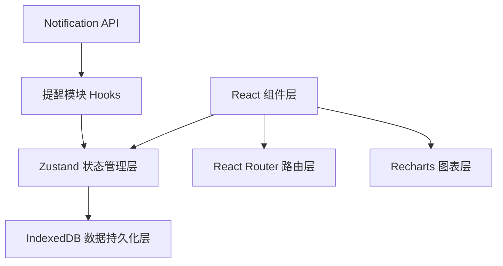
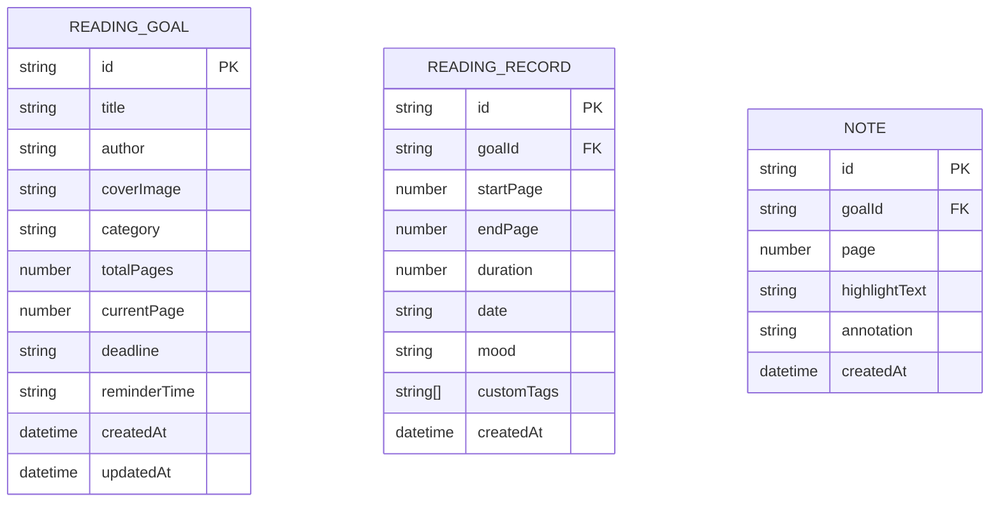

## 1. 架构设计



## 2. 技术描述

- **前端框架**：React@18 + TypeScript + Vite
- **状态管理**：Zustand
- **路由**：react-router-dom@6
- **图表库**：recharts
- **数据持久化**：IndexedDB（idb-keyval封装）
- **唯一ID**：uuid
- **构建工具**：Vite
- **包管理**：npm

## 3. 路由定义

| 路由 | 用途 |
|------|------|
| / | 主页 - 阅读目标卡片网格 |
| /goal/:id | 目标详情页 - 阅读记录和笔记 |
| /analytics | 统计看板页 - 数据可视化 |
| /settings | 设置页 - 提醒配置 |

## 4. 数据模型

### 4.1 数据模型定义



### 4.2 TypeScript 类型定义

```typescript
interface ReadingGoal {
  id: string;
  title: string;
  author: string;
  coverImage: string;
  category: string;
  totalPages: number;
  currentPage: number;
  deadline: string;
  reminderTime?: string;
  createdAt: string;
  updatedAt: string;
}

interface ReadingRecord {
  id: string;
  goalId: string;
  startPage: number;
  endPage: number;
  duration: number;
  date: string;
  mood: string;
  customTags: string[];
  createdAt: string;
}

interface Note {
  id: string;
  goalId: string;
  page: number;
  highlightText: string;
  annotation: string;
  createdAt: string;
}
```

## 5. 项目文件结构

```
├── package.json
├── index.html
├── vite.config.js
├── tsconfig.json
└── src/
    ├── main.tsx
    ├── App.tsx
    ├── index.css
    ├── modules/
    │   ├── reading/
    │   │   ├── components/
    │   │   │   ├── ReadingGoalCard.tsx
    │   │   │   ├── RecordTimeline.tsx
    │   │   │   ├── GoalDetailModal.tsx
    │   │   │   └── NoteModule.tsx
    │   │   └── store.ts
    │   ├── analytics/
    │   │   ├── components/
    │   │   │   ├── Dashboard.tsx
    │   │   │   └── Charts.tsx
    │   │   └── utils.ts
    │   └── notifications/
    │       └── hooks.ts
    ├── utils/
    │   └── indexedDB.ts
    ├── pages/
    │   ├── Home.tsx
    │   ├── GoalDetail.tsx
    │   ├── Analytics.tsx
    │   └── Settings.tsx
    ├── components/
    │   ├── Navbar.tsx
    │   ├── BottomTab.tsx
    │   └── ReminderToast.tsx
    └── types/
        └── index.ts
```

## 6. 核心模块说明

### 6.1 状态管理 (Zustand Store)
- 管理 ReadingGoal、ReadingRecord、Note 三类数据
- 提供增删改查方法
- 数据变更后同步到 IndexedDB
- 主动通知组件更新

### 6.2 IndexedDB 工具类
- 封装数据库打开、增删改查操作
- 支持事务处理
- 异步操作返回 Promise

### 6.3 图表模块
- 使用 Recharts 封装柱状图、环形图、折线图
- 支持时间范围切换（周/月）
- 入场动画和切换动画效果

### 6.4 提醒模块
- 自定义 Hook 封装 Notification API
- 管理提醒定时器
- 支持浏览器系统通知和页面提示框

### 6.5 性能优化
- 卡片列表虚拟滚动
- 首屏渲染3秒内完成
- 100个目标时FPS不低于30
