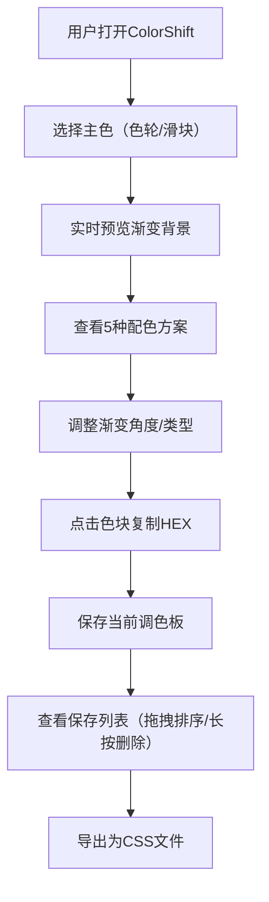

## 1. 产品概述

ColorShift 是一款浏览器配色工具，帮助设计师和开发者实时调整、预览和导出基于主题色的渐变配色方案，提供多种色彩调和模式与渐变效果预览。

- 主要用途：快速生成和谐配色方案，预览渐变效果，导出可直接使用的CSS代码
- 目标用户：UI/UX设计师、前端开发者、创意工作者
- 市场价值：降低配色决策成本，提升工作效率，提供专业级色彩调和方案

## 2. 核心功能

### 2.1 功能模块

1. **主页面**：色轮选择器、HSLA滑块、调色板预览、渐变预览区、保存列表、控制面板

### 2.2 页面详情

| 页面名称 | 模块名称 | 功能描述 |
|-----------|-------------|---------------------|
| 主页面 | 色轮选择器 | 交互式取色，点击或拖拽选择主色 |
| 主页面 | HSLA滑块 | 精细调整色相、饱和度、亮度、透明度 |
| 主页面 | 调色板预览 | 5种配色方案（单色、类似色、互补色、三色、四色）各5色块，点击复制HEX值 |
| 主页面 | 渐变预览区 | 实时渲染主色到补色的渐变背景，支持0.3秒平滑过渡 |
| 主页面 | 渐变控制 | 角度调整（0-360度）、渐变类型切换（线性、径向、圆锥） |
| 主页面 | 保存列表 | 卡片形式展示已保存调色板（最多20个），支持拖拽排序、长按删除 |
| 主页面 | 导出功能 | 将保存的所有调色板导出为单个CSS文件，自动触发下载 |

## 3. 核心流程

用户选择主色 → 实时预览渐变和5种配色方案 → 调整渐变参数 → 保存满意的方案 → 批量导出为CSS文件

## 4. 用户界面设计

### 4.1 设计风格

- **主背景色**：#F5F3F0（暖白色调，营造柔和舒适的工作环境）
- **操作面板**：毛玻璃效果（backdrop-filter: blur(12px)，白色半透明背景）
- **按钮样式**：圆形悬浮按钮，点击有0.15秒缩放反馈（scale 0.95→1.0）
- **色卡样式**：80px×120px，圆角8px，悬停上浮4px并带阴影扩散
- **字体**：Inter，现代简洁的无衬线字体
- **布局风格**：桌面端左右分栏（左侧色轮+控制，右侧色卡网格），底部40%为渐变预览区

### 4.2 页面设计概述

| 页面名称 | 模块名称 | UI元素 |
|-----------|-------------|-------------|
| 主页面 | 色轮选择器 | 居中放置，支持点击取色，带旋转标尺动画 |
| 主页面 | HSLA滑块 | 四个水平滑块，实时反馈数值 |
| 主页面 | 色卡网格 | Flex布局自动换行，悬停浮起动画 |
| 主页面 | 渐变预览区 | 占底部40%，0.3秒平滑过渡动画 |
| 主页面 | 保存列表卡片 | 渐变缩略图+名称+时间，支持拖拽排序 |
| 主页面 | 复制提示气泡 | 点击色块后出现1.5秒的"已复制"提示 |

### 4.3 响应式设计

- **桌面端**（默认）：左右分栏布局，色卡80px×120px
- **移动端**：上下布局，所有元素宽度100%，色卡缩小为60px宽
- 触摸优化：拖拽操作、长按删除均支持触摸事件
