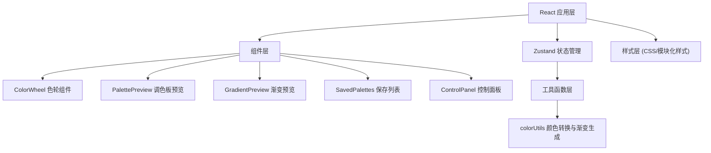

## 1. 架构设计



## 2. 技术描述

- **前端框架**：React@18 + TypeScript
- **构建工具**：Vite
- **状态管理**：Zustand
- **UI依赖**：
  - react@18, react-dom@18
  - zustand（状态管理）
  - uuid（生成唯一ID）
  - @fontsource/inter（字体）
  - react-beautiful-dnd（拖拽排序）
- **初始化方式**：Vite + React TypeScript 模板

## 3. 文件结构定义

| 文件路径 | 用途 |
|---------|------|
| `package.json` | 项目依赖与脚本配置 |
| `index.html` | 入口HTML文件 |
| `vite.config.js` | Vite配置（React插件、路径别名） |
| `tsconfig.json` | TypeScript配置（严格模式、ESNext） |
| `src/App.tsx` | 根组件，整合所有子组件 |
| `src/store/useColorStore.ts` | Zustand状态管理（主题色、调色板列表、导出配置） |
| `src/components/ColorWheel.tsx` | 交互式色轮选择器组件 |
| `src/components/PalettePreview.tsx` | 调色板预览组件（色卡网格） |
| `src/utils/colorUtils.ts` | 颜色转换与渐变生成工具函数 |
| `src/components/GradientPreview.tsx` | 渐变预览区域组件 |
| `src/components/GradientControls.tsx` | 渐变角度与类型控制组件 |
| `src/components/SavedPalettes.tsx` | 已保存调色板列表组件 |
| `src/components/HSLAInputs.tsx` | HSLA滑块输入组件 |
| `src/styles/global.css` | 全局样式与CSS变量 |

## 4. 状态模型

### 4.1 Zustand Store 定义

```typescript
interface ColorState {
  // 当前主色 (HEX)
  primaryColor: string;
  // HSLA值
  hsla: { h: number; s: number; l: number; a: number };
  // 渐变角度 0-360
  gradientAngle: number;
  // 渐变类型
  gradientType: 'linear' | 'radial' | 'conic';
  // 已保存的调色板列表（最多20个）
  savedPalettes: SavedPalette[];
  // 复制提示状态
  copiedColor: string | null;

  // Actions
  setPrimaryColor: (hex: string) => void;
  setHSLA: (hsla: Partial<{ h: number; s: number; l: number; a: number }>) => void;
  setGradientAngle: (angle: number) => void;
  setGradientType: (type: 'linear' | 'radial' | 'conic') => void;
  savePalette: (name?: string) => void;
  deletePalette: (id: string) => void;
  reorderPalettes: (fromIndex: number, toIndex: number) => void;
  setCopiedColor: (hex: string | null) => void;
  exportToCSS: () => void;
}

interface SavedPalette {
  id: string;
  name: string;
  primaryColor: string;
  schemes: ColorSchemes;
  gradientAngle: number;
  gradientType: 'linear' | 'radial' | 'conic';
  createdAt: number;
}

interface ColorSchemes {
  monochromatic: string[];
  analogous: string[];
  complementary: string[];
  triadic: string[];
  tetradic: string[];
}
```

### 4.2 颜色工具函数定义

```typescript
// HEX转RGB
function hexToRgb(hex: string): { r: number; g: number; b: number }

// RGB转HEX
function rgbToHex(r: number, g: number, b: number): string

// HEX转HSL
function hexToHsl(hex: string): { h: number; s: number; l: number }

// HSL转HEX
function hslToHex(h: number, s: number, l: number): string

// 生成线性渐变CSS
function generateLinearGradient(color1: string, color2: string, angle: number): string

// 生成径向渐变CSS
function generateRadialGradient(color1: string, color2: string): string

// 生成圆锥渐变CSS
function generateConicGradient(color1: string, color2: string, angle: number): string

// 获取补色
function getComplementaryColor(hex: string): string

// 生成5种配色方案
function generateColorSchemes(primaryHex: string): ColorSchemes
```

## 5. 性能要求

- 所有颜色计算（包括渐变生成）必须控制在5ms以内
- 使用requestAnimationFrame驱动动画
- 组件卸载时取消所有订阅，避免内存泄漏
- 使用React.memo优化纯展示组件
- 使用useMemo缓存颜色计算结果
