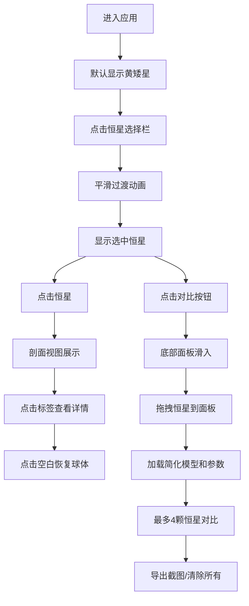

## 1. 产品概述

恒星3D可视化应用，帮助天文学爱好者和学生直观观察、对比不同类型恒星的3D模型、内部结构和相对尺度。解决现有天文教学工具静态、缺乏交互、难以展示恒星内部结构和相对尺度的问题。

- 目标用户：天文学爱好者、学生、教育工作者
- 核心价值：通过交互式3D可视化，让抽象的天文概念变得直观可感

## 2. 核心 Features

### 2.1 用户角色
| 角色 | 注册方式 | 核心权限 |
|------|----------|----------|
| 普通用户 | 无需注册 | 浏览恒星模型、查看剖面、使用对比模式、导出截图 |

### 2.2 功能模块
1. **主场景页面**：3D恒星渲染、恒星选择栏、交互控制
2. **剖面视图**：恒星内部结构展示、数据标注、详细信息卡片
3. **对比模式**：多恒星并排展示、参数对比、截图导出

### 2.3 页面详情
| 页面名称 | 模块名称 | 功能描述 |
|---------|----------|----------|
| 主场景页面 | 恒星选择栏 | 顶部横向排列5个圆形图标，点击切换恒星类型，悬停显示名称和温度 |
| 主场景页面 | 3D渲染场景 | 动态星空背景、恒星球体模型、表面噪点纹理、自转动画 |
| 主场景页面 | 剖面视图 | 点击恒星剖开显示内部结构层，悬浮标签显示温度、密度、占比 |
| 对比模式 | 对比面板 | 底部滑入面板，网格布局展示多颗恒星简化模型及关键参数 |
| 对比模式 | 操作按钮 | 清除所有、导出截图功能 |

## 3. 核心流程

### 用户浏览恒星流程
用户进入页面 → 默认显示黄矮星模型 → 点击顶部恒星图标切换 → 平滑过渡动画 → 显示选中恒星
→ 点击恒星查看剖面 → 悬浮标签展示各层数据 → 点击标签查看详情 → 点击空白区域恢复完整球体

### 对比模式流程
用户点击"对比"按钮 → 面板从底部滑入 → 拖拽顶部恒星图标到面板占位卡片 → 面板加载简化模型和参数 → 可添加最多4颗恒星 → 点击"清除所有"清空面板 → 点击"导出截图"保存对比图

## 4. 用户界面设计

### 4.1 设计风格
- **主色调**：深邃星空主题，背景 #0B0E14（接近黑色）
- **强调色**：渐变色 #4A90D9 到 #357ABD（按钮），各恒星特有渐变色（选择图标）
- **字体**：采用 'Orbitron' 作为显示字体（科幻感），'Inter' 作为正文字体
- **按钮样式**：圆角设计，半透明毛玻璃效果，悬停时亮度提升
- **面板样式**：半透明毛玻璃效果 rgba(30,40,60,0.7)，模糊12px，1px白色半透明描边，圆角12px
- **布局**：顶部固定选择栏，中央3D场景，右下角浮动按钮，底部滑入对比面板

### 4.2 页面设计概览
| 页面名称 | 模块名称 | UI元素 |
|---------|----------|--------|
| 主场景页面 | 恒星选择栏 | 5个渐变圆形图标（直径48px，间距16px），悬停放大1.2倍，显示名称和温度 |
| 主场景页面 | 3D场景 | 动态星空粒子背景，恒星球体（表面动态噪点、自转、辉光效果），轨道控制器 |
| 主场景页面 | 剖面视图 | 半透明材质分层（核心橙色、辐射层、对流层浅黄、表面），脉冲发光，悬浮毛玻璃标签 |
| 主场景页面 | 详情卡片 | 毛玻璃背景，带关闭按钮，显示详细参数 |
| 对比模式 | 对比面板 | 90%宽，40%高（平板50%），2-4列网格，每列含小尺寸模型和参数 |
| 对比模式 | 操作按钮 | 渐变色按钮（圆角8px），悬停变亮 |

### 4.3 响应式设计
- **桌面端**（≥1024px）：完整布局，对比面板高40%
- **平板端**（768px-1024px）：自适应缩放，对比面板高50%
- **最小宽度**：768px，低于此宽度提示使用更大屏幕

### 4.4 3D场景指南
- **环境**：深空黑色背景，动态星空粒子（缓慢旋转）
- **光照**：主光源模拟恒星光（根据恒星类型调整颜色），环境光补充
- **相机**：轨道控制器，阻尼系数0.1，缩放范围3-30单位，默认距离10单位
- **动画**：恒星自转（3-20秒周期，因类型而异），表面噪点动态变化，星空粒子缓慢旋转，剖面脉冲发光
- **后期处理**：轻微泛光效果增强辉光，FXAA抗锯齿
- **性能预算**：单颗恒星约5000面，对比模式4颗约20000面，目标帧率≥30fps
