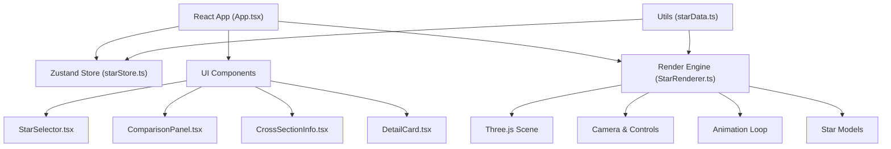

## 1. 架构设计



## 2. 技术描述

- **前端框架**：React@18 + TypeScript + Vite@5
- **3D渲染**：Three.js@0.160（原生，不使用React Three Fiber以获得更好的性能控制）
- **状态管理**：Zustand@4（轻量级，渲染性能优异）
- **工具库**：uuid@9（生成唯一ID）
- **样式方案**：原生CSS + CSS变量（毛玻璃效果、动画）
- **构建工具**：Vite（TypeScript支持、热更新、Three.js优化）
- **后端**：无（纯前端应用，数据内置）
- **数据库**：无（所有数据硬编码在starData.ts中）

## 3. 路由定义

| 路由 | 用途 |
|------|------|
| / | 主应用页面（单页应用，无多路由） |

## 4. 文件结构

```
src/
├── App.tsx                 # 根组件，协调UI和渲染引擎
├── main.tsx                # React入口
├── index.css               # 全局样式、CSS变量
├── stores/
│   └── starStore.ts        # Zustand状态管理
├── engine/
│   └── StarRenderer.ts     # Three.js渲染引擎封装
├── components/
│   ├── StarSelector.tsx    # 顶部恒星选择栏
│   ├── ComparisonPanel.tsx # 对比模式面板
│   ├── CrossSectionInfo.tsx # 剖面信息面板
│   └── DetailCard.tsx      # 详情卡片
├── utils/
│   ├── starData.ts         # 恒星数据定义
│   └── textureGenerator.ts # 程序化纹理生成（Web Worker）
├── workers/
│   └── texture.worker.ts   # 纹理生成Web Worker
└── types/
    └── index.ts            # TypeScript类型定义
```

## 5. 核心模块设计

### 5.1 Zustand Store (starStore.ts)
```typescript
interface StarState {
  currentStar: StarType;
  isCrossSection: boolean;
  comparisonStars: StarType[]; // 最多4颗
  selectedLayer: string | null;
  actions: {
    setStar: (type: StarType) => void;
    toggleCrossSection: () => void;
    addComparisonStar: (type: StarType) => void;
    removeComparisonStar: (index: number) => void;
    clearComparison: () => void;
    setSelectedLayer: (layer: string | null) => void;
  };
}
```

### 5.2 StarRenderer 引擎
- `init(container: HTMLElement)` - 初始化场景、相机、光照
- `switchStar(type: StarType, animate?: boolean)` - 切换恒星模型（0.6秒缓出动画）
- `showCrossSection(show: boolean)` - 显示/隐藏剖面视图
- `updateComparison(stars: StarType[])` - 更新对比面板的简化模型
- `dispose()` - 资源清理
- 私有方法：创建星空粒子、创建恒星模型、创建剖面、动画循环

### 5.3 恒星数据模型 (starData.ts)
```typescript
interface StarData {
  id: string;
  name: string;
  type: StarType;
  color: string;       // 主色
  gradient: string[];  // 渐变色（用于图标）
  radius: number;      // 相对太阳半径
  mass: number;        // 相对太阳质量
  temperature: number; // 表面温度(K)
  spectralType: string;
  lifespan: string;    // 寿命
  rotationPeriod: number; // 自转周期(秒)
  layers: StarLayer[]; // 内部结构层
}

interface StarLayer {
  name: string;
  color: string;
  opacity: number;
  radiusRatio: number; // 相对半径比例
  temperature: string;
  density: string;
  percentage: string;
  description: string;
}
```

## 6. 性能优化策略

### 6.1 预加载策略
- 应用启动时预创建所有5种恒星的几何体和材质
- 使用Web Worker在后台线程生成程序化纹理
- 星空粒子使用BufferGeometry，共享材质

### 6.2 渲染优化
- 使用实例化渲染（InstancedMesh）处理星空粒子
- 材质复用，避免重复创建
- 不可见对象设置`visible = false`而非销毁
- 对比模式使用简化几何体（低面数球体）

### 6.3 动画优化
- 使用GSAP或原生requestAnimationFrame + 插值
- 切换动画使用Three.js的Clock计算delta时间
- 纹理动画使用ShaderMaterial的uniform时间变量

### 6.4 帧率目标
- 单恒星场景：≥60fps
- 4颗恒星对比：≥30fps
- 首帧响应：<200ms

## 7. 数据模型

### 7.1 恒星类型枚举
```typescript
type StarType = 'red_dwarf' | 'yellow_dwarf' | 'blue_giant' | 'white_dwarf' | 'red_supergiant';
```

### 7.2 5种恒星数据示例
| 类型 | 名称 | 半径(太阳) | 质量(太阳) | 温度(K) | 光谱型 |
|------|------|-----------|-----------|---------|--------|
| 红矮星 | 比邻星 | 0.15 | 0.12 | 3,000 | M |
| 黄矮星 | 太阳 | 1.0 | 1.0 | 5,778 | G |
| 蓝巨星 | 参宿增一 | 20 | 20 | 30,000 | O/B |
| 白矮星 | 天狼星B | 0.01 | 1.0 | 10,000 | D |
| 红超巨星 | 参宿四 | 1,000 | 20 | 3,500 | M |
