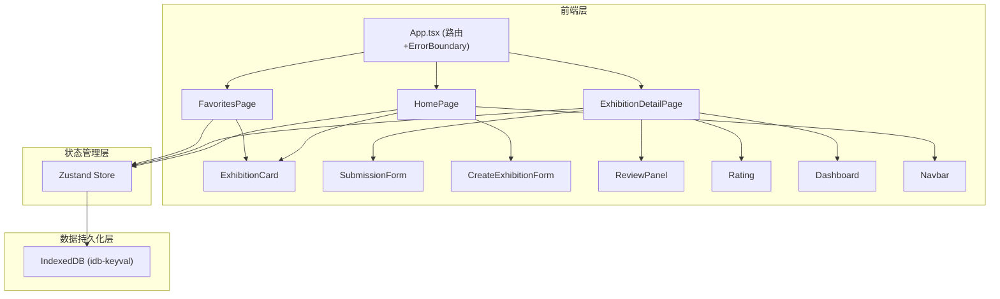
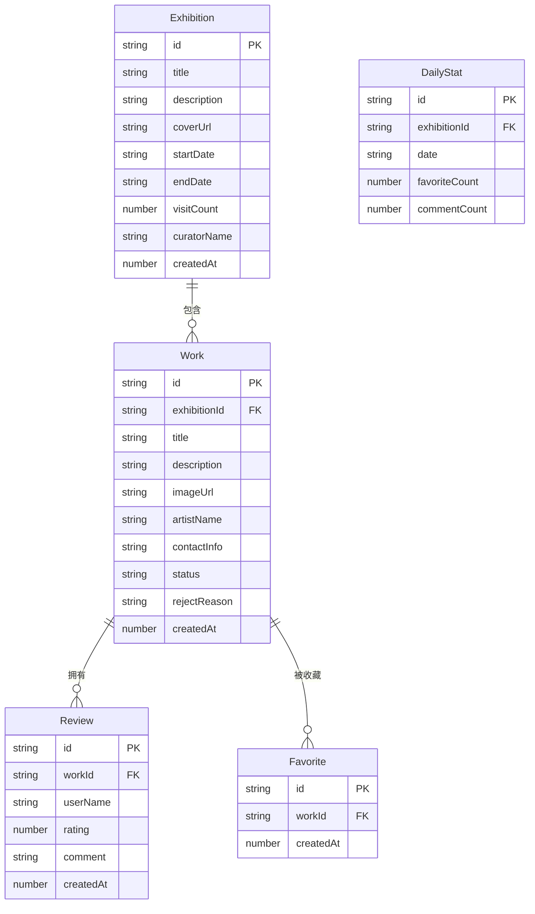

## 1. 架构设计



## 2. 技术说明

- **前端框架**：React@18 + TypeScript（严格模式）
- **构建工具**：Vite（含路径别名 @→src）
- **状态管理**：Zustand（单一store管理展览、作品、收藏、评论等全局状态）
- **数据持久化**：IndexedDB（通过 idb-keyval 封装，读写操作异步不阻塞UI）
- **路由**：react-router-dom@6（BrowserRouter，3条主路由）
- **样式方案**：CSS Modules + CSS变量（深紫主题色系）
- **图标**：lucide-react
- **唯一标识**：uuid
- **后端**：无，纯前端应用

## 3. 路由定义

| 路由 | 用途 | 组件 |
|------|------|------|
| `/` | 首页，展览网格、搜索排序、创建展览 | HomePage |
| `/exhibition/:id` | 展览详情，作品画廊、提交/审核、热度仪表盘 | ExhibitionDetailPage |
| `/favorites` | 用户收藏的作品列表 | FavoritesPage |

## 4. 数据模型

### 4.1 数据模型定义



### 4.2 TypeScript 类型定义

```typescript
interface Exhibition {
  id: string;
  title: string;
  description: string;
  coverUrl: string;
  startDate: string;
  endDate: string;
  visitCount: number;
  curatorName: string;
  createdAt: number;
}

interface Work {
  id: string;
  exhibitionId: string;
  title: string;
  description: string;
  imageUrl: string;
  artistName: string;
  contactInfo: string;
  status: 'pending' | 'approved' | 'rejected';
  rejectReason?: string;
  createdAt: number;
}

interface Review {
  id: string;
  workId: string;
  userName: string;
  rating: number;
  comment: string;
  createdAt: number;
}

interface Favorite {
  id: string;
  workId: string;
  createdAt: number;
}

interface DailyStat {
  id: string;
  exhibitionId: string;
  date: string;
  favoriteCount: number;
  commentCount: number;
}
```

## 5. 文件结构

```
ArtCollab/
├── package.json
├── index.html
├── vite.config.js
├── tsconfig.json
├── src/
│   ├── types.ts          ← 数据契约，供所有模块引用
│   ├── store.ts          ← Zustand store，全局状态+actions
│   ├── index.ts          ← 入口，挂载App，触发store初始化
│   ├── App.tsx           ← 根组件，路由+ErrorBoundary+页面切换动画
│   ├── styles/
│   │   ├── global.css    ← CSS变量、全局样式、动画定义
│   │   └── transitions.css ← 路由切换动画
│   ├── components/
│   │   ├── ExhibitionCard.tsx   ← 展览卡片（props: Exhibition, onSelect）
│   │   ├── SubmissionForm.tsx   ← 作品提交表单（含字段校验）
│   │   ├── CreateExhibitionForm.tsx ← 创建展览表单（遮罩弹窗）
│   │   ├── ReviewPanel.tsx      ← 作品审核面板
│   │   ├── Rating.tsx           ← 星级评分组件
│   │   ├── Dashboard.tsx        ← 热度仪表盘（CSS柱状图）
│   │   ├── Navbar.tsx           ← 毛玻璃导航栏（含汉堡菜单）
│   │   ├── Toast.tsx            ← Toast通知组件
│   │   └── LazyImage.tsx        ← 懒加载图片组件（IntersectionObserver）
│   └── pages/
│       ├── HomePage.tsx          ← 首页（展览网格+搜索排序+创建按钮）
│       ├── ExhibitionDetailPage.tsx ← 展览详情（画廊+提交+审核+仪表盘）
│       └── FavoritesPage.tsx     ← 我的收藏
```

### 数据流向说明

1. **初始化**：`index.ts` → 调用 `store.loadFromDB()` → 从 IndexedDB 加载展览/作品/收藏/评论数据
2. **展览创建**：`CreateExhibitionForm` → `store.addExhibition()` → 更新状态 + 写入 IndexedDB
3. **作品提交**：`SubmissionForm` → `store.addWork()` → 更新状态 + 写入 IndexedDB → Toast通知
4. **作品审核**：`ReviewPanel` → `store.approveWork()` / `store.rejectWork()` → 更新状态 + 写入 IndexedDB
5. **收藏操作**：`ExhibitionCard` / 作品卡片 → `store.toggleFavorite()` → 更新状态 + 写入 IndexedDB + 更新 DailyStat
6. **评论评分**：`Rating` + 评论框 → `store.addReview()` → 更新状态 + 写入 IndexedDB + 更新 DailyStat
7. **热度仪表盘**：`Dashboard` ← 读取 `store` 中的 DailyStat 数据计算趋势
