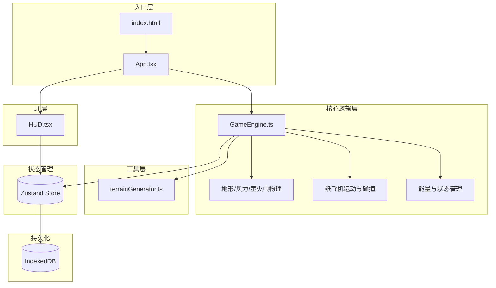
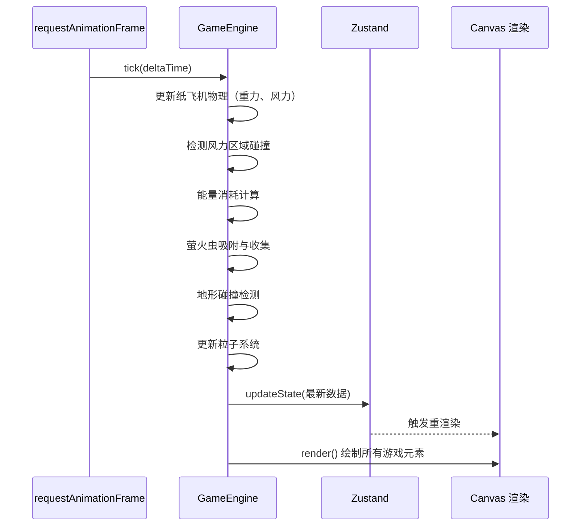

# WindWalker 技术架构文档

## 1. 技术栈选型

| 分类 | 技术 | 版本 | 用途 |
|------|------|------|------|
| 框架 | React | 18.x | UI 组件化 |
| 语言 | TypeScript | 5.x | 类型安全 |
| 构建 | Vite | 5.x | 快速开发构建 |
| 状态 | Zustand | 4.x | 轻量状态管理 |
| 存储 | idb-keyval | 6.x | IndexedDB 封装 |
| 工具 | uuid | 9.x | 唯一 ID 生成 |
| 渲染 | Canvas API | - | 2D 游戏画面渲染 |

---

## 2. 架构设计

### 2.1 整体架构图



### 2.2 模块职责

#### App.tsx - 根组件
- 挂载 Canvas 元素
- 绑定键盘、鼠标、触控事件
- 管理游戏生命周期（开始/暂停/结束）
- 初始化 GameEngine 和状态

#### GameEngine.ts - 游戏引擎
- requestAnimationFrame 驱动的游戏循环
- 纸飞机物理运动（仰角、重力、滑翔）
- 风力区域影响计算
- 能量消耗与恢复计算
- 萤火虫吸附与收集逻辑
- 碰撞检测
- 粒子系统（尾迹、碎片）
- 输出游戏状态到 Zustand Store

#### HUD.tsx - 界面组件
- 纯 React 组件，订阅 Zustand 状态
- 渲染能量条、风向提示、距离、收集数
- 游戏结束弹窗
- 使用 CSS 动画实现交互反馈

#### terrainGenerator.ts - 地图生成
- 程序随机生成横版地形
- 配置风力区域位置和类型
- 萤火虫集群分布
- 提供地形段数据结构供引擎消费

---

## 3. 核心数据结构

### 3.1 纸飞机状态

```typescript
interface Plane {
  x: number;           // 水平位置（世界坐标）
  y: number;           // 垂直位置
  vx: number;          // 水平速度
  vy: number;          // 垂直速度
  angle: number;       // 仰角（弧度）
  tilt: number;        // 侧倾角度
  energy: number;      // 能量 0-100
  isBoost: boolean;    // 是否冲刺中
  boostTimer: number;  // 冲刺剩余时间
}
```

### 3.2 风力区域

```typescript
type WindType = 'updraft' | 'downdraft' | 'tailwind';

interface WindZone {
  id: string;
  type: WindType;
  x: number;
  y: number;
  width: number;
  height: number;
  strength: number;    // 风力强度
}
```

### 3.3 萤火虫

```typescript
interface Firefly {
  id: string;
  x: number;
  y: number;
  baseY: number;       // 基准Y（用于浮动）
  phase: number;       // 呼吸动画相位
  frequency: number;   // 闪烁频率
  collected: boolean;
  attracting: boolean; // 正在被吸附
}
```

### 3.4 地形段

```typescript
interface TerrainSegment {
  startX: number;
  endX: number;
  type: 'forest' | 'canyon' | 'waterfall' | 'volcano';
  topHeights: number[];  // 顶部地形高度采样
  bottomHeights: number[]; // 底部地形高度采样
  windZones: WindZone[];
  fireflies: Firefly[];
}
```

### 3.5 游戏状态（Zustand Store）

```typescript
interface GameState {
  // 运行状态
  status: 'menu' | 'playing' | 'paused' | 'gameover';
  
  // 实时数据
  distance: number;       // 飞行距离（米）
  fireflyCount: number;   // 已收集萤火虫数
  energy: number;         // 当前能量
  planeTilt: number;      // 纸飞机侧倾（用于UI）
  
  // 风力提示
  activeWind: WindType | null;
  
  // 历史记录
  highScore: number;
  leaderboard: LeaderboardEntry[];
  unlockedTerrains: string[];
  
  // Actions
  startGame: () => void;
  pauseGame: () => void;
  resumeGame: () => void;
  endGame: () => void;
  updateState: (patch: Partial<GameState>) => void;
}
```

---

## 4. 游戏循环流程



---

## 5. 性能优化策略

1. **Canvas 分层渲染**：背景静态层与动态元素分离，减少重绘区域
2. **粒子池**：预分配 200 个粒子对象，动态回收复用，避免 GC
3. **地形按需生成**：只生成可视范围前后各 2 段地形，远处回收
4. **状态最小化更新**：Zustand 订阅使用 selector 避免不必要的 UI 重渲染
5. **requestAnimationFrame 时间步长**：固定物理步长，保证不同帧率下物理一致性

---

## 6. 存储设计

使用 idb-keyval 操作 IndexedDB：

| Key | Value 类型 | 说明 |
|-----|-----------|------|
| `windwalker:highscore` | `number` | 历史最高距离 |
| `windwalker:leaderboard` | `LeaderboardEntry[]` | 排行榜（前10名） |
| `windwalker:unlocked` | `string[]` | 已解锁地形名称 |
