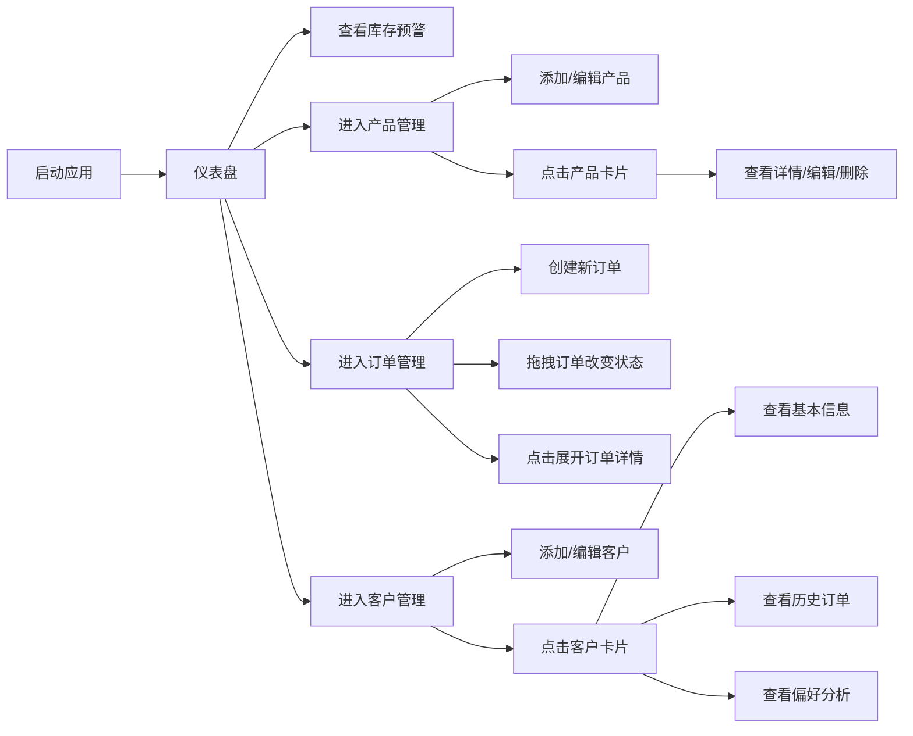

## 1. 产品概述

手工艺工作室轻量级CRM应用，解决手工制品品类多、批次乱、客户分散的管理难题。目标用户为小型手工艺工作室（陶瓷、木雕、织物等），提供产品、订单、客户一体化管理能力。

- 核心价值：帮助手工艺人从繁琐的手工记账中解放出来，专注创作
- 市场定位：垂直于手工艺术领域的轻量型SaaS工具

## 2. 核心功能

### 2.1 用户角色
| 角色 | 注册方式 | 核心权限 |
|------|----------|----------|
| 工作室管理员 | 本地应用使用 | 完整的产品、订单、客户管理权限 |

### 2.2 功能模块
1. **仪表盘首页**：数据统计卡片、库存预警、快速入口
2. **产品管理页**：产品CRUD、瀑布流展示、库存预警标记
3. **订单管理页**：订单CRUD、状态流转、拖拽操作
4. **客户管理页**：客户CRUD、消费分析、偏好画像

### 2.3 页面详情
| 页面名称 | 模块名称 | 功能描述 |
|----------|----------|----------|
| 仪表盘 | 统计卡片 | 四个玻璃态卡片展示总产品数、总订单数、总客户数、库存预警数量 |
| 仪表盘 | 预警提示 | 库存预警卡片脉冲红光动画，点击跳转低库存列表 |
| 产品管理 | 瀑布流网格 | 产品卡片展示（缩略图、名称、库存），自适应网格布局 |
| 产品管理 | 产品卡片 | 库存≤3时红色加粗脉冲闪烁，点击展开详情模态框 |
| 产品管理 | 详情模态框 | 毛玻璃背景，左向右滑入动画，编辑/删除按钮 |
| 订单管理 | 订单表格 | 状态色左边框，点击展开子行显示详情 |
| 订单管理 | 拖拽状态 | 拖拽改变订单状态，背景颜色过渡动画 |
| 客户管理 | 客户卡片 | 圆形头像（姓名首字母）、动态消费金额滚动动画 |
| 客户管理 | 侧边面板 | 右向左滑入，三标签页：基本信息/历史订单/偏好分析 |
| 客户管理 | 偏好分析 | 关键词云，文字大小颜色代表偏好程度 |

## 3. 核心流程

## 4. 用户界面设计

### 4.1 设计风格
- **主色**：深陶土 `#8B5E3C` - 用于标题、主色调
- **强调色**：活力橙 `#E07A2F` - 用于按钮、关键交互点
- **背景色**：温暖米白 `#F9F3EA` - 页面主背景
- **卡片色**：纯白 `#FFFFFF` + 陶土色边框 `#D4A574`（1px，16px圆角）
- **字体**：系统无衬线字体，避免使用Inter/Roboto等通用字体
- **按钮**：圆角按钮，点击时scale(0.95)按下动画（0.15s）
- **动效**：页面切换淡入+上移（0.3s缓出），滑入模态框，脉冲闪烁预警

### 4.2 页面设计概述
| 页面名称 | 模块名称 | UI元素 |
|----------|----------|--------|
| 仪表盘 | 统计卡片 | 毛玻璃效果（backdrop-blur: 8px），半透明白边框，预警卡片脉冲红光 |
| 产品管理 | 瀑布流网格 | 自适应网格（min-width: 280px），卡片左上圆形缩略图，底部库存显示 |
| 产品管理 | 模态框 | 毛玻璃背景，内容从左滑入，编辑/删除按钮 |
| 订单管理 | 表格 | 状态色左边框（灰/橙/蓝/绿），展开子行动画 |
| 客户管理 | 侧边面板 | 400px宽度，右向左滑入，半透明遮罩，三标签页切换 |
| 客户管理 | 关键词云 | 文字大小和颜色深浅体现偏好程度 |

### 4.3 响应式
- 桌面端优先，平板和移动端自适应
- 网格布局使用 CSS Grid `auto-fill` + `minmax(280px, 1fr)`
- 侧边面板在小屏幕转为全屏模态
- 订单表格在移动端转为卡片列表

### 4.4 性能要求
- 订单列表100条数据滚动帧率 ≥ 55fps
- 产品搜索响应时间 ≤ 200ms
- 使用虚拟滚动或 `content-visibility` 优化长列表
