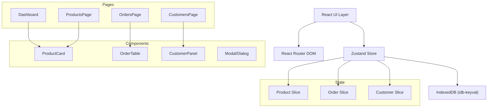
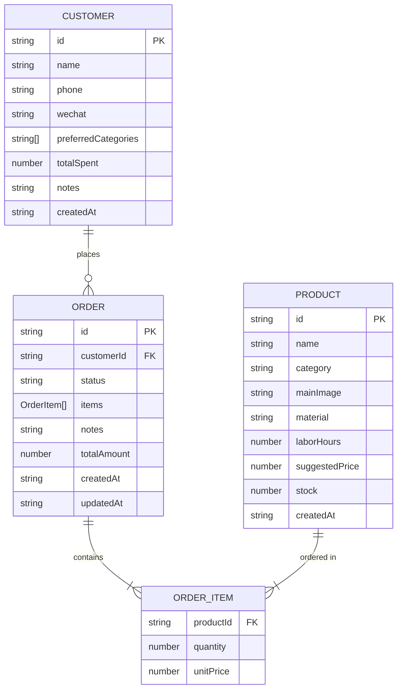

## 1. 架构设计



## 2. 技术描述

- **前端框架**：React@18 + TypeScript + Vite
- **路由**：react-router-dom@6
- **状态管理**：Zustand（slice模式）
- **数据持久化**：IndexedDB via idb-keyval
- **工具库**：uuid（生成ID）
- **字体**：@fontsource/inter（按需加载）
- **初始化工具**：vite-init react-ts 模板

## 3. 路由定义

| 路由 | 用途 |
|------|------|
| `/` | 仪表盘首页（Dashboard） |
| `/products` | 产品管理页（ProductsPage） |
| `/orders` | 订单管理页（OrdersPage） |
| `/customers` | 客户管理页（CustomersPage） |
| `/products?lowStock=true` | 按库存排序的产品列表（高亮度标记低库存） |

## 4. 数据模型

### 4.1 实体关系图



### 4.2 TypeScript 类型定义

```typescript
export enum OrderStatus {
  PENDING = 'pending',      // 待确认 - 灰色
  IN_PROGRESS = 'progress', // 制作中 - 橙色
  SHIPPED = 'shipped',      // 已发货 - 蓝色
  COMPLETED = 'completed',  // 已完成 - 绿色
}

export interface Product {
  id: string;
  name: string;
  category: string;
  mainImage?: string;
  material: string;
  laborHours: number;
  suggestedPrice: number;
  stock: number;
  createdAt: string;
}

export interface OrderItem {
  productId: string;
  quantity: number;
  unitPrice: number;
}

export interface Order {
  id: string;
  customerId: string;
  status: OrderStatus;
  items: OrderItem[];
  notes?: string;
  totalAmount: number;
  createdAt: string;
  updatedAt: string;
}

export interface Customer {
  id: string;
  name: string;
  phone: string;
  wechat?: string;
  preferredCategories: string[];
  totalSpent: number;
  notes?: string;
  createdAt: string;
}

export interface CategoryEmojiMap {
  [key: string]: string; // '陶瓷': '🏺', '木雕': '🪵', '织物': '🧶'
}
```

## 5. 状态管理设计

### 5.1 Store Slices

**Product Slice:**
- `products: Product[]`
- `addProduct(data: Omit<Product, 'id' | 'createdAt'>): void`
- `updateProduct(id: string, data: Partial<Product>): void`
- `deleteProduct(id: string): void`
- `lowStockProducts: Product[]` - selector（stock ≤ 3）
- `searchProducts(keyword: string): Product[]` - 模糊搜索

**Order Slice:**
- `orders: Order[]`
- `addOrder(data: Omit<Order, 'id' | 'createdAt' | 'updatedAt'>): void`
- `updateOrderStatus(id: string, status: OrderStatus): void`
- `updateOrder(id: string, data: Partial<Order>): void`
- `deleteOrder(id: string): void`
- `getOrdersByCustomer(customerId: string): Order[]` - selector

**Customer Slice:**
- `customers: Customer[]`
- `addCustomer(data: Omit<Customer, 'id' | 'createdAt' | 'totalSpent'>): void`
- `updateCustomer(id: string, data: Partial<Customer>): void`
- `deleteCustomer(id: string): void`
- `getCustomerPreferences(customerId: string): {category: string, count: number}[]` - 偏好分析 selector

## 6. 性能优化策略

1. **长列表优化**：
   - `content-visibility: auto` + `contain-intrinsic-size`
   - 按需渲染不可见区域
   - 虚拟滚动（订单≥100条时启用）

2. **搜索优化**：
   - 使用 `useMemo` 缓存搜索结果
   - 防抖搜索输入（150ms）
   - 索引化产品名称和品类字段

3. **动画优化**：
   - 使用 `transform` 和 `opacity` 动画（GPU加速）
   - 避免布局抖动（layout thrashing）
   - `will-change` 预提示浏览器

4. **状态优化**：
   - Zustand selector 精确订阅，避免不必要重渲染
   - `useShallow` 对比对象引用
   - 数据持久化使用 `requestIdleCallback` 异步写入

## 7. 项目文件结构

```
src/
├── App.tsx              # 根组件
├── main.tsx             # 入口
├── index.css            # 全局样式
├── types.ts             # 类型定义
├── store.ts             # Zustand store
├── components/
│   ├── ProductCard.tsx
│   ├── OrderTable.tsx
│   ├── CustomerPanel.tsx
│   ├── Modal.tsx
│   └── SidePanel.tsx
├── pages/
│   ├── Dashboard.tsx
│   ├── ProductsPage.tsx
│   ├── OrdersPage.tsx
│   └── CustomersPage.tsx
└── utils/
    ├── db.ts            # IndexedDB 操作
    ├── format.ts        # 格式化工具
    └── emoji.ts         # 品类emoji映射
```
