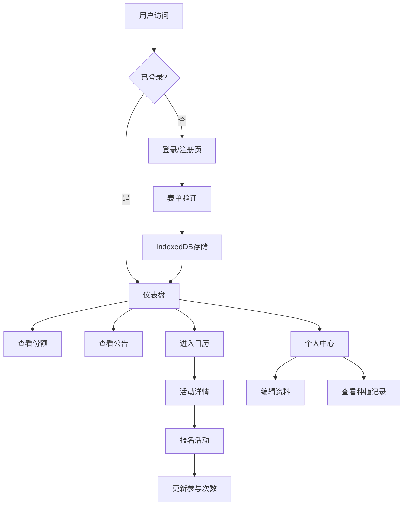

## 1. 产品概述
HarvestShare是一款社区农场会员管理应用，旨在连接小型社区农场与会员，提供蔬菜份额预订、农场活动参与、种植记录追踪等一站式服务。
- 目标用户：社区农场会员、农场管理人员
- 核心价值：简化农场运营管理，提升会员参与体验，促进社区互动

## 2. 核心功能

### 2.1 用户角色
| 角色 | 注册方式 | 核心权限 |
|------|----------|----------|
| 会员用户 | 邮箱注册 | 预订蔬菜份额、报名农场活动、查看种植记录、编辑个人资料 |
| 农场管理员 | 后台创建 | 发布公告、管理活动、确认订单（本期重点实现会员端功能） |

### 2.2 功能模块
1. **认证模块**：会员注册、登录、登出，邮箱唯一性校验
2. **仪表盘模块**：份额订阅状态展示、最新公告滚动播放、快捷入口
3. **活动日历模块**：按月展示农场活动、活动详情查看、在线报名
4. **个人中心模块**：个人资料编辑、种植参与记录、会员等级展示、等级权益说明

### 2.3 页面详情
| 页面名称 | 模块名称 | 功能描述 |
|---------|----------|----------|
| 登录注册页 | 认证模块 | 新会员注册（姓名、邮箱、密码、头像上传）、会员登录、表单验证、错误提示 |
| 首页仪表盘 | 仪表盘模块 | 环形进度条展示份额订阅进度、最新三条公告滚动播放、份额方案卡片、快捷操作入口 |
| 活动日历页 | 日历模块 | 月视图活动展示、活动卡片按状态着色、活动详情浮窗、报名功能 |
| 个人中心页 | 个人中心模块 | 头像上传与预览、个人信息编辑、种植记录时间线、会员等级色条、等级权益浮层 |

## 3. 核心流程

### 3.1 会员注册登录流程
用户访问应用 → 未登录跳转登录页 → 填写注册/登录表单 → 表单验证 → 提交到IndexedDB → 登录成功跳转仪表盘 → 状态持久化

### 3.2 份额预订流程
用户在仪表盘查看份额方案 → 点击预订按钮 → 选择方案、填写配送地址和备注 → 提交订单 → 状态更新为"待确认" → 仪表盘进度条更新

### 3.3 活动报名流程
用户进入日历页 → 浏览月视图活动 → 点击活动卡片查看详情 → 点击报名按钮 → 更新报名人数 → 活动卡片状态变更 → 仪表盘参与次数更新

## 4. 用户界面设计

### 4.1 设计风格
- **主色调**：自然温暖色系，主背景#F8F5F0（米白），强调色#7CB342（草绿）、#FFB74D（阳光橙）
- **导航栏**：森林绿#4A6741到#6B8E23渐变，移动端纯色
- **卡片设计**：白色背景#FFFFFF，浅木色边框#D9C9B0，12px圆角，柔和阴影
- **字体**：标题使用Playfair Display（优雅衬线体），正文使用Lato（清晰无衬线体）
- **图标**：Lucide图标库，风格统一圆润
- **动效**：页面淡入0.3秒，卡片悬停上移4px+阴影加深，公告平滑展开收起

### 4.2 页面设计概述
| 页面名称 | 模块名称 | UI元素 |
|---------|----------|--------|
| 登录注册页 | 认证模块 | 卡片式表单、头像上传预览、密码显示切换、红色错误提示淡入、绿色成功toast |
| 首页仪表盘 | 仪表盘模块 | 顶部公告滚动条、环形进度条（份额进度）、份额方案卡片网格、最新公告列表 |
| 活动日历页 | 日历模块 | 月份切换导航、活动状态色标、活动卡片网格、毛玻璃效果详情浮窗 |
| 个人中心页 | 个人中心模块 | 圆形头像上传、渐变色等级色条、种植记录时间线、小铲子图标、底部弹出权益浮层 |

### 4.3 响应式设计
- **桌面端（>768px）**：三列卡片布局，完整导航栏
- **平板端（481-768px）**：两列卡片布局，导航栏简化
- **移动端（≤480px）**：单列卡片布局，汉堡菜单，纯色导航栏背景
- **触摸优化**：按钮最小高度44px，足够的点击间距，移除:hover效果改用:active状态

### 4.4 性能优化
- IndexedDB数据读取≤300ms
- 月份切换渲染≤200ms
- 图片模糊占位符过渡加载
- 骨架屏加载动画
