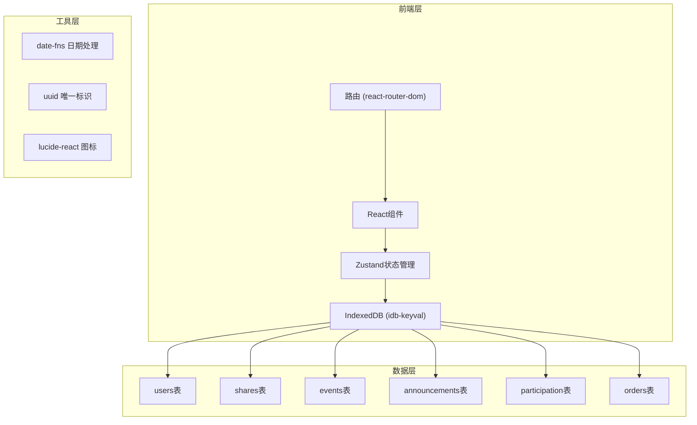
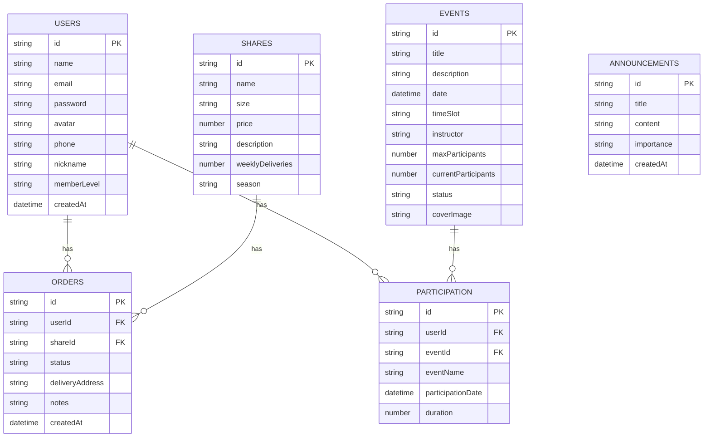

## 1. 架构设计



## 2. 技术描述
- **前端框架**：React@18 + TypeScript + Vite
- **状态管理**：Zustand（按模块划分store）
- **路由管理**：react-router-dom@6
- **数据持久化**：IndexedDB（idb-keyval库）
- **日期处理**：date-fns
- **图标库**：lucide-react
- **唯一标识**：uuid
- **样式方案**：CSS Modules + CSS Variables

## 3. 路由定义
| 路由 | 页面组件 | 权限要求 |
|------|----------|----------|
| /auth | LoginPage | 公开 |
| /dashboard | DashboardPage | 需要登录 |
| /calendar | CalendarPage | 需要登录 |
| /profile | ProfilePage | 需要登录 |
| /share-order | ShareOrderPage | 需要登录 |
| * | 重定向到/dashboard或/auth | - |

## 4. 数据模型

### 4.1 数据模型定义



### 4.2 数据流向说明

#### 认证模块数据流
IndexedDB(users表) → authStore → LoginPage组件
- 注册：LoginPage表单提交 → authStore.register → IndexedDB存储 → 更新currentUser
- 登录：LoginPage表单提交 → authStore.login → IndexedDB查询 → 更新currentUser

#### 仪表盘模块数据流
IndexedDB(shares/announcements/orders表) → dashboardStore → DashboardPage组件
- 份额数据：dashboardStore.fetchShares → IndexedDB查询shares表 → 更新shares列表
- 公告数据：dashboardStore.fetchAnnouncements → IndexedDB查询announcements表 → 更新announcements列表
- 订单数据：dashboardStore.fetchOrders → IndexedDB查询orders表 → 计算进度

#### 日历模块数据流
IndexedDB(events/participation表) → calendarStore → CalendarPage组件
- 活动列表：calendarStore.fetchEvents → IndexedDB查询events表 → 更新events列表
- 活动报名：CalendarPage点击报名 → calendarStore.signUp → 更新events表 → 回调dashboardStore刷新参与次数

#### 个人中心模块数据流
IndexedDB(users/participation表) → profileStore → ProfilePage组件
- 用户资料：profileStore.fetchProfile → IndexedDB查询users表 → 更新userProfile
- 参与记录：profileStore.fetchParticipation → IndexedDB查询participation表 → 更新记录列表

## 5. 文件结构

```
src/
├── App.tsx                    # 根组件，路由配置，全局loading
├── main.tsx                   # 入口文件
├── index.css                  # 全局样式，CSS变量
├── types/
│   └── index.ts               # 全局类型定义
├── utils/
│   ├── db.ts                  # IndexedDB操作封装
│   ├── seedData.ts            # 初始数据填充
│   └── helpers.ts             # 工具函数（等级计算等）
├── components/
│   ├── Layout/
│   │   ├── Navbar.tsx         # 导航栏组件
│   │   └── ProtectedRoute.tsx # 路由保护组件
│   ├── UI/
│   │   ├── Toast.tsx          # Toast提示组件
│   │   ├── Skeleton.tsx       # 骨架屏组件
│   │   ├── ProgressRing.tsx   # 环形进度条组件
│   │   └── Modal.tsx          # 通用模态框组件
│   └── Share/
│       └── ShareCard.tsx      # 份额卡片组件
└── modules/
    ├── auth/
    │   ├── store.ts           # authStore
    │   └── LoginPage.tsx      # 登录注册页面
    ├── dashboard/
    │   ├── store.ts           # dashboardStore
    │   ├── DashboardPage.tsx  # 仪表盘页面
    │   └── ShareOrderPage.tsx # 份额预定页面
    ├── calendar/
    │   ├── store.ts           # calendarStore
    │   └── CalendarPage.tsx   # 日历页面
    └── profile/
        ├── store.ts           # profileStore
        └── ProfilePage.tsx    # 个人中心页面
```

## 6. 状态管理架构

### 6.1 Store划分原则
- 按业务模块划分，每个模块独立store
- Store只处理业务逻辑，不包含UI渲染逻辑
- Store之间通过回调或直接引用进行通信

### 6.2 Store接口定义

**authStore**
```typescript
interface AuthState {
  currentUser: User | null;
  isLoading: boolean;
  login: (email: string, password: string) => Promise<void>;
  register: (userData: RegisterData) => Promise<void>;
  logout: () => void;
  checkAuth: () => Promise<void>;
}
```

**dashboardStore**
```typescript
interface DashboardState {
  shares: Share[];
  announcements: Announcement[];
  orders: Order[];
  isLoading: boolean;
  fetchShares: () => Promise<void>;
  fetchAnnouncements: () => Promise<void>;
  fetchOrders: (userId: string) => Promise<void>;
  refreshParticipationCount: (userId: string) => Promise<void>;
}
```

**calendarStore**
```typescript
interface CalendarState {
  events: Event[];
  isLoading: boolean;
  fetchEvents: (month?: number, year?: number) => Promise<void>;
  signUp: (eventId: string, userId: string) => Promise<void>;
}
```

**profileStore**
```typescript
interface ProfileState {
  userProfile: User | null;
  participationRecords: Participation[];
  isLoading: boolean;
  fetchProfile: (userId: string) => Promise<void>;
  fetchParticipation: (userId: string) => Promise<void>;
  updateProfile: (userId: string, data: Partial<User>) => Promise<void>;
}
```
