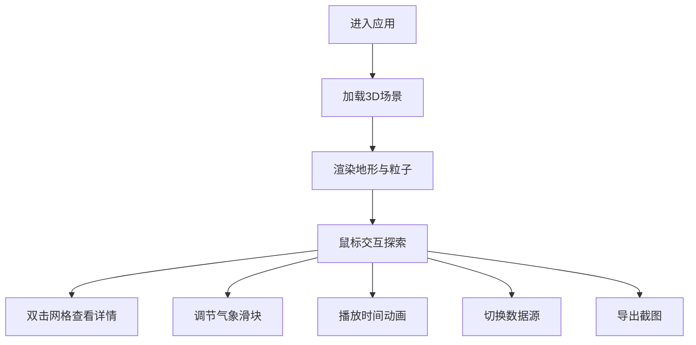

## 1. 产品概述

三维气象可视化应用，用于实时展示城市区域内风力、温度和湿度的空间分布与时间演化规律。面向公众和气象爱好者，通过直观的3D交互界面帮助用户理解气象要素的动态变化。

## 2. 核心功能

### 2.1 功能模块
1. **3D地形地图**：海拔着色地形网格，支持鼠标交互（旋转、缩放、点选）
2. **风力粒子系统**：半透明粒子随风速风向动态变化，带尾迹效果
3. **气象控制面板**：温度、湿度、风力等级调节滑块
4. **信息弹窗**：点击网格块显示详细气象数据和预报图表
5. **时间动画**：24小时数据循环播放，10倍速
6. **数据源切换**：城市A/城市B切换，带渐隐渐现过渡

### 2.2 页面详情
| 页面名称 | 模块名称 | 功能描述 |
|---------|---------|----------|
| 主页面 | 3D场景 | 地形网格、粒子系统、鼠标交互、双击高亮上浮 |
| 主页面 | 左侧控制面板 | 当前时间、天气图标、温/湿/风滑块、重置视角、播放/暂停、截图导出 |
| 主页面 | 顶部导航栏 | 应用名称、数据源切换、单位切换、帮助按钮 |
| 主页面 | 信息弹窗 | 经纬度、温湿度、风速、2小时预报折线图 |

## 3. 核心流程

用户进入应用 → 查看默认3D地形和粒子效果 → 拖拽旋转/滚轮缩放探索 → 双击网格查看详情 → 调节滑块改变气象参数 → 播放时间动画观察变化 → 切换数据源对比 → 导出截图

## 4. 用户界面设计

### 4.1 设计风格
- **主题**：深色科技风，深蓝黑渐变背景（#0B131C到#1A2D3F）
- **文字**：浅蓝色#A0D8EF + 白色#FFFFFF
- **面板**：毛玻璃半透明材质，背景模糊8-12px，半透明白色0.1-0.2
- **按钮/滑块**：渐变色#2E86AB到#1B7A7A，悬停色相偏移
- **地形着色**：低处深绿#1B4332，高处灰白#D5D5D5
- **圆角**：面板16px圆角
- **动画**：0.2-0.4秒缓动（ease-out），地图操作带阻尼

### 4.2 页面设计概览
| 页面 | 模块 | UI元素 |
|-----|-----|--------|
| 主页面 | 3D场景 | 地形网格、风力粒子、双击高亮上浮、信息弹窗 |
| 主页面 | 左侧控制面板（280px宽） | 深蓝色毛玻璃、时间显示、三个滑块、三个按钮 |
| 主页面 | 顶部导航栏（60px高） | 应用名称（粗体白字）、三个圆形图标按钮 |

### 4.3 响应式
- 桌面端优先设计
- Canvas自适应窗口大小
- 控制面板固定宽度，垂直方向可滚动

### 4.4 3D场景指引
- **环境**：深色背景，雾效增强空间感
- **灯光**：环境光 + 方向光，模拟日光
- **相机**：透视相机，初始俯瞰视角
- **交互**：OrbitControls，0.8阻尼惯性，缩放范围限制
- **粒子**：3000个上限，动态LOD，尾迹0.5秒渐隐
- **性能**：稳定60FPS，Geometry实例化优化
